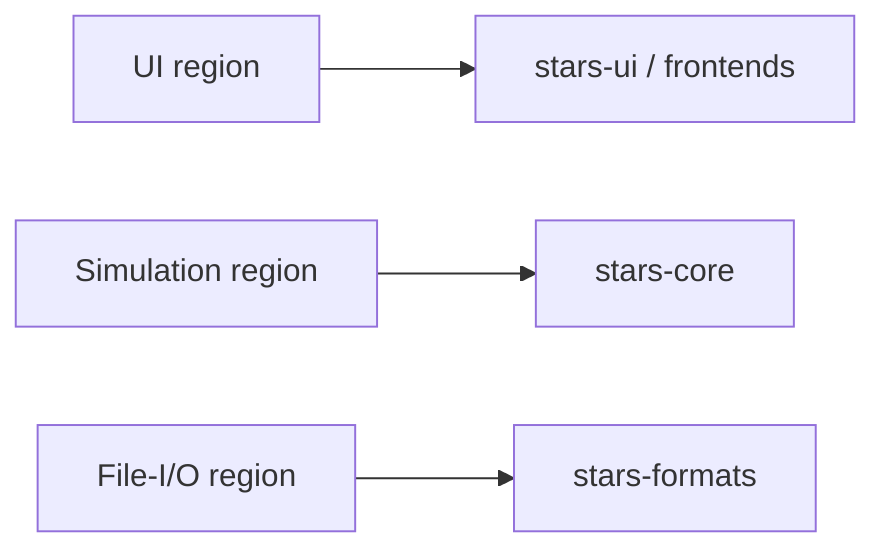

# Ghidra Triage — `STARS!.EXE`

- **Status:** in progress (initial clustering)
- **Ghidra project:** `ghidra/Stars` (program `/STARS!.EXE`)
- **Purpose:** cluster the binary's functions into **UI**, **simulation**, and
  **file-I/O** regions so later steps know where to look. This is a living map,
  refined as functions are named during RE.

## Binary facts

| Property        | Value                                             |
|-----------------|---------------------------------------------------|
| Format          | New Executable (NE), 16-bit Windows               |
| Language        | `x86:LE:16` Protected Mode                        |
| Image base      | `0000:0000`                                        |
| Functions       | ~1350                                             |
| Symbols         | ~8649                                             |
| Memory blocks   | 165 (segmented; many code/data segments)          |
| Address form    | `segment:offset` (e.g. `1048:34e0`)               |

Addresses in these docs use Ghidra's `seg:off` notation.

## Exported entry points (from the NE export table)

108 external entry points were recovered; almost all are Win16 dialog
procedures or window procedures (`param_count: 0`). The named exports below are
the primary navigation anchors into the code.

### UI — dialog & window procedures

| Export            | Address     | Likely role                                   |
|-------------------|-------------|-----------------------------------------------|
| `ABOUT`           | `1010:0c10` | About box                                     |
| `ORDERINFODLG`    | `1010:0e32` | Order/info dialog                             |
| `HOSTMODEDIALOG`  | `1018:4644` | Host-mode dialog (turn generation entry)      |
| `TITLEWNDPROC`    | `1018:608a` | Title / main window procedure                 |
| `TRANSFERDLG`     | `1048:34e0` | File transfer dialog (load/save/PBEM)         |
| `ZIPPRODDLG`      | `10c8:2d26` | Production queue dialog                        |
| `BROWSERWNDPROC`  | `10d0:1c8a` | Ship/planet browser window                    |
| `RACEWIZARDDLG1`  | `10d8:0336` | Race creation wizard — page 1                 |
| `RACEWIZARDDLG2`  | `10d8:0cb4` | Race creation wizard — page 2                 |
| `RACEWIZARDDLG3`  | `10d8:1b90` | Race creation wizard — page 3                 |
| `RACEWIZARDDLG4`  | `10d8:22d8` | Race creation wizard — page 4                 |
| `RACEWIZARDDLG5`  | `10d8:26e0` | Race creation wizard — page 5                 |
| `RACEWIZARDDLG6`  | `10d8:29f0` | Race creation wizard — page 6                 |

### Program / runtime entry points

| Symbol            | Address     | Notes                                         |
|-------------------|-------------|-----------------------------------------------|
| `program_entry`   | `0000:0000` | Program entry                                 |
| `entry`           | `1110:001a` | External/runtime entry                        |
| `___EXPORTEDSTUB` | `1110:2726` | Exported stub                                 |

## Region model

We classify functions into three regions. Each region has an owning Rust crate
so RE work maps directly onto implementation targets.

### 1. UI region → `stars-ui` (+ frontends)

Seeds: `ABOUT`, `ORDERINFODLG`, `TITLEWNDPROC`, `BROWSERWNDPROC`, `ZIPPRODDLG`,
`RACEWIZARDDLG1-6`, `HOSTMODEDIALOG`, `TRANSFERDLG`.

Recognition cues: calls into USER/GDI (`DialogBox`, `SendMessage`,
`GetDlgItem`, `TextOut`, `BitBlt`), message-loop `switch` on `WM_*`, resource
IDs. These are re-expressed as egui views in Step 5.

### 2. Simulation region → `stars-core`

Seeds: functions reachable from `HOSTMODEDIALOG` that are **not** UI (turn
generation), plus the arithmetic-heavy helpers they call. Recognition cues:
integer math, table lookups, RNG calls, no USER/GDI imports.

Subsystems to locate and spec (Steps 3–4): PRNG, mineral/resource production,
population growth, fleet movement, scanning, combat, research/tech advance, AI.

### 3. File-I/O region → `stars-formats`

Seeds: functions reachable from `TRANSFERDLG` and host-mode save/load.
Recognition cues: KERNEL file calls (`_lopen`, `_lread`, `_lwrite`, `_lclose`),
buffer/bit manipulation for (de)compression/encoding, checksum loops.

Formats to recover (Step 2): `.xy`, `.mN`, `.hN`, `.xN`, `.rN`, `.hst`.

## Working method

1. Start from a seed export and walk its call graph (callees) in Ghidra.
2. Tag each visited function with a region and a proposed name.
3. Record newly named simulation/I-O routines in the relevant `formats/` or
   `formulas/` spec's header (`Ghidra routine(s):`).
4. Keep this table growing; it is the index for the whole RE effort.

## Function inventory (to be filled during RE)

| Address | Proposed name | Region | Notes |
|---------|---------------|--------|-------|
| _(add rows as functions are identified)_ | | | |
