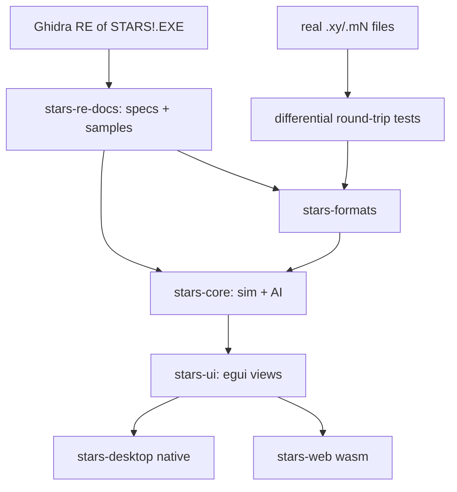

# Stars-re delivery plan

The delivery plan for the project: scope, architecture decisions, RE
methodology, testing strategy and the staged delivery steps. Step status is
marked in **Delivery Steps** below (`✓` done, `*` in progress).

# Requirements

### Overview & Goals
Reverse-engineer the 16-bit Windows 3.1 game **Stars!** (`STARS!.EXE`) and produce a clean, portable **Rust reimplementation** that runs natively on Windows 11, macOS, and Linux, with a **web/WebAssembly** build as a stretch goal.

The binary is a **New Executable (NE)**, `x86:LE:16` protected-mode image (~1350 functions, ~8649 symbols) that depends heavily on the Win16 API (USER/GDI/KERNEL), custom window procedures, and many dialogs (e.g. `RACEWIZARDDLG1-6`, `HOSTMODEDIALOG`, `TRANSFERDLG`, `BROWSERWNDPROC`, `ZIPPRODDLG`, `ORDERINFODLG`). Supporting assets include `stars.exe` (launcher stub), `intro.exe`, `STARS!.HLP`, and `wavemix.dll` for sound. A 280-page manual PDF documents the game rules.

The project is **RE-guided reimplementation**: Ghidra is used to recover the exact data formats and game logic, which are re-expressed as specifications and reimplemented cleanly in Rust — not machine-translated. Correctness is validated primarily through **differential file testing** and **spec-driven test vectors**.

### Scope
#### In Scope
- Reverse-engineering the on-disk **file formats** (`.xy` universe, `.mN` player state, `.hN` history, `.xN` orders, `.rN`/race, `.hst` host) for read/write compatibility with the original game.
- Reverse-engineering and reimplementing the **deterministic game simulation**: production, minerals/resources, fleet movement, scanning, combat, research, planet/population growth, and the RNG that drives them.
- **Turn generation / order processing** pipeline and **single-player vs AI**.
- **Multiplayer**: hotseat and play-by-email (PBEM) via file exchange, matching the original's turn-file workflow.
- A **faithful UI recreation** of the core screens (galaxy map, race wizard, production, ship/planet browsers, reports) using egui.
- **Cross-platform desktop** builds and a **wasm/web** build (stretch).

#### Out of Scope (initially)
- Bit-perfect recreation of the intro (`intro.exe`) and the `wavemix.dll` sound mixer (sound is a later enhancement).
- The original `STARS!.HLP` help viewer (content can be linked/ported later).
- Networked real-time multiplayer beyond the file-based PBEM/hotseat model.
- Modding tools or new gameplay features beyond the original.

### User Stories
- As a player on Windows 11 / macOS / Linux, I want to launch a native Stars! and play a full single-player game against AI so that I can enjoy the game on a modern machine.
- As an existing Stars! player, I want to open my original `.xy`/`.mN` files so that my existing games and universes still work.
- As a group of friends, I want to play hotseat and PBEM turns so that we can continue the classic multiplayer experience.
- As a returning fan, I want the screens and race wizard to look and behave like the original so that the game feels authentic.
- As a casual user (stretch), I want to play in a browser so that no install is needed.

### Functional Requirements
- Parse and re-serialize all core file formats with **byte-accurate round-tripping** of real game files.
- Generate a new turn from player orders that matches the original engine's results for the same inputs (within documented RNG/formula fidelity).
- Reproduce the race-creation wizard, galaxy map interaction, production queue, and the main browser/report dialogs.
- Support starting a new game, saving/loading, hotseat rotation, and PBEM turn export/import.

### Non-Functional Requirements
- **Determinism**: identical inputs + seed produce identical simulation outputs across platforms.
- **Portability**: one core crate reused by native and wasm frontends; no platform-specific logic in the core.
- **Maintainability**: clean, documented Rust with the RE knowledge captured as living specs and tests.
- **Performance**: turn generation and map rendering responsive for large (many-planet) universes.

# Technical Design

### Current Implementation (original binary)
- `STARS!.EXE` — 16-bit NE, `x86:LE:16` protected mode, segmented (many code/data segments; ~165 memory blocks in Ghidra), ~1350 functions, ~8649 symbols. Loaded and analyzed in the provided Ghidra project (`ghidra/Stars`).
- UI is Win16 dialog/window-procedure driven. Notable exported entry points seen in Ghidra: `RACEWIZARDDLG1`–`RACEWIZARDDLG6`, `HOSTMODEDIALOG`, `TRANSFERDLG`, `BROWSERWNDPROC`, `TITLEWNDPROC`, `ZIPPRODDLG`, `ORDERINFODLG`, `ABOUT`.
- Auxiliary files: `stars.exe` (small launcher stub), `intro.exe` (intro), `STARS!.HLP` (WinHelp), `wavemix.dll` + `wavemix.ini` (sound mixing).
- Game rules are documented in `documentation/MANUAL.PDF` (280 pages) — used to cross-check reverse-engineered formulas.

### Key Decisions (confirmed with user)
- **Strategy: RE-guided clean reimplementation** in Rust — Ghidra recovers formats/logic; we write new, maintainable code rather than decompiled C.
- **Language: Rust**, chosen for strong cross-platform + wasm support and determinism.
- **Architecture: headless core + thin frontends** — a pure, platform-agnostic core (game logic + file formats) with separate desktop and wasm frontend crates in a Cargo workspace. No I/O, rendering, or platform code in the core.
- **UI: egui / eframe** — immediate-mode GUI well suited to Stars!'s dense, form/table/dialog-heavy interface; same code compiles natively and to wasm.
- **Fidelity: differential file testing + spec-driven-from-Ghidra** — real game files drive round-trip byte-comparison tests; decompiled formulas/RNG/combat become written specs with test vectors.

### Proposed Changes / Target Architecture
A Cargo **workspace** with clearly separated crates:
- `stars-formats` — binary readers/writers for `.xy`, `.mN`, `.hN`, `.xN`, `.rN`, `.hst`; pure data structs + (de)serialization; no game logic.
- `stars-core` — the deterministic game model and simulation systems (universe, planets, fleets, races, tech tree, production, movement, scanning, combat, research, RNG) and the turn/order-processing engine and AI. No rendering, no filesystem, no platform APIs.
- `stars-ui` — shared egui view code (galaxy map, race wizard, production, browsers, reports) built on top of `stars-core` state.
- `stars-desktop` — eframe/winit native binary (Windows/macOS/Linux) wiring `stars-ui` + file I/O.
- `stars-web` — eframe wasm target (stretch) wiring `stars-ui` with browser storage/file APIs.
- `stars-re-docs` — the reverse-engineering knowledge base: format layouts, formula specs, RNG notes, and captured test vectors that drive the tests.

### Data Models / Contracts
- `stars-formats` exposes typed models and functions, e.g.:
  - `fn read_universe(bytes: &[u8]) -> Result<Universe, FormatError>` / `fn write_universe(&Universe) -> Vec<u8>`
  - analogous `read_/write_` pairs for player (`.mN`), history (`.hN`), orders (`.xN`), race (`.rN`), host (`.hst`).
  - Round-trip contract: `write(read(bytes)) == bytes` for real sample files.
- `stars-core` exposes a deterministic engine, e.g.:
  - `struct GameState { universe, planets, fleets, players, tech, rng_seed, turn }`
  - `fn generate_turn(state: &GameState, orders: &[PlayerOrders]) -> GameState` (pure, deterministic given seed).
  - A dedicated RNG type reproducing the original's PRNG (captured from Ghidra) so combat/minerals/events match.

### Components
- **Reverse-engineering pipeline**: Ghidra decompilation → specs + captured sample files in `stars-re-docs` → Rust implementation + tests.
- **Formats layer** (`stars-formats`): the first correctness anchor via differential tests.
- **Simulation core** (`stars-core`): systems mapped from Ghidra functions (production, movement, combat, research, growth) plus AI.
- **UI layer** (`stars-ui` + frontends): faithful egui recreation of the key dialogs identified in the binary (`RACEWIZARDDLG*`, `ZIPPRODDLG`, `BROWSERWNDPROC`, `HOSTMODEDIALOG`, `TRANSFERDLG`, `ORDERINFODLG`).

### File Structure
```
stars-re/
  Cargo.toml            # workspace
  crates/
    stars-formats/      # file format read/write + round-trip tests
    stars-core/         # deterministic simulation + AI
    stars-ui/           # shared egui views
    stars-desktop/      # eframe native binary
    stars-web/          # eframe wasm target (stretch)
  docs/                 # stars-re-docs: format layouts, formula specs, RNG notes, test vectors
  binary/ documentation/ ghidra/   # existing: original assets, manual, Ghidra project
```

### Architecture Diagram


### Risks
- **Undocumented/obfuscated formats**: Stars! files are compressed/encoded; recovering exact layouts (and any checksums) is the hardest RE work — mitigated by differential byte-comparison against real files.
- **RNG & formula fidelity**: subtle mismatches cascade over turns — mitigated by spec/test-vector capture and (optionally) side-by-side reference runs of the original under an emulator/Wine.
- **UI faithfulness vs. immediate-mode**: replicating exact Win16 layouts in egui takes iteration — mitigated by prioritizing behavior/faithful-enough visuals over pixel-perfection early.
- **Scope size**: this is a multi-year-scale effort; the delivery plan sequences it so each stage yields a usable increment.

# RE Methodology

### Reverse-Engineering Workflow
All RE knowledge is captured as durable artifacts in `docs/` (the `stars-re-docs` knowledge base) so implementation is spec-driven and reproducible.

1. **Map the binary** in Ghidra: cluster the ~1350 functions by segment and by the exported dialog/window-proc entry points to identify UI vs. simulation vs. file I/O regions.
2. **Locate file I/O**: find the load/save routines (likely reachable from `TRANSFERDLG`/host-mode code) and the (de)compression/encoding used for `.xy`/`.mN` files.
3. **Recover formats**: document exact byte layouts (headers, records, bitfields, block encoding, any checksums) as spec docs, with annotated hex from real sample files.
4. **Recover logic**: decompile the production, movement, scanning, combat, research, and growth routines; transcribe formulas and the PRNG into specs with worked **test vectors**. Cross-check against `MANUAL.PDF`.
5. **Implement + verify**: reimplement in Rust against the specs; validate with differential file tests and test vectors; optionally run the original under an emulator/Wine to produce reference turn outputs for the hardest cases.

### Fidelity Strategy (confirmed)
- **Differential file testing** — round-trip real `.xy`/`.mN`/`.hN`/`.xN` files; assert byte-for-byte equality and semantic equality of parsed models.
- **Spec-driven from Ghidra** — formulas/RNG/combat implemented against captured specs + vectors, kept in `docs/`.

### Tooling
- Ghidra (provided project) for decompilation and cross-references.
- Rust `cargo test` for round-trip and vector tests; sample game files stored as fixtures.
- (Optional) winevdm/OTVDM or Wine to run the original 16-bit binary for reference-output generation.

# Testing

### Validation Approach
Correctness is anchored in automated Rust tests driven by the RE specs and real game files, layered from formats upward to full turn generation, then UI behavior.

### Key Scenarios
- **Format round-trip**: `write(read(file)) == file` for every supported extension using real sample files.
- **Model semantics**: parsed structures expose expected values (planet counts, fleet positions, race traits) matching known sample games.
- **Turn generation**: given a saved state + orders, `generate_turn` reproduces the reference next-turn state (from spec vectors and/or original-engine reference runs).
- **Subsystem vectors**: production, mineral growth, movement, combat, and research each pass their captured test vectors, including RNG-dependent outcomes with fixed seeds.
- **Multiplayer flow**: hotseat rotation and PBEM export/import produce valid, engine-consistent turn files.
- **UI smoke**: race wizard, galaxy map, production queue, and browsers open and reflect core state (headless-testable logic separated from rendering).

### Edge Cases
- Corrupt/truncated files and unknown versions fail gracefully with typed errors.
- Very large universes (max planets/fleets) for performance and overflow behavior matching the original's 16-bit limits.
- Determinism across native and wasm targets (same seed → same result).

### Test Changes
- Add fixture directory of anonymized real game files.
- Add per-crate unit/integration tests; add golden test-vector files in `docs/` consumed by `stars-core` tests.

# Delivery Steps

### ✓ Step 1: Scaffold Rust workspace and RE knowledge base
A buildable Cargo workspace and a documentation pipeline exist, ready to receive reverse-engineered specs.

- Create the workspace with empty `stars-formats`, `stars-core`, `stars-ui`, `stars-desktop`, and (skeleton) `stars-web` crates.
- Establish `docs/` (`stars-re-docs`) with templates for format layouts, formula specs, RNG notes, and test vectors.
- Set up a Ghidra triage doc that clusters the ~1350 functions by segment and by exported entry points (`RACEWIZARDDLG*`, `HOSTMODEDIALOG`, `TRANSFERDLG`, `BROWSERWNDPROC`, `ZIPPRODDLG`, `ORDERINFODLG`) into UI / simulation / file-I/O regions.
- Wire up CI-style `cargo build`/`cargo test` and a fixtures folder for real sample game files.

### ✓ Step 2: Reverse-engineer and implement file formats
`stars-formats` reads and byte-accurately re-writes the core Stars! file formats, verified against real files.

- Locate load/save and (de)compression/encoding routines in Ghidra (reachable from transfer/host-mode code).
- Document exact byte layouts (headers, records, bitfields, block encoding, checksums) for `.xy`, `.mN`, `.hN`, `.xN`, `.rN`, `.hst` in `docs/`.
- Implement typed models and `read_/write_` pairs per format in `stars-formats`.
- Add differential round-trip tests asserting `write(read(bytes)) == bytes` on real fixtures plus semantic-equality checks.

### ✓ Step 3: Reverse-engineer and implement the deterministic simulation core
`stars-core` models the universe and reproduces the original's per-subsystem calculations deterministically.

- Define the core data model (`GameState`: universe, planets, fleets, players, tech tree, seed, turn).
- Recover and implement the original PRNG and the production, mineral/resource, population growth, fleet movement, and scanning formulas from Ghidra, cross-checked with `MANUAL.PDF`.
- Capture worked test vectors in `docs/` and add unit tests for each subsystem with fixed seeds.
- Keep the core free of I/O, rendering, and platform code.

**Delivered.** The planetary economy is recovered and implemented: the
simulation PRNG (`Random`/`Randomize`), habitability and maximum population,
population growth and death, mining and mineral-concentration decay, resource
output with the operable mine/factory caps, scanner ranges, and fleet movement
geometry and fuel. Each is specified in `docs/formulas/` citing both the Ghidra
address and the `MANUAL.PDF` page, with golden vectors in
`docs/vectors/planetary-economy.json` taken from the manual's own worked
examples.

Verified two ways: the vectors, and a differential replay of real save files
(`crates/stars-core/tests/differential_growth.rs`) in which 372 of 426
planet-years of the 40-turn Exodus game reproduce the original engine's
population *and* its fractional-population accumulator exactly.

Carried into Step 4/5 rather than done here: everything that depends on ship
designs or the components table — the Alternate Reality population, mining and
resource model, per-design scanner ranges, and engine fuel-use tables — plus
mine-field traversal and stargates.

### * Step 4: Implement turn generation, combat, research, and AI

`stars-core` can advance a full game turn from player orders and play single-player against AI.

- Implement the order/turn-processing pipeline: `generate_turn(state, orders) -> state`.
- Reverse-engineer and implement combat resolution and the research/tech-advance system with RNG fidelity.
- Implement single-player AI opponents (behavior derived from RE + manual).
- Validate turn output against reference next-turn states via spec vectors (and optionally original-engine reference runs).

**Progress.** Done: the turn pipeline's order (`docs/formulas/turn-order.md`),
**research** in full, the per-planet **resource and research accounting**, and
the **component data tables** (engines, armour, shields, scanners, planetary,
beams, torpedoes), which closed the fuel and scanner-range gaps left open in
Step 3. `generate_turn` runs the recovered steps and names the rest in
`TurnReport::skipped`.

Remaining, in dependency order:

1. **Hull and stock-design tables** (`rghuldef` and friends) — the last of the
   component data.
2. **The production build queue** — needs those costs. Auto-build (mines,
   factories, defenses) is tractable first, since those costs are race
   attributes.
3. ~~**The battle recording (VCR) format**~~ — **done.** 47 recordings decode
   from the Exodus fixture; see `docs/formats/battle.md`.
4. **Combat** (`battle.c`, ~4000 lines) — *in progress.* The board, starting
   positions, movement schedule, target scoring, weapon accuracy, damage
   resolution and the **beam firing loop** are implemented
   (`docs/formulas/combat.md`). Eight of the eleven replayable beam battles
   reproduce the recorded casualties exactly, with movement taken from the
   recording and everything else computed. The movement scoring is transcribed from
   the disassembly (`ScoreGuessBattleDamage`) and rates the engine's chosen
   square among its best in 86% of moves against a 71% chance rate. What
   remains: `DzMoveRangeToConsider` and `FIsTargetOfMdTarget`, two small stubs
   that together explain the residual; and torpedo resolution, which needs the
   RNG in the right state.
5. **The AI players** (six source files), which depend on nearly all of the
   above.

**The ship-design layer is now in place** (`docs/formulas/design.md`): the 32
ship hulls and 5 starbase hulls are transcribed alongside the rest of the
component tables, and `stars_core::design::ShipDesign` derives mass, armour,
shields, fuel and cargo capacity, scanner range and cost from a hull and its
slots. Mass is verified against the battle recordings.

What is still open inside it: battle initiative from battle computers, and the
stock design tables. The armour computation was read out of `UpdateShdefCost`
and now reproduces all 493 designs in the sample games exactly.

###   Step 5: Build the egui desktop frontend with faithful core screens
`stars-desktop` runs a playable single-player game on Windows/macOS/Linux with recreated key screens.

- Build shared `stars-ui` egui views: galaxy map/starfield, race-creation wizard (mirroring `RACEWIZARDDLG1-6`), production queue (`ZIPPRODDLG`), and ship/planet browsers/reports (`BROWSERWNDPROC`, `ORDERINFODLG`).
- Wire `stars-desktop` (eframe/winit) to `stars-core` and `stars-formats` for new-game, save/load, and turn generation.
- Recreate original layouts/behavior faithfully; keep rendering-independent view logic testable.

###   Step 6: Add hotseat and PBEM multiplayer
Multiple humans can play via shared files and play-by-email turn exchange.

- Implement hotseat rotation and per-player state isolation in the frontend + core.
- Implement PBEM turn-file export/import using the `stars-formats` `.xN`/`.mN`/`.hst` handling and host-mode logic (`HOSTMODEDIALOG`, `TRANSFERDLG`).
- Add tests ensuring exported/imported turn files are engine-consistent and round-trip cleanly.

###   Step 7: Web/WebAssembly build (stretch)
`stars-web` runs the game in a browser via the same core and UI.

- Compile `stars-ui` through eframe to wasm in `stars-web`.
- Implement browser file/storage integration for loading/saving games and turn files.
- Verify determinism parity between native and wasm builds (same seed produces identical results).
- Provide a static hosting build and smoke-test the core play flow in-browser.