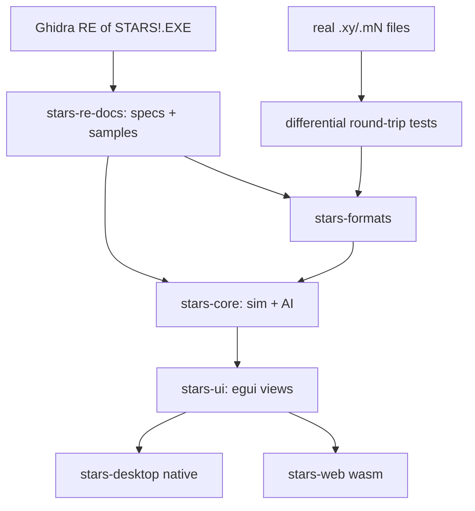

# Stars-re delivery plan

The delivery plan for the project: scope, architecture decisions, RE
methodology, testing strategy and the staged delivery steps. Step status is
marked in **Delivery Steps** below (`✓` done, `*` in progress).

# Requirements

### Overview & Goals
Reverse-engineer the 16-bit Windows 3.1 game **Stars!** (`STARS!.EXE`) and produce a clean, portable **Rust reimplementation** that runs natively on Windows 11, macOS, and Linux, with a **web/WebAssembly** build as a stretch goal.

The binary is a **New Executable (NE)**, `x86:LE:16` protected-mode image (~1350 functions, ~8649 symbols) that depends heavily on the Win16 API (USER/GDI/KERNEL), custom window procedures, and many dialogs (e.g. `RACEWIZARDDLG1-6`, `HOSTMODEDIALOG`, `TRANSFERDLG`, `BROWSERWNDPROC`, `ZIPPRODDLG`, `ORDERINFODLG`). Supporting assets include `stars.exe` (launcher stub), `intro.exe`, `STARS!.HLP`, and `wavemix.dll` for sound. A 280-page manual PDF documents the game rules.

The project is **RE-guided reimplementation**: Ghidra is used to recover the exact data formats and game logic, which are re-expressed as specifications and reimplemented cleanly in Rust — not machine-translated. Correctness is validated primarily through **differential file testing** and **spec-driven test vectors**.

### Scope
#### In Scope
- Reverse-engineering the on-disk **file formats** (`.xy` universe, `.mN` player state, `.hN` history, `.xN` orders, `.rN`/race, `.hst` host) for read/write compatibility with the original game.
- Reverse-engineering and reimplementing the **deterministic game simulation**: production, minerals/resources, fleet movement, scanning, combat, research, planet/population growth, and the RNG that drives them.
- **Turn generation / order processing** pipeline and **single-player vs AI**.
- **Multiplayer**: hotseat and play-by-email (PBEM) via file exchange, matching the original's turn-file workflow.
- A **faithful UI recreation** of the core screens (galaxy map, race wizard, production, ship/planet browsers, reports) using egui.
- **Cross-platform desktop** builds and a **wasm/web** build (stretch).

#### Out of Scope (initially)
- Bit-perfect recreation of the intro (`intro.exe`) and the `wavemix.dll` sound mixer (sound is a later enhancement).
- The original `STARS!.HLP` help viewer (content can be linked/ported later).
- Networked real-time multiplayer beyond the file-based PBEM/hotseat model.
- Modding tools or new gameplay features beyond the original.

### User Stories
- As a player on Windows 11 / macOS / Linux, I want to launch a native Stars! and play a full single-player game against AI so that I can enjoy the game on a modern machine.
- As an existing Stars! player, I want to open my original `.xy`/`.mN` files so that my existing games and universes still work.
- As a group of friends, I want to play hotseat and PBEM turns so that we can continue the classic multiplayer experience.
- As a returning fan, I want the screens and race wizard to look and behave like the original so that the game feels authentic.
- As a casual user (stretch), I want to play in a browser so that no install is needed.

### Functional Requirements
- Parse and re-serialize all core file formats with **byte-accurate round-tripping** of real game files.
- Generate a new turn from player orders that matches the original engine's results for the same inputs (within documented RNG/formula fidelity).
- Reproduce the race-creation wizard, galaxy map interaction, production queue, and the main browser/report dialogs.
- Support starting a new game, saving/loading, hotseat rotation, and PBEM turn export/import.

### Non-Functional Requirements
- **Determinism**: identical inputs + seed produce identical simulation outputs across platforms.
- **Portability**: one core crate reused by native and wasm frontends; no platform-specific logic in the core.
- **Maintainability**: clean, documented Rust with the RE knowledge captured as living specs and tests.
- **Performance**: turn generation and map rendering responsive for large (many-planet) universes.

# Technical Design

### Current Implementation (original binary)
- `STARS!.EXE` — 16-bit NE, `x86:LE:16` protected mode, segmented (many code/data segments; ~165 memory blocks in Ghidra), ~1350 functions, ~8649 symbols. Loaded and analyzed in the provided Ghidra project (`ghidra/Stars`).
- UI is Win16 dialog/window-procedure driven. Notable exported entry points seen in Ghidra: `RACEWIZARDDLG1`–`RACEWIZARDDLG6`, `HOSTMODEDIALOG`, `TRANSFERDLG`, `BROWSERWNDPROC`, `TITLEWNDPROC`, `ZIPPRODDLG`, `ORDERINFODLG`, `ABOUT`.
- Auxiliary files: `stars.exe` (small launcher stub), `intro.exe` (intro), `STARS!.HLP` (WinHelp), `wavemix.dll` + `wavemix.ini` (sound mixing).
- Game rules are documented in `documentation/MANUAL.PDF` (280 pages) — used to cross-check reverse-engineered formulas.

### Key Decisions (confirmed with user)
- **Strategy: RE-guided clean reimplementation** in Rust — Ghidra recovers formats/logic; we write new, maintainable code rather than decompiled C.
- **Language: Rust**, chosen for strong cross-platform + wasm support and determinism.
- **Architecture: headless core + thin frontends** — a pure, platform-agnostic core (game logic + file formats) with separate desktop and wasm frontend crates in a Cargo workspace. No I/O, rendering, or platform code in the core.
- **UI: egui / eframe** — immediate-mode GUI well suited to Stars!'s dense, form/table/dialog-heavy interface; same code compiles natively and to wasm.
- **Fidelity: differential file testing + spec-driven-from-Ghidra** — real game files drive round-trip byte-comparison tests; decompiled formulas/RNG/combat become written specs with test vectors.

### Proposed Changes / Target Architecture
A Cargo **workspace** with clearly separated crates:
- `stars-formats` — binary readers/writers for `.xy`, `.mN`, `.hN`, `.xN`, `.rN`, `.hst`; pure data structs + (de)serialization; no game logic.
- `stars-core` — the deterministic game model and simulation systems (universe, planets, fleets, races, tech tree, production, movement, scanning, combat, research, RNG) and the turn/order-processing engine and AI. No rendering, no filesystem, no platform APIs.
- `stars-ui` — shared egui view code (galaxy map, race wizard, production, browsers, reports) built on top of `stars-core` state.
- `stars-desktop` — eframe/winit native binary (Windows/macOS/Linux) wiring `stars-ui` + file I/O.
- `stars-web` — eframe wasm target (stretch) wiring `stars-ui` with browser storage/file APIs.
- `stars-re-docs` — the reverse-engineering knowledge base: format layouts, formula specs, RNG notes, and captured test vectors that drive the tests.

### Data Models / Contracts
- `stars-formats` exposes typed models and functions, e.g.:
  - `fn read_universe(bytes: &[u8]) -> Result<Universe, FormatError>` / `fn write_universe(&Universe) -> Vec<u8>`
  - analogous `read_/write_` pairs for player (`.mN`), history (`.hN`), orders (`.xN`), race (`.rN`), host (`.hst`).
  - Round-trip contract: `write(read(bytes)) == bytes` for real sample files.
- `stars-core` exposes a deterministic engine, e.g.:
  - `struct GameState { universe, planets, fleets, players, tech, rng_seed, turn }`
  - `fn generate_turn(state: &GameState, orders: &[PlayerOrders]) -> GameState` (pure, deterministic given seed).
  - A dedicated RNG type reproducing the original's PRNG (captured from Ghidra) so combat/minerals/events match.

### Components
- **Reverse-engineering pipeline**: Ghidra decompilation → specs + captured sample files in `stars-re-docs` → Rust implementation + tests.
- **Formats layer** (`stars-formats`): the first correctness anchor via differential tests.
- **Simulation core** (`stars-core`): systems mapped from Ghidra functions (production, movement, combat, research, growth) plus AI.
- **UI layer** (`stars-ui` + frontends): faithful egui recreation of the key dialogs identified in the binary (`RACEWIZARDDLG*`, `ZIPPRODDLG`, `BROWSERWNDPROC`, `HOSTMODEDIALOG`, `TRANSFERDLG`, `ORDERINFODLG`).

### File Structure
```
stars-re/
  Cargo.toml            # workspace
  crates/
    stars-formats/      # file format read/write + round-trip tests
    stars-core/         # deterministic simulation + AI
    stars-ui/           # shared egui views
    stars-desktop/      # eframe native binary
    stars-web/          # eframe wasm target (stretch)
  docs/                 # stars-re-docs: format layouts, formula specs, RNG notes, test vectors
  binary/ documentation/ ghidra/   # existing: original assets, manual, Ghidra project
```

### Architecture Diagram


### Risks
- **Undocumented/obfuscated formats**: Stars! files are compressed/encoded; recovering exact layouts (and any checksums) is the hardest RE work — mitigated by differential byte-comparison against real files.
- **RNG & formula fidelity**: subtle mismatches cascade over turns — mitigated by spec/test-vector capture and (optionally) side-by-side reference runs of the original under an emulator/Wine.
- **UI faithfulness vs. immediate-mode**: replicating exact Win16 layouts in egui takes iteration — mitigated by prioritizing behavior/faithful-enough visuals over pixel-perfection early.
- **Scope size**: this is a multi-year-scale effort; the delivery plan sequences it so each stage yields a usable increment.

# RE Methodology

### Reverse-Engineering Workflow
All RE knowledge is captured as durable artifacts in `docs/` (the `stars-re-docs` knowledge base) so implementation is spec-driven and reproducible.

1. **Map the binary** in Ghidra: cluster the ~1350 functions by segment and by the exported dialog/window-proc entry points to identify UI vs. simulation vs. file I/O regions.
2. **Locate file I/O**: find the load/save routines (likely reachable from `TRANSFERDLG`/host-mode code) and the (de)compression/encoding used for `.xy`/`.mN` files.
3. **Recover formats**: document exact byte layouts (headers, records, bitfields, block encoding, any checksums) as spec docs, with annotated hex from real sample files.
4. **Recover logic**: decompile the production, movement, scanning, combat, research, and growth routines; transcribe formulas and the PRNG into specs with worked **test vectors**. Cross-check against `MANUAL.PDF`.
5. **Implement + verify**: reimplement in Rust against the specs; validate with differential file tests and test vectors; optionally run the original under an emulator/Wine to produce reference turn outputs for the hardest cases.

### Fidelity Strategy (confirmed)
- **Differential file testing** — round-trip real `.xy`/`.mN`/`.hN`/`.xN` files; assert byte-for-byte equality and semantic equality of parsed models.
- **Spec-driven from Ghidra** — formulas/RNG/combat implemented against captured specs + vectors, kept in `docs/`.

### Tooling
- Ghidra (provided project) for decompilation and cross-references.
- Rust `cargo test` for round-trip and vector tests; sample game files stored as fixtures.
- (Optional) winevdm/OTVDM or Wine to run the original 16-bit binary for reference-output generation.

# Testing

### Validation Approach
Correctness is anchored in automated Rust tests driven by the RE specs and real game files, layered from formats upward to full turn generation, then UI behavior.

### Key Scenarios
- **Format round-trip**: `write(read(file)) == file` for every supported extension using real sample files.
- **Model semantics**: parsed structures expose expected values (planet counts, fleet positions, race traits) matching known sample games.
- **Turn generation**: given a saved state + orders, `generate_turn` reproduces the reference next-turn state (from spec vectors and/or original-engine reference runs).
- **Subsystem vectors**: production, mineral growth, movement, combat, and research each pass their captured test vectors, including RNG-dependent outcomes with fixed seeds.
- **Multiplayer flow**: hotseat rotation and PBEM export/import produce valid, engine-consistent turn files.
- **UI smoke**: race wizard, galaxy map, production queue, and browsers open and reflect core state (headless-testable logic separated from rendering).

### Edge Cases
- Corrupt/truncated files and unknown versions fail gracefully with typed errors.
- Very large universes (max planets/fleets) for performance and overflow behavior matching the original's 16-bit limits.
- Determinism across native and wasm targets (same seed → same result).

### Test Changes
- Add fixture directory of anonymized real game files.
- Add per-crate unit/integration tests; add golden test-vector files in `docs/` consumed by `stars-core` tests.

# Delivery Steps

### ✓ Step 1: Scaffold Rust workspace and RE knowledge base
A buildable Cargo workspace and a documentation pipeline exist, ready to receive reverse-engineered specs.

- Create the workspace with empty `stars-formats`, `stars-core`, `stars-ui`, `stars-desktop`, and (skeleton) `stars-web` crates.
- Establish `docs/` (`stars-re-docs`) with templates for format layouts, formula specs, RNG notes, and test vectors.
- Set up a Ghidra triage doc that clusters the ~1350 functions by segment and by exported entry points (`RACEWIZARDDLG*`, `HOSTMODEDIALOG`, `TRANSFERDLG`, `BROWSERWNDPROC`, `ZIPPRODDLG`, `ORDERINFODLG`) into UI / simulation / file-I/O regions.
- Wire up CI-style `cargo build`/`cargo test` and a fixtures folder for real sample game files.

### ✓ Step 2: Reverse-engineer and implement file formats
`stars-formats` reads and byte-accurately re-writes the core Stars! file formats, verified against real files.

- Locate load/save and (de)compression/encoding routines in Ghidra (reachable from transfer/host-mode code).
- Document exact byte layouts (headers, records, bitfields, block encoding, checksums) for `.xy`, `.mN`, `.hN`, `.xN`, `.rN`, `.hst` in `docs/`.
- Implement typed models and `read_/write_` pairs per format in `stars-formats`.
- Add differential round-trip tests asserting `write(read(bytes)) == bytes` on real fixtures plus semantic-equality checks.

### ✓ Step 3: Reverse-engineer and implement the deterministic simulation core
`stars-core` models the universe and reproduces the original's per-subsystem calculations deterministically.

- Define the core data model (`GameState`: universe, planets, fleets, players, tech tree, seed, turn).
- Recover and implement the original PRNG and the production, mineral/resource, population growth, fleet movement, and scanning formulas from Ghidra, cross-checked with `MANUAL.PDF`.
- Capture worked test vectors in `docs/` and add unit tests for each subsystem with fixed seeds.
- Keep the core free of I/O, rendering, and platform code.

**Delivered.** The planetary economy is recovered and implemented: the
simulation PRNG (`Random`/`Randomize`), habitability and maximum population,
population growth and death, mining and mineral-concentration decay, resource
output with the operable mine/factory caps, scanner ranges, and fleet movement
geometry and fuel. Each is specified in `docs/formulas/` citing both the Ghidra
address and the `MANUAL.PDF` page, with golden vectors in
`docs/vectors/planetary-economy.json` taken from the manual's own worked
examples.

Verified two ways: the vectors, and a differential replay of real save files
(`crates/stars-core/tests/differential_growth.rs`) in which 372 of 426
planet-years of the 40-turn Exodus game reproduce the original engine's
population *and* its fractional-population accumulator exactly.

Carried into Step 4/5 rather than done here: everything that depends on ship
designs or the components table — the Alternate Reality population, mining and
resource model, per-design scanner ranges, and engine fuel-use tables — plus
mine-field traversal and stargates.

### ✓ Step 4: Implement turn generation, combat, research, and AI

`stars-core` can advance a full game turn from player orders and play single-player against AI.

- Implement the order/turn-processing pipeline: `generate_turn(state, orders) -> state`.
- Reverse-engineer and implement combat resolution and the research/tech-advance system with RNG fidelity.
- Implement single-player AI opponents (behavior derived from RE + manual).
- Validate turn output against reference next-turn states via spec vectors (and optionally original-engine reference runs).

**Progress.**

Done and verified:

- **The turn pipeline's order** (`docs/formulas/turn-order.md`), recovered from
  `FGenerateTurn`.
- **Research** in full — the cost table, the annual advance, field switching,
  Generalized Research and Super Stealth's theft.
- **The production queue** — item costs and the per-item build loop, wired into
  `generate_turn`.
- **The component tables** — engines, armour, shields, scanners, planetary
  items, beams, torpedoes, specials, bombs, mining and mine layers, plus the 32
  ship hulls and 5 starbase hulls.
- **The ship design layer** — mass, armour, shields, capacities, scanner range
  and cost derived from a hull and its slots.
- **The battle recording (VCR) format**, which is what makes combat testable.
- **Combat** — board, starting positions, movement schedule and search,
  targeting, weapon accuracy, damage resolution and the beam firing loop.
- **Loading a real saved game** into a `GameState`, and generating a turn on it.
- **Fleets** — the model, loading with their waypoints, movement along orders,
  and fuel consumption.

Measured against real save files:

| check | result |
|-------|--------|
| whole-turn replay: planet population | 87% of 438 planet-years, self-contained |
| whole-turn replay: mineral concentrations | 86% |
| whole-turn replay: mines / factories | 67% / 71% |
| whole-turn replay: surface minerals | 27% all three, 83% per mineral within 1 kT |
| whole-turn replay: fleet positions | 378 of 438 exact |
| computer players identified | 3 games, all players, exact |
| mining, isolated | 13,981 of 14,192 readings (98%) |
| resources cover recorded research | 1580 of 1588 player-years (99%) |
| population growth, isolated | 383 of 438 exact, including the fractional accumulator |
| research | 11 accumulation years and 5 priced breakthroughs, all exact |
| ship design mass | 73 of 85 battle tokens exact, rest explained by cargo |
| ship design armour | 493 designs, zero disagreements |
| battle replay, beam-only | 11 of 13 battles reproduce recorded casualties |
| battle movement, beeline | 83 of 83 close on their target |
| battle movement, scored | 455 of 478 among our best-rated (chance 72%) |
| battle movement, phase order | 209 of 209 rounds, 746 moves, 0 over allowance |
| operating mine count, roll-free subset | 4,606 of 4,629 exact |
| terraform reach | 37,712 of 37,743 axis-readings (99.9%) |
| AI terraform order, fresh | 196 of 196 (100%) |
| AI mine/factory decision, isolated | 6,826 of 7,997 (85%; chance 28%, floor 49%) |
| `.xy` planet coordinates vs fleets in orbit | 43,769 of 43,769 exact |

**What is left is bounded by the fixtures, not by effort.** Every subsystem in
this step is now transcribed and implemented; what remains unverified is listed
under "Carried into Step 5 unverified" and needs a corpus this repository does
not have. The items below record where each stands.

1. **The AI players** — identification and the terraform decision verified;
   the rest in progress. `fixtures/games/all-computer-players` (101 turns,
   sixteen computer players, six personalities, four difficulties) makes the
   AI checkable. Which opponent runs a player is decoded and tested; the
   auto-terraform decision is transcribed and confirmed against 5785 recorded
   entries. `vrglpplAi`, the planet list every per-planet AI routine walks, is
   recovered: it is every planet the player owns, shuffled. The mine/factory
   decision reproduces *whether* the AI builds (99% recall, 72% precision over
   21,508 planet-year pairs) but gets the amount right only a third of the
   time; the residual most likely lies in the economy rather than the AI.
   Starbase orders and replacements are transcribed, their shape confirmed on
   2440 planet-turns and their arithmetic on 516 Macinti replacements;
   the colonisation target rule is transcribed and its target now ranks 27%
   exact and 52% within three against a 1% chance rate, using the partial
   planet records the loader now keeps. War and fleet dispatch are now
   transcribed too, and both are unverifiable against this corpus: host files
   carry no battle records and only 56 conquests, and a recorded fleet has
   already arrived, leaving 36 waypoint legs with a warp. Scoring either needs
   `.x` order files, which the fixtures do not include. See
   `docs/formulas/ai.md`.
2. **Orders beyond movement** — **ship building is done**: a queued ship is
   costed from its design, its minerals and resources are spent, and the
   finished ships join a fleet the owner has in orbit. A planet with no fleet
   there reports the ships but cannot place them, because a new fleet needs
   coordinates and a planet's position lives in the `.xy` file rather than in
   `GameState`. This does not move the Exodus replay, which queues five ship
   entries in forty turns; the sixteen-AI corpus is where ships are built.
   Planet **coordinates are now loaded** from the `.xy`
   (`GameState::apply_universe`), so a planet with no fleet in orbit starts a
   new one instead of dropping the ships. Wiring that up caught a decoding bug:
   the `.xy` x chain starts at 1000, not 0 — confirmed because a fleet the
   engine records as orbiting a planet must stand on it, and all 43,769 such
   readings were off by exactly `(1000, 0)` before the fix and exact after.
   **Cargo transfer is decoded and wired in** (`docs/formats/cargo.md`): it is not the
   waypoint's Transport task, which is consumed on execution and reads 0 on all
   50,173 waypoints in the fixtures, but block types 1, 2, 23 and 25 in the `.x`
   order files. Ids and quantities decode; the two mode bytes are constant
   across every sample and are exposed raw. It is **not** the cause of the 27%
   surface-mineral figure — every recorded planet transfer moves colonists, not
   minerals. That figure is now diagnosed (see below).
   **Colonisation and remote mining are now wired in.** Colonisation follows the
   cargo transfers: an unload of colonists from a fleet onto a planet its owner
   does not hold accumulates a `COLDROP`, and `DropColonists` settles every
   landing on a planet together, so rival claims are weighed against each other.
   Remote mining runs from `SatisfyOrders(3)`, gated on the fleet having stayed
   put all turn, being over a planet rather than deep space, and that planet
   being unowned. Neither is verifiable here, and the reason is not the one
   previously recorded: the claim that the triggering waypoint tasks "read 0 in
   every fixture" was measured over type-20 order blocks, which are the 8-byte
   *taskless* form. Type 19 is the full 18-byte `ORDER` with its task union, and
   the fixtures hold 4,331 Transport, 4,935 Colonize, 741 Remote Mining, 1,726
   Lay Minefield and 40 Patrol tasks, all with `fValidTask` set. They still
   cannot verify execution: the tasks ride waypoints the fleet has not reached,
   are consumed on arrival, and a fleet is typically several years en route — of
   2,359 Colonize targets on unowned planets only 14 are taken the following
   year. And no fleet in the corpus carries mining robots: the one player who
   designed them built none, so the remote-mining path never fires.
   **Landing colonists is recovered
   in full**:
   `DropColonists` does both settling and invasion, and its weights (attackers
   110%, War Monger 165%, Alternate Reality 0%; defenders 100%, Inner Strength
   200%) and winner rule are implemented in `stars-core::ground`, along with the queue a new planet inherits from its
   owner's template and the wreckage salvage a captured planet grants. See
   `docs/formulas/ground.md`, and remote mining's fleet mine count
   (`CMineFromLpfl`, capped at 4000) is in `docs/formulas/mining.md`.
3. **RNG alignment through a turn** — investigated twice, searched, and still
   **blocked**, but for a sharper reason than first recorded. The startup
   seeding is `Randomize2(GetTickCount())`, and `Randomize2` writes the same
   state as `Randomize`: both index a 128-entry primes table with two 7-bit
   values, so the generator starts in one of at most 16,256 states however
   arbitrary the clock. That is small enough to enumerate, and mining supplies
   the constraints to test each one — `MineMinerals` draws exactly one
   `Random(100)` per mineral with a non-zero remainder, in planet-id order, and
   a quiet planet's surface change says whether that draw rounded up. The search
   (`examples/rng_search`) tries every seeding against every offset and **finds
   nothing**: a run of 39 where luck reaches 52, and 197 of 242 where luck
   reaches 207. It is not vacuous — given a planted seed and offset it recovers
   them exactly, 556 of 556. So the state is not merely unrecorded; the space it
   lives in has been enumerated and does not yield the stream from these files.
   Consecutive tutorial-mode turns remain the fixture that would settle it,
   because they remove the offset problem entirely. There are two generators; the gameplay one
   (`lRandSeed1`/`lRandSeed2`, driven by `Random`) is never re-seeded when a
   turn is generated, so its state depends on everything the host process did
   since it started and is written to no save file. A recorded turn therefore
   cannot be replayed draw-for-draw from these fixtures, however complete the
   formulas are. The exception is **tutorial mode**: bit 11 of the runtime mode word at
   `DS:0x7ca`, set by `StartTutor`, restarts the generator from `0x499602d2`
   every turn. `fixtures/games/tutorial` was made in that mode but holds a
   single turn state with no consecutive pair. **Consecutive turns played
   through the tutorial** are therefore the highest-value fixture the project
   could add, and anyone with the original executable can produce them. See
   `docs/rng/prng.md`.

   What this blocks:
   Torpedo combat resolution needs the RNG in the right state — its formulas are
   all transcribed and implemented, and only the replay's firing loop is left,
   which cannot be exact without the generator — and so does the
   surface-mineral figure: that 27% is mostly the mining remainder roll, not
   missing consumption. Per reading the model is 61% exact and **83% within one
   kilotonne**, and the error distribution is dominated by 0, -1 and +1 — the
   width of one `Random(100)` roll. The replay starts the RNG fresh instead of
   in the state the original had reached, so the rolls are independent of the
   original's. Aligning the stream would take per-mineral agreement to about
   83% and the all-three figure to roughly 57%. The genuinely unmodelled
   residual is the 8% of readings off by six or more — a far smaller target
   than 73%. The residual movement-scoring gap is **resolved**, and it was not in the model
   at all: `DxyMoveTokTo` and the damage estimate had both been cleared, and the
   loss was in the replay harness, which never applied the recorded casualties
   and never updated `moves_left`. A token's remaining moves size its search box
   and decide whether an enemy can close on it, so a stale value put moves in
   the wrong branch entirely. Fixing both took beelines from 105 of 111 to
   **83 of 83** and scored moves from 84% to **94%** against an unchanged 72%
   chance rate — a gap of 22 where the best previously recorded was 15
   (`docs/formulas/combat.md`).
4. **Terraforming** — recovered and applied during the turn, and now verified
   end to end. The reach model is right for 37,712 of 37,743 axis-readings
   (99.9%) and unblocks `PctPlanetOptValue` and the colonisation gate; the step
   count is `IpctCanTerraformLppl` and matches **196 of 196** of the AI's fresh
   terraform orders once those are reconstructed as `recorded + built that
   turn`; and the factor a step moves is `IBestTerraform`'s gain per click,
   **not** the manual's "furthest out of range". Wiring it in let the
   whole-turn replay stop feeding itself the recorded environment: population
   is now 85% standing on its own, against 82% without terraforming and an
   87% that was reading the answer. See `docs/formulas/terraforming.md`.

###   Step 5: Build the egui desktop frontend with faithful core screens
`stars-desktop` runs a playable single-player game on Windows/macOS/Linux with recreated key screens.

- Build shared `stars-ui` egui views: galaxy map/starfield, race-creation wizard (mirroring `RACEWIZARDDLG1-6`), production queue (`ZIPPRODDLG`), and ship/planet browsers/reports (`BROWSERWNDPROC`, `ORDERINFODLG`).
- Wire `stars-desktop` (eframe/winit) to `stars-core` and `stars-formats` for new-game, save/load, and turn generation.
- Recreate original layouts/behavior faithfully; keep rendering-independent view logic testable.

#### What Step 4 settled that changes this

**Orders now execute, so there is a game to put a UI on.** An earlier revision
of this section opened by saying the turn generator "does not execute waypoint
tasks at all", and put that at the head of the step. It is done:
`generate_turn_with_orders(state, orders, rng)` applies the recorded cargo
transfers as `DoOrders(0)`, settles the colonist landings they cause through
`DropColonists`, and runs remote mining from `SatisfyOrders(3)`. `generate_turn`
keeps its old signature and delegates with no orders.

That revision also justified the gap with a claim that is **wrong**: that "all
50,173 waypoints in the fixtures read task 0". They do not. An order is the
NB09 `ORDER` struct — an 8-byte header plus a 10-byte task union — and the file
writes it as one of two block types. Type 20 is the header alone and is always
taskless; **type 19 carries the union and always carries a real task**. Counted
over both, the fixtures hold 4,331 Transport, 4,935 Colonize, 741 Remote
Mining, 1,726 Lay Minefield and 40 Patrol tasks. Reading only type 20 finds
task 0 everywhere by construction. See `docs/formats/waypoint.md`.

**Planet coordinates and names are loaded.** They live only in the `.xy`, and
`GameState::apply_universe` now fills `Planet::position` and `Planet::name`.
The galaxy map has what it needs. Wiring that up also found a decoding bug: the
`.xy` x chain starts at **1000**, not 0 — confirmed because a fleet the engine
records as orbiting a planet must stand on it, and all 43,769 such readings
were off by exactly `(1000, 0)` before the fix and exact after.

**A `GameState` is one player's view, not the truth.** `planets` holds what can
be simulated; `known_planets` holds what has only been scanned, and
`Planet::detail` says which. The scanner pane must render the two differently —
that distinction *is* the fog of war, and it falls out of the loader rather than
needing UI-side bookkeeping.

**A player's file holds only that player's own ship designs**, and a battle
recording names a token's design by *slot number* — slot 3 of one player is not
slot 3 of another. Any screen that shows an enemy ship must not look its design
up that way. What the recording does carry is the token's initiative range, and
`initMin == 0xFF` means it has no weapons at all; that is enough to draw an
armed ship apart from an unarmed one. Anything finer — an opponent's armour, its
weapons — is simply not in the file.

**The production dialog is race-dependent, and the rule is already written
down.** An Alternate Reality race builds no planetary installation and a Claim
Adjuster never terraforms; `ground::template_allows` encodes exactly the filter
the game applies. The dialog should drive off it rather than reimplement it. The
Claim Adjuster half of that is not just a template filter but a consequence:
`AutoTerraform` leaves its planets at their optimum every turn, so
`IpctCanTerraformLppl` is zero and the item is never offered.

**A queue entry is a running balance, not an order.** Its fields are
`count:10, item:7, class:3, completion:7` — remaining count and percent paid,
not what was chosen. The dialog should present it that way. Auto-build items
are their own ids (`mdIdleFactory` 7, `mdIdleMine` 8, `mdIdleDefense` 9,
`mdIdleAlchemy` 11, `mdIdleTerraform` 12), not a flag; ship entries carry
`class = grobjFleet` and a design slot, 0-15 for ships and 16-25 for starbases.

This is worth stating as a general rule for the whole UI, because it caught out
three separate subsystems during Step 4: **anything the game counts down is a
balance, not a record of a decision.** A screen that shows "4 terraform queued"
is showing what is left, not what was ordered.

**The Selection Summary's habitability figure is two numbers**, current and
after terraforming, and both are implemented — `hab::pct_planet_desirability`
and `colonise::pct_planet_opt_value`, with `terraform::reachable_band` for the
environment graph's bars. The graph's direction-selection arm is now read too:
it was `FCanTerraformLppl`'s `fHelp == 0` branch, which looked backwards because
that flag means *hostile*.

**Diplomacy has data behind it.** `Player::relations` is loaded — one byte per
player, `0` neutral, `1` friend, `2` enemy. Combat and remote terraforming both
read it, so a relations screen is wiring rather than reverse engineering.

**Save files are version-dependent.** Two format details already differ between
2.6 and 2.8 — the battle action record and the three-player starting squares —
and every format in `docs/formats` was recovered from one game or one binary.
The loader must not assume a version; `ActionLayout::for_version` is the
precedent for how to handle it.

#### What the battle screen can and cannot show

Combat came a long way in Step 4 and the VCR is the best-supported screen, but
its limits are specific and worth knowing before it is drawn:

| | state |
|-|-------|
| board, starting squares, movement schedule | verified |
| the three-phase movement round | verified — 209 of 209 rounds, 746 moves |
| movement scoring | 455 of 478 (95%) against a 72% chance rate |
| beam firing, gattlings, target classes | implemented |
| casualties reproduced from a recording | 11 of 13 battles |
| torpedo firing loop | implemented; its **accuracy formula is unverified** |
| exact replay of any battle | impossible — every tie-break and torpedo roll draws from an RNG whose state is not in the files |

The VCR should therefore *play the recording*, not re-simulate it. The recording
carries every move, every shot and every casualty; re-deriving them can only
disagree.

#### Suggested order

1. ~~**The battle VCR.**~~ **Done.** `stars_ui::vcr` prepares a recording for
   playback — one frame per action, each carrying the board as it stood after
   it — and steps forward and back over it. It plays the recording rather than
   re-simulating, and the test of that is not agreement with our combat model
   but with the engine: played to the end, all **47** recordings reproduce the
   casualty totals the recording states independently of its action list, over
   746 moves, 164 shots and 31 disengages. Rendered as text by
   `stars <file> --vcr [id]`; the egui version is a drawing layer over the same
   view-model.
2. ~~**The egui shell.**~~ **Done.** `stars` with no arguments, or with a save
   file, opens a window; `--summary`, `--turn` and `--vcr` keep the text tools.
   The split that matters is that **`stars-ui` depends on `egui` alone** — pure
   Rust, builds anywhere — while the native windowing stack (`eframe`, `winit`,
   `rfd`) lives only in `stars-desktop`. CI grew one step installing the Linux
   system libraries that stack needs.
3. ~~**Galaxy map and scanner.**~~ **Done.** The map fits the universe to the
   panel, draws owned planets solid and merely-scanned ones hollow — the fog of
   war falling out of `planets` versus `known_planets` — and says plainly when
   no `.xy` was found rather than piling every planet on the origin.
   `planets` versus `known_planets` is the fog of war.
4. ~~**Planet and fleet detail panes.**~~ **Done** as read-only views,
   including the two habitability figures, the terraforming band, and a
   production queue presented as the running balance it is. The environment
   *graph* is still a table of numbers rather than a drawing.
5. ~~**The production dialog.**~~ **Done.** A planet's queue can be added to,
   reordered and emptied, with the build list coming from
   `ground::template_allows` rather than a fixed menu — so a Claim Adjuster is
   never offered terraforming and an Alternate Reality race is offered no
   installation at all. **Turn generation** is wired to a button, and reports
   what it did *and what it did not simulate*.
6. ~~**Order entry and saving.**~~ **Done, for four kinds of order.** Cargo can
   be moved between a fleet and the planet it orbits, a fleet can be sent to a
   planet at a chosen warp, research can be dialled, and a production queue
   edited. A transfer is applied **at once** and logged, which is what the game
   does — an order file records what the client already did, not what it intends.
   **Saving writes back only what was changed**: 2,063 fixture files save
   byte-for-byte identical when untouched, and an edited queue survives a save
   and reload. See "Saving is not re-encoding" below.
7. ~~**Waypoint tasks.**~~ **Done for the two that matter.** The turn generator
   now runs arrival tasks after movement: **Colonize** puts a fleet's colonists
   on the unowned planet it orbits and settles it through the ordinary landing
   path, and **Transport** performs its per-cargo instructions. Both are
   settable from the fleet screen, and a task is **consumed when it runs** —
   which is why every waypoint in a saved game that has already been reached
   reads zero. Decoding the Transport payload closed a documented open question
   in `docs/formats/waypoint.md`.
8. ~~**The new game flow.**~~ **Done.** `stars_core::newgame::generate` is a
   transcription of `GenerateWorld`: it scatters and thins the planets, names
   them from the master table, rolls their environments and mineral
   concentrations, places the homeworlds inside the distance band the
   "distance between players" setting scales, sets each player's starting
   technology from their primary trait, stocks their homeworld, spends the
   leftover advantage points on it and hands out their first ships. The
   universe it produces is written as a real `.xy`
   (`Universe::create` and the new `FileHeader::to_payload`). The New Game
   wizard is a `stars-ui` screen; `stars --new <name>` does the same from the
   command line.

   Nearly all of it is **verified against `fixtures/incoming/turn0/`**, a real
   turn-0 three-player game: the planet-count formula on all nine distinct
   universes, the environment and concentration distributions against 600 real
   planets, the homeworlds' installations, environments and mineral stock, the
   leftover-point spend, all six starting ship designs slot for slot, their
   fuel loads, and the identity of the two computer players. See
   `docs/formulas/new-game.md` and `docs/vectors/new-game.json`.

   Two departures from the reconstructed `create.c` were forced by that fixture
   and are documented there: the engine substitution list ends **Long Hump 6,
   Fuel Mizer** rather than the other way round, and the mining list falls back
   to the original part rather than downgrading it.

9. ~~**The race wizard's pricing.**~~ **Done**, though not the wizard itself.
   `CAdvantagePoints` (`10e0:444c`) and the habitability integral it rests on,
   `LInnateRaceHabitability` (`10e0:4cb2`), are transcribed in
   `stars_core::advantage`. It prices the stock Humanoid at exactly 25, which
   the turn-0 fixture confirms twice over — and that is the only independent
   check the corpus offers, because **a computer player never consults the
   function**: its homeworld is stocked with the full fifty leftover points
   whatever its race costs. What remains is the wizard's own screens: a race can
   be chosen from the ten primary traits or loaded from a `.rN` file, but not
   designed.

10. ~~**The `.hst` and `.mN` writers.**~~ **Done.** Every record type a save
    file holds now has an encoder that is an exact inverse of its decoder,
    asserted over **1,576,529 blocks** in the fixtures — planets, fleets,
    waypoints, designs, players and races, battle plans, production queues and
    space objects — plus a packed-string encoder checked on 230 distinct names.
    `stars_core::save` assembles them into a host file and one turn file per
    player, and `stars_ui::App::save_new_game` writes the whole set (`.xy`,
    `.hst`, `.m1`…) and re-opens the game from it.

    The test that matters is not the round trip but the comparison with the
    original engine: the turn-0 fixture is loaded and written out again, and
    **190 of its host file's blocks and all 67 of its three turn files' come
    back byte for byte**. The only things excused are the file header — whose
    version word and cipher salt are ours to choose — and the two sections a
    `GameState` does not carry, space objects and messages.

    Doing it record by record found two decoder bugs that the whole-file round
    trip could never have caught, because a block's payload was being kept
    verbatim: planet blocks were dropping the concentration-decay accumulators
    the mining formula reads, and the plural race name was read past its length
    byte, decoding padding as trailing spaces in 54,185 blocks. It also
    disproved a conclusion in `docs/formulas/new-game.md`: the two racial traits
    that do not fit the sixteen-bit trait field are stored in the checkbox byte,
    so the built-in opponents really do have Cheap Factories. See
    `docs/formats/writing.md`.

11. ~~**The `CAdvantagePoints` discrepancy.**~~ **Resolved, and it was not the
    function.** The turn-0 homeworlds implied that the built-in opponents were
    stocked as fifty-point races while the transcription priced them well below
    zero. The disassembly of `GenerateWorld` shows why: `iT = 50` sits under a
    test on `fAi` **alone**, with the difficulty test nested inside it and
    gating only the population bonus. The reconstructed `create.c` flattens the
    two into `if (fAi && lvlAi > 2)`, which is what sent the earlier
    investigation after the pricing function.

    So a person spends `min(50, CAdvantagePoints)` and a computer player spends
    fifty; from Tough upward it also gets the mineral-concentration bonus, and
    from Expert upward a tenth more colonists. Verified against **every
    homeworld in all three real turn-0 games** — 34 of them, covering all six
    personalities at all four difficulties: every population, concentration and
    surface stock is now reproduced exactly. The difficulty field also turned
    out to be three bits, not two.

    This was the third reading of the same observation, and the second one that
    a piece of the reconstructed C had misled. The rule that keeps holding is
    that the observable was wrong, not the model.

12. ~~**The `.x` order file writer.**~~ **Done.** Every operation record has an
    encoder that is an exact inverse of its decoder, and all **58** `.xN` files
    in the fixtures rebuild byte for byte from their parsed logs — 878 records
    over eight types. `stars_ui::App` keeps the log as the player acts, because
    an order file records what the client already did: cargo transfers and
    fleet orders go on as events, while the production queues and the research
    setting are state and get one replacing record each at the end. Saving
    writes `<base>.xN` beside the state file.

    The log header's `lSerialNumber` and `rgbConfig` turned out not to be
    per-game identity at all: `FWriteLogFile` fills them from `vSerialNumber`,
    the **registration serial of the copy of Stars! that wrote the file**, and
    `vrgbEnvCur`, a **fingerprint of the machine** — the host compares the pair
    across players to catch two people submitting from one registration. This
    project writes zero, because it has no registration and inventing one would
    be forging a licence key; a serial already sitting in a `.xN` beside the
    save is copied over instead. See `docs/formats/orders-x.md`.

13. ~~**Reading `.x` files in the turn generator.**~~ **Done**, which closes the
    loop: a player can now open their turn file, give orders, submit, and have
    a host pick the submission up off the disk and generate the year from it.
    `stars_core::replay` applies a log to the host's state — waypoints,
    production queues, research, planet routing and ship designs immediately,
    where the client had already applied them, and cargo transfers into a
    `TurnOrders` for `DoOrders(0)`, because a transfer applied there feeds the
    same year's growth.

    A log arrives from the player's machine, so nothing in it is taken on
    trust: every operation is checked against the player whose file it was, and
    what fails is counted rather than obeyed. Operations the replay does not
    implement — fleet splits and merges, relations, battle plans, renames — are
    named in the report rather than dropped silently.

    `stars <file.hst> --turn` replays every `.xN` beside the host file that
    names that game and that year. The graphical shell does the same, skipping
    its own player's log, which this session already applied as the orders were
    made.

14. ~~**Fleet splits, merges and renames.**~~ **Done**, and decoding them
    corrected the spec. `rtLogFleetCargoXfer` (23) is not a cargo transfer at
    all: its wider mask names the sixteen **ship design slots** and its
    quantities are ship counts, which is how a split moves ships into the new
    fleet. Every one of the 45 such records in the fixtures names a design slot
    the source fleet actually holds, checked against the same turn's state
    file, and every quantity is a small count rather than a cargo amount.

    `rtLogFleetSplit` (24) is two bytes naming the fleet, with the transfer
    that follows doing the work; `rtLogFleetMerge` (37) is a list of fleet ids
    of which **the first survives**, which seven of the nine merges in the
    exodus game confirm against the next year's state file (the two exceptions
    are a survivor lost that year and reused fleet numbers). All 53 records
    round-trip, and the replay creates the new fleet, moves the ships, absorbs
    the merged fleets and applies the rename.

    The frontend makes these orders by **replaying them** — the same function a
    host runs on the submitted log — so a session's own copy and the host's
    cannot drift. A rename is the one operation that does not survive a save:
    the type-21 block that holds fleet names appears in no fixture, so its
    layout is unverified.

15. ~~**The fleet-name block.**~~ **Done**, entirely from the binary: no file in
    the fixtures contains one, because nobody renamed a fleet in any captured
    game. `WriteFleet` (`1070:8776`) writes the fleet, its orders, and then —
    only when `FLEET.lpszName` is set — a type-21 block holding the name;
    `WriteRtString` (`1070:87b4`) shows the payload is the ordinary packed
    string field with one escape, a length byte of `0` meaning the packed form
    did not fit in its 31-byte budget and what follows is the string itself,
    NUL-terminated. The `.xN` rename order carries the same field.

    Reading, writing and replaying all handle it, including through the
    edit-preserving save path: a rename inserts the block after the fleet's
    waypoints, a change replaces it, and clearing the name removes it.

16. ~~**Relations, battle plans and the two flag operations.**~~ **Done**, which
    leaves one order operation in the format undecoded. `rtLogFleetFlagBit9`
    (10) is the **repeat-orders** flag — bit 9 of the fleet's flag word, hence
    the name; `rtLogFleetOrderAttrNib` (11) sets one waypoint's task nibble,
    bounds-checked against the fleet's order count and the highest task the
    enumeration defines; `rtLogFleetPlan` (42) picks the fleet's battle plan;
    and `rtLogRelations` (38) carries the player's whole relations table, one
    byte per player, which the client rewrites in place rather than appending
    a second record.

    All four round-trip, replay, and are reachable from the fleet and player
    screens. `Fleet` gained `repeat_orders`, which the loader and both writers
    had been dropping, and the edit-preserving save path patches the two fleet
    fields by decoding the block, overwriting them and re-encoding — so nothing
    unmodelled in it is lost.

17. ~~**The default production queue.**~~ **Done**, which leaves **no operation
    in the order format undecoded**. `rtLogPlayerZpq1` (46) carries
    `PLAYER.zpq1`, and the same structure turns out to occupy the last 26 bytes
    of every player block — offsets 86 to 111, most of the region the writer had
    been preserving without knowing what it was.

    It is the queue a planet starts with when it becomes that player's. 49 of
    the 7,040 full-data player blocks in the fixtures carry a non-empty one, and
    every single one decodes to the same thing — 100 factories, 100 mines, 100
    defences, no research — which is the queue a Stars! player conventionally
    sets for new colonies. That is a corpus verification, not just a reading of
    the binary.

    `turn2.c` applies it wherever a planet changes hands, with two racial
    filters that are the ones `ground::template_allows` already knows: an
    Alternate Reality race queues no planetary installation, a Claim Adjuster no
    terraforming. `orders::apply_default_queue` does the same, and the player
    screen edits the queue.

18. ~~**The `rtLogFleetOrderAttrNib` fixture gap.**~~ **Closed — by showing
    there was no gap to fill.** Type 11 was the one order operation with no
    example anywhere in the corpus, and its layout rested on the reconstructed
    `log.c` alone. It is absent because **nothing in `stars.2.7j.exe` writes
    it**: `WriteMemRt` (`1048:a130`) is the only routine that appends to the log
    buffer, and all 24 of its call sites were read — 23 push a constant record
    type, and the one computed type is picked from the three cargo-transfer
    widths. No fixture can ever contain a type-11 record, so the operation was
    re-derived from the host's replay arm at `1048:c3f0` instead, and pinned by
    eight worked examples in `docs/vectors/order-attr-nib.json`.

    Reading the arm rather than the reconstruction changed the decoder: the
    original tests the value word against 10 **before** masking it, so `0x10` is
    refused even though its nibble is a legal task. `FleetOrderTask` now keeps
    the raw word — which also makes it round-trip bytes it did not write — and
    the replay bound is the original's.

    The same sweep of the call sites named a writer for every other operation
    (the table in `docs/formats/orders-x.md`) and turned up two more record
    types a client can log that this project does not model: `rtBtlPlan` (30),
    a battle plan's own definition, and `rtChgPassword` (36). Neither appears in
    any fixture either, but unlike 11 they have writers, so a real log could
    carry one.

19. ~~**Battle plan definitions (`rtBtlPlan`, 30).**~~ **Done.** The previous
    step turned this up as an operation a client can log that this project did
    not model: type 42 says which plan a fleet fights under, but nothing wrote
    the plan itself. Now `Player` carries its battle plans, the loader reads
    them out of the file's type-30 blocks instead of assuming the five
    defaults, the writers put back what the player holds, and the plans screen
    edits them.

    The payload is byte-for-byte a state file's type-30 block — `WriteBattlePlan`
    (`1070:89b8`) fills one buffer and hands it either to `WriteMemRt` or to the
    block writer — so the existing, fixture-verified decoder reads both, and the
    only new format work was the **delete** form: two bytes, flagged by bit 6 of
    byte 1, which is also how the replay recognises it.

    Reading the host's arm (`1048:c287`) settled three things the block spec had
    left open. Byte 1 is a tactic **nibble** plus flags, not a whole tactic. The
    field ranges are tactic `0..=6`, both targets `0..=8`, sixteen plans per
    player. And a plan is routed by the slot nibble in its first byte, which
    `ReadBattlePlan` stamps back — worth knowing, because the two default plans
    *Sniper* and *Chicken* both ship carrying slot 3, so an untouched default's
    nibble cannot be trusted; this project stamps the slot on everything it
    writes.

    Deleting is the interesting one. `DeleteBattlePlan` (`10f0:1706`) shifts the
    following plans up, restamps their ids, and walks the player's fleets moving
    every plan index at or past the deleted slot down one — including a fleet
    that was using the deleted plan. That decrement is a plain byte subtract, so
    deleting slot 0 leaves such a fleet on 255; the engine keeps the wrap,
    because a host that clamped would part company with the client that wrote
    the log.

    What the tactic and target *values* mean is still not decoded — the names
    live in the executable's resource strings, which nothing here reads yet — so
    the editor shows them as numbers with the ranges enforced. That leaves
    `rtChgPassword` (36) as the only operation a client can log that this
    project does not model.

20. ~~**The turn password (`rtChgPassword`, 36).**~~ **Done, and with it every
    operation a 2.7j client can log.** Stars! stores no password: it stores a
    32-bit fold of the typed text (`LSaltFromSz`, `1040:59ce`) at offset 12 of
    the player block — the field `race-r.md` had already named from an
    independent source — and compares salts when asked for it again. The order
    record is those same four bytes, `0` meaning cleared.

    `Player` carries the salt, the loader and both writers move it, the replay
    arm (`1048:c65c`) applies it, and the player screen sets and clears it. The
    text never leaves the text box: only its salt reaches the game, the file and
    the log, which is exactly what the original does.

    Two things worth writing down. The corpus pins the *field* but not the
    *fold*: 6,969 of the 7,040 full player blocks carry one and the same
    non-zero salt — the exodus games were set up with a single password — and
    the other 71 carry `0`, so `0` = none is confirmed while the transcription
    of `LSaltFromSz` rests on the disassembly alone. And the fold is a
    checksum, not a password hash; it was never more than a way to stop the
    other players in a play-by-mail game opening each other's turns by accident.
    This project stores what the game stores and offers no way back the other
    way, because the game itself only ever compares salts.

21. ~~**The waypoint tasks beyond colonise and transport.**~~ **Merge, scrap
    and route are done; lay mines and patrol are specified but not performed.**
    `docs/formulas/waypoint-tasks.md` covers all ten tasks, what each one does
    and where it is in the binary.

    Counting the fixtures first turned out to be the useful move: 6,892 of the
    unimplemented waypoints lay minefields, 40 patrol, and **merge, scrap,
    route and give appear zero times**. So the four cheap tasks are the ones
    nobody in the sample used, and the two that matter need a subsystem. Three
    of the four are now simulated — give is a long routine that has to carry a
    fleet's designs across to another player, and nothing in the corpus
    exercises it.

    Scrap is the one with a real formula: a third of each ship's build cost
    plus the hold, of which the planet keeps 80% with a starbase and 50%
    without (`CreateSalvage`, `10f0:7ee8`). Scrapping in deep space drops a
    salvage object this engine does not model, so those minerals are lost.
    Merge and route came out of `Merge2Fleets` and `AutoRouteFleet`; route
    needed `PLANET.idRoute` in the model, which is stored one-based so that
    zero can mean "no route", and merge needed the waypoint's target **class**,
    because a bare id cannot tell planet 7 from fleet 7.

    Lay minefields is specified in full — the payload is a countdown of years
    with `5` meaning *indefinitely* (which is what all 6,836 well-formed
    examples in the fixtures hold), a fleet must sit still to lay unless the
    player is Space Demolition, and the count is
    `10 × Σ ships × Σ slot count × part ability`, the ×10 confirmed against the
    component table. What stops it being performed is that there is nowhere to
    put the mines: a minefield object model, the file's object section, and the
    rules that make a field matter are a subsystem of their own and the obvious
    next step.

22. ~~**The minefield subsystem.**~~ **Done: laying, growth and traversal.**
    `docs/formulas/minefields.md` is the spec. `GameState` now holds
    minefields, reads them out of a file's object section and writes them back
    — and carries the objects it does *not* model, so saving a game no longer
    quietly deletes its wormholes and packets.

    A field is a circle whose **radius in light years is the square root of its
    mine count**, which is why the file stores no radius: the laying code tests
    containment by comparing the squared distance against the count. The three
    kinds differ by four tables in the executable, all read out rather than
    recalled: safe warp `4, 6, 5`; hit chance `0.3%, 1%, 3.5%` a light year per
    warp over that; damage a ship `100, 500, 0`; and a minimum total of `500,
    2000, 0` for a fleet of four or fewer, which is what makes a lone scout an
    expensive way to find a minefield.

    Laying: a fleet must have sat still all year unless its player is Space
    Demolition, who lay while moving at half rate; the count is
    `10 × Σ ships × slot count × part ability`; each of the three kinds goes
    into its own field; and the mines join the nearest of the player's own
    fields that already **reaches** the fleet, moving its centre toward the
    fleet weighted by the two counts, or start a new field. The order counts
    down years, with `5` meaning indefinitely.

    Flying through one: the speed that matters is recovered from the distance
    travelled rather than read from the order, only a non-friend's fields are a
    hazard, and each light year inside one is its own roll. The first hit stops
    the fleet where it happened.

    Verified against real data: the 2450 exodus turn's minefields load, keep
    their counts, kinds, owners and centres, and come back unchanged through a
    save. Not modelled: decay, sweeping, detonation, and the interval merging
    and shield absorption inside the damage step.

23. ~~**Minefield decay and sweeping.**~~ **Done, and detonation with it.**
    The three rules that make a minefield a balance rather than a ratchet:

    **Decay** (`ThingDecay`, `10b8:70c6`, step 8 of the turn): two percent a
    year plus four for every planet inside the circle — one for a Space
    Demolition player, whose fields last four times as long — capped at fifty,
    and twenty-five more if the field is armed. A standard field never loses
    fewer than ten mines whatever the percentage says, which is why a small
    field evaporates in a couple of years unless it is fed; speed bumps have no
    such floor.

    **Sweeping** (`SweepForMines`, `10b8:76a4`, step 14): every fleet with
    beams, then every planet with a starbase, clears the fields it sits in that
    belong to someone it is not friendly with. A design sweeps
    `Σ range² × count × damage` over its beam slots — a starbase reaching one
    square further, a gattling sweeping as though its range were 4, and a
    sapper sweeping nothing. A speed bump gives up a third of that. The rule
    worth knowing: if the sweep would take the field below the sweeper's own
    distance from the centre it takes exactly enough to leave the field just
    short instead, so a fleet can shrink a field until it is standing outside
    it, but only one at the very centre clears it away.

    **Detonation**: an armed field goes off under everyone standing in it, with
    no roll, at the top of `ThingDecay`.

    A hit now costs the field too — a twentieth of it, or a hundredth once that
    passes fifty — and the fleet that found it can see it afterwards. What is
    left unmodelled is inside the damage step: the interval merging, the
    engine-count scaling and shield absorption.

24. ~~**The patrol task.**~~ **Done.** The forty patrol waypoints in the
    corpus all carry an **all-zero payload**, which turned out to be the answer
    rather than a dead end: the payload is the patrol's warp and range, and
    zero means the defaults — fifty light years.

    Patrol is not run by `SatisfyOrders` at all. It runs while each player's
    turn file is **written**, because what a patrol does is decided from that
    player's own view; this engine runs it at the end of a generated year.
    `FCheckPatrolWP` (`10f8:71ac`), a tutorial checker rather than the
    implementation, is what gives away where the range lives: `ORDER + 0x0a`.

    The search takes the nearest enemy fleet the battle plan will attack and
    that matches its primary target class, preferring one no other patroller
    has claimed this pass, within `iDist × 50 + 50` light years — the tenth
    setting meaning *as far as it takes*.

    Two rules came out of it that combat will want as well: **who a fleet will
    attack** (`FAttackPlayer`, `10f0:ae06`) reads the "attack who" byte of its
    battle plan against its owner's relations, and **what counts as a target**
    (`FMatchTarget`, `1038:6612`) classifies by the **hull's** category rather
    than by what is fitted to it.

    Fixed while in there: the arrival-task pass was cancelling any task on a
    fleet that was not orbiting a planet, which would have quietly killed a
    patrol or a minefield order in deep space. Only colonise and transport
    need a planet.

25. ~~**Giving a fleet away.**~~ **Done, and with it every waypoint task.** The
    arm at `10b0:932b` is long enough that the community reconstruction gives
    up on it, but it comes apart into four rules.

    **Who gets it** is the waypoint's `id` counted among the *other* players:
    an index at or above the giver's own is shifted up by one, so the stored
    number is a position in the list of everybody else. **A fleet carrying
    colonists cannot be given** — `FLEET.rgwtMin[3]` at `10b0:9436`; people are
    not a gift. **The recipient must have room for the designs**: an identical
    design they already hold is reused, the rest need free slots, and if any
    design has nowhere to go the whole gift is refused. Then the fleet changes
    hands, its stacks remapped onto the recipient's design slots.

    No fixture contains one, so this rests on the binary alone; the messages
    are not modelled.

26. **What is still missing to call it playable.** Every waypoint task is now
    simulated; a loaded state file cannot carry
    structural fleet changes back (the game does not either — the order log
    does); and neither generation nor the writers carry wormholes, the Mystery
    Trader, messages, battle recordings or scores, all of which live in
    structures `GameState` does not model.

#### Saving is not re-encoding

A save file is mostly data this project models partially or not at all. A save
that re-derived the file from `GameState` would quietly lose whatever was not
understood, so saving keeps the file exactly as it was read and replaces only
the blocks the player changed.

Two boundaries turned out to matter, and both were found by a test asserting
that an untouched game saves byte-for-byte:

- **Only edited queues are rewritten.** Re-encoding an untouched queue from the
  simulation's own model produced different bytes, because that model is a
  simplification of the file's.
- **Only the latest segment is rewritten.** A `.mN` can hold several turns —
  Exodus's do — and the game state is read from the last of them. Writing the
  current queues over an earlier turn's would corrupt the history the file is
  keeping.

The production queue is the one record type that can now be *written*
(`ProductionQueueRecord::encode`), and it round-trips on all 26,938 queue blocks
in the fixtures before ever being asked to write an edit.

#### Carried into Step 5 unverified

These are implemented and unit-tested but have no fixture that can confirm them.
None blocks the UI; all are worth revisiting if a richer corpus appears.

- **Torpedo accuracy.** Only 8 of 100 recorded volleys yield a clean hit count —
  24 shots, which decides nothing. Any game with more torpedo fire would settle
  it, RNG or not.
- **Bombing.** The fixtures are full of bombs but a run leaves no record of its
  own, and a population drop cannot be attributed to it.
- **Gattlings.** No Exodus design carries one, and Exodus holds the only battle
  recordings.
- **Remote terraforming and remote mining.** The one Orbital Adjuster in the
  corpus sits over its owner's already-optimal homeworld; no fleet anywhere
  carries a mining robot.
- **RNG alignment.** Searched and not found: the seeding reaches only 16,256
  states, and every one was tried against every offset. See `docs/rng/prng.md`.

###   Step 6: Add hotseat and PBEM multiplayer
Multiple humans can play via shared files and play-by-email turn exchange.

- Implement hotseat rotation and per-player state isolation in the frontend + core.
- Implement PBEM turn-file export/import using the `stars-formats` `.xN`/`.mN`/`.hst` handling and host-mode logic (`HOSTMODEDIALOG`, `TRANSFERDLG`).
- Add tests ensuring exported/imported turn files are engine-consistent and round-trip cleanly.

###   Step 7: Web/WebAssembly build (stretch)
`stars-web` runs the game in a browser via the same core and UI.

- Compile `stars-ui` through eframe to wasm in `stars-web`.
- Implement browser file/storage integration for loading/saving games and turn files.
- Verify determinism parity between native and wasm builds (same seed produces identical results).
- Provide a static hosting build and smoke-test the core play flow in-browser.