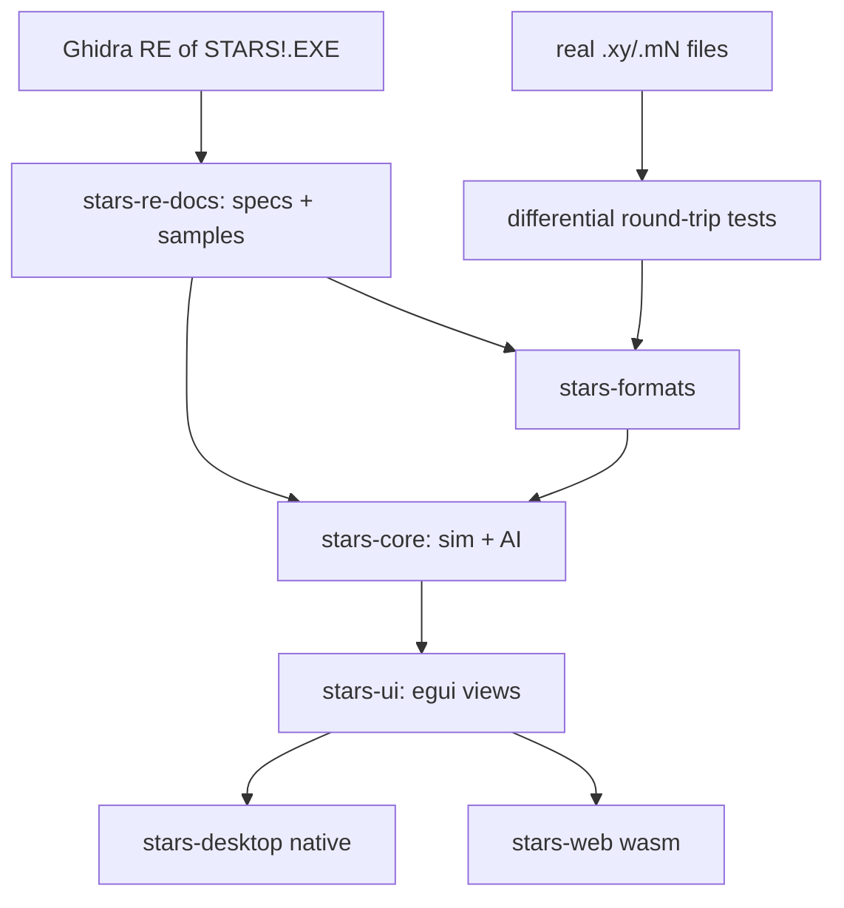

# Stars-re delivery plan

The delivery plan for the project: scope, architecture decisions, RE
methodology, testing strategy and the staged delivery steps. Step status is
marked in **Delivery Steps** below (`✓` done, `*` in progress).

# Requirements

### Overview & Goals
Reverse-engineer the 16-bit Windows 3.1 game **Stars!** (`STARS!.EXE`) and produce a clean, portable **Rust reimplementation** that runs natively on Windows 11, macOS, and Linux, with a **web/WebAssembly** build as a stretch goal.

The binary is a **New Executable (NE)**, `x86:LE:16` protected-mode image (~1350 functions, ~8649 symbols) that depends heavily on the Win16 API (USER/GDI/KERNEL), custom window procedures, and many dialogs (e.g. `RACEWIZARDDLG1-6`, `HOSTMODEDIALOG`, `TRANSFERDLG`, `BROWSERWNDPROC`, `ZIPPRODDLG`, `ORDERINFODLG`). Supporting assets include `stars.exe` (launcher stub), `intro.exe`, `STARS!.HLP`, and `wavemix.dll` for sound. A 280-page manual PDF documents the game rules.

The project is **RE-guided reimplementation**: Ghidra is used to recover the exact data formats and game logic, which are re-expressed as specifications and reimplemented cleanly in Rust — not machine-translated. Correctness is validated primarily through **differential file testing** and **spec-driven test vectors**.

### Scope
#### In Scope
- Reverse-engineering the on-disk **file formats** (`.xy` universe, `.mN` player state, `.hN` history, `.xN` orders, `.rN`/race, `.hst` host) for read/write compatibility with the original game.
- Reverse-engineering and reimplementing the **deterministic game simulation**: production, minerals/resources, fleet movement, scanning, combat, research, planet/population growth, and the RNG that drives them.
- **Turn generation / order processing** pipeline and **single-player vs AI**.
- **Multiplayer**: hotseat and play-by-email (PBEM) via file exchange, matching the original's turn-file workflow.
- A **faithful UI recreation** of the core screens (galaxy map, race wizard, production, ship/planet browsers, reports) using egui.
- **Cross-platform desktop** builds and a **wasm/web** build (stretch).

#### Out of Scope (initially)
- Bit-perfect recreation of the intro (`intro.exe`) and the `wavemix.dll` sound mixer (sound is a later enhancement).
- The original `STARS!.HLP` help viewer (content can be linked/ported later).
- Networked real-time multiplayer beyond the file-based PBEM/hotseat model.
- Modding tools or new gameplay features beyond the original.

### User Stories
- As a player on Windows 11 / macOS / Linux, I want to launch a native Stars! and play a full single-player game against AI so that I can enjoy the game on a modern machine.
- As an existing Stars! player, I want to open my original `.xy`/`.mN` files so that my existing games and universes still work.
- As a group of friends, I want to play hotseat and PBEM turns so that we can continue the classic multiplayer experience.
- As a returning fan, I want the screens and race wizard to look and behave like the original so that the game feels authentic.
- As a casual user (stretch), I want to play in a browser so that no install is needed.

### Functional Requirements
- Parse and re-serialize all core file formats with **byte-accurate round-tripping** of real game files.
- Generate a new turn from player orders that matches the original engine's results for the same inputs (within documented RNG/formula fidelity).
- Reproduce the race-creation wizard, galaxy map interaction, production queue, and the main browser/report dialogs.
- Support starting a new game, saving/loading, hotseat rotation, and PBEM turn export/import.

### Non-Functional Requirements
- **Determinism**: identical inputs + seed produce identical simulation outputs across platforms.
- **Portability**: one core crate reused by native and wasm frontends; no platform-specific logic in the core.
- **Maintainability**: clean, documented Rust with the RE knowledge captured as living specs and tests.
- **Performance**: turn generation and map rendering responsive for large (many-planet) universes.

# Technical Design

### Current Implementation (original binary)
- `STARS!.EXE` — 16-bit NE, `x86:LE:16` protected mode, segmented (many code/data segments; ~165 memory blocks in Ghidra), ~1350 functions, ~8649 symbols. Loaded and analyzed in the provided Ghidra project (`ghidra/Stars`).
- UI is Win16 dialog/window-procedure driven. Notable exported entry points seen in Ghidra: `RACEWIZARDDLG1`–`RACEWIZARDDLG6`, `HOSTMODEDIALOG`, `TRANSFERDLG`, `BROWSERWNDPROC`, `TITLEWNDPROC`, `ZIPPRODDLG`, `ORDERINFODLG`, `ABOUT`.
- Auxiliary files: `stars.exe` (small launcher stub), `intro.exe` (intro), `STARS!.HLP` (WinHelp), `wavemix.dll` + `wavemix.ini` (sound mixing).
- Game rules are documented in `documentation/MANUAL.PDF` (280 pages) — used to cross-check reverse-engineered formulas.

### Key Decisions (confirmed with user)
- **Strategy: RE-guided clean reimplementation** in Rust — Ghidra recovers formats/logic; we write new, maintainable code rather than decompiled C.
- **Language: Rust**, chosen for strong cross-platform + wasm support and determinism.
- **Architecture: headless core + thin frontends** — a pure, platform-agnostic core (game logic + file formats) with separate desktop and wasm frontend crates in a Cargo workspace. No I/O, rendering, or platform code in the core.
- **UI: egui / eframe** — immediate-mode GUI well suited to Stars!'s dense, form/table/dialog-heavy interface; same code compiles natively and to wasm.
- **Fidelity: differential file testing + spec-driven-from-Ghidra** — real game files drive round-trip byte-comparison tests; decompiled formulas/RNG/combat become written specs with test vectors.

### Proposed Changes / Target Architecture
A Cargo **workspace** with clearly separated crates:
- `stars-formats` — binary readers/writers for `.xy`, `.mN`, `.hN`, `.xN`, `.rN`, `.hst`; pure data structs + (de)serialization; no game logic.
- `stars-core` — the deterministic game model and simulation systems (universe, planets, fleets, races, tech tree, production, movement, scanning, combat, research, RNG) and the turn/order-processing engine and AI. No rendering, no filesystem, no platform APIs.
- `stars-ui` — shared egui view code (galaxy map, race wizard, production, browsers, reports) built on top of `stars-core` state.
- `stars-desktop` — eframe/winit native binary (Windows/macOS/Linux) wiring `stars-ui` + file I/O.
- `stars-web` — eframe wasm target (stretch) wiring `stars-ui` with browser storage/file APIs.
- `stars-re-docs` — the reverse-engineering knowledge base: format layouts, formula specs, RNG notes, and captured test vectors that drive the tests.

### Data Models / Contracts
- `stars-formats` exposes typed models and functions, e.g.:
  - `fn read_universe(bytes: &[u8]) -> Result<Universe, FormatError>` / `fn write_universe(&Universe) -> Vec<u8>`
  - analogous `read_/write_` pairs for player (`.mN`), history (`.hN`), orders (`.xN`), race (`.rN`), host (`.hst`).
  - Round-trip contract: `write(read(bytes)) == bytes` for real sample files.
- `stars-core` exposes a deterministic engine, e.g.:
  - `struct GameState { universe, planets, fleets, players, tech, rng_seed, turn }`
  - `fn generate_turn(state: &GameState, orders: &[PlayerOrders]) -> GameState` (pure, deterministic given seed).
  - A dedicated RNG type reproducing the original's PRNG (captured from Ghidra) so combat/minerals/events match.

### Components
- **Reverse-engineering pipeline**: Ghidra decompilation → specs + captured sample files in `stars-re-docs` → Rust implementation + tests.
- **Formats layer** (`stars-formats`): the first correctness anchor via differential tests.
- **Simulation core** (`stars-core`): systems mapped from Ghidra functions (production, movement, combat, research, growth) plus AI.
- **UI layer** (`stars-ui` + frontends): faithful egui recreation of the key dialogs identified in the binary (`RACEWIZARDDLG*`, `ZIPPRODDLG`, `BROWSERWNDPROC`, `HOSTMODEDIALOG`, `TRANSFERDLG`, `ORDERINFODLG`).

### File Structure
```
stars-re/
  Cargo.toml            # workspace
  crates/
    stars-formats/      # file format read/write + round-trip tests
    stars-core/         # deterministic simulation + AI
    stars-ui/           # shared egui views
    stars-desktop/      # eframe native binary
    stars-web/          # eframe wasm target (stretch)
  docs/                 # stars-re-docs: format layouts, formula specs, RNG notes, test vectors
  binary/ documentation/ ghidra/   # existing: original assets, manual, Ghidra project
```

### Architecture Diagram


### Risks
- **Undocumented/obfuscated formats**: Stars! files are compressed/encoded; recovering exact layouts (and any checksums) is the hardest RE work — mitigated by differential byte-comparison against real files.
- **RNG & formula fidelity**: subtle mismatches cascade over turns — mitigated by spec/test-vector capture and (optionally) side-by-side reference runs of the original under an emulator/Wine.
- **UI faithfulness vs. immediate-mode**: replicating exact Win16 layouts in egui takes iteration — mitigated by prioritizing behavior/faithful-enough visuals over pixel-perfection early.
- **Scope size**: this is a multi-year-scale effort; the delivery plan sequences it so each stage yields a usable increment.

# RE Methodology

### Reverse-Engineering Workflow
All RE knowledge is captured as durable artifacts in `docs/` (the `stars-re-docs` knowledge base) so implementation is spec-driven and reproducible.

1. **Map the binary** in Ghidra: cluster the ~1350 functions by segment and by the exported dialog/window-proc entry points to identify UI vs. simulation vs. file I/O regions.
2. **Locate file I/O**: find the load/save routines (likely reachable from `TRANSFERDLG`/host-mode code) and the (de)compression/encoding used for `.xy`/`.mN` files.
3. **Recover formats**: document exact byte layouts (headers, records, bitfields, block encoding, any checksums) as spec docs, with annotated hex from real sample files.
4. **Recover logic**: decompile the production, movement, scanning, combat, research, and growth routines; transcribe formulas and the PRNG into specs with worked **test vectors**. Cross-check against `MANUAL.PDF`.
5. **Implement + verify**: reimplement in Rust against the specs; validate with differential file tests and test vectors; optionally run the original under an emulator/Wine to produce reference turn outputs for the hardest cases.

### Fidelity Strategy (confirmed)
- **Differential file testing** — round-trip real `.xy`/`.mN`/`.hN`/`.xN` files; assert byte-for-byte equality and semantic equality of parsed models.
- **Spec-driven from Ghidra** — formulas/RNG/combat implemented against captured specs + vectors, kept in `docs/`.

### Tooling
- Ghidra (provided project) for decompilation and cross-references.
- Rust `cargo test` for round-trip and vector tests; sample game files stored as fixtures.
- (Optional) winevdm/OTVDM or Wine to run the original 16-bit binary for reference-output generation.

# Testing

### Validation Approach
Correctness is anchored in automated Rust tests driven by the RE specs and real game files, layered from formats upward to full turn generation, then UI behavior.

### Key Scenarios
- **Format round-trip**: `write(read(file)) == file` for every supported extension using real sample files.
- **Model semantics**: parsed structures expose expected values (planet counts, fleet positions, race traits) matching known sample games.
- **Turn generation**: given a saved state + orders, `generate_turn` reproduces the reference next-turn state (from spec vectors and/or original-engine reference runs).
- **Subsystem vectors**: production, mineral growth, movement, combat, and research each pass their captured test vectors, including RNG-dependent outcomes with fixed seeds.
- **Multiplayer flow**: hotseat rotation and PBEM export/import produce valid, engine-consistent turn files.
- **UI smoke**: race wizard, galaxy map, production queue, and browsers open and reflect core state (headless-testable logic separated from rendering).

### Edge Cases
- Corrupt/truncated files and unknown versions fail gracefully with typed errors.
- Very large universes (max planets/fleets) for performance and overflow behavior matching the original's 16-bit limits.
- Determinism across native and wasm targets (same seed → same result).

### Test Changes
- Add fixture directory of anonymized real game files.
- Add per-crate unit/integration tests; add golden test-vector files in `docs/` consumed by `stars-core` tests.

# Delivery Steps

### ✓ Step 1: Scaffold Rust workspace and RE knowledge base
A buildable Cargo workspace and a documentation pipeline exist, ready to receive reverse-engineered specs.

- Create the workspace with empty `stars-formats`, `stars-core`, `stars-ui`, `stars-desktop`, and (skeleton) `stars-web` crates.
- Establish `docs/` (`stars-re-docs`) with templates for format layouts, formula specs, RNG notes, and test vectors.
- Set up a Ghidra triage doc that clusters the ~1350 functions by segment and by exported entry points (`RACEWIZARDDLG*`, `HOSTMODEDIALOG`, `TRANSFERDLG`, `BROWSERWNDPROC`, `ZIPPRODDLG`, `ORDERINFODLG`) into UI / simulation / file-I/O regions.
- Wire up CI-style `cargo build`/`cargo test` and a fixtures folder for real sample game files.

### ✓ Step 2: Reverse-engineer and implement file formats
`stars-formats` reads and byte-accurately re-writes the core Stars! file formats, verified against real files.

- Locate load/save and (de)compression/encoding routines in Ghidra (reachable from transfer/host-mode code).
- Document exact byte layouts (headers, records, bitfields, block encoding, checksums) for `.xy`, `.mN`, `.hN`, `.xN`, `.rN`, `.hst` in `docs/`.
- Implement typed models and `read_/write_` pairs per format in `stars-formats`.
- Add differential round-trip tests asserting `write(read(bytes)) == bytes` on real fixtures plus semantic-equality checks.

### ✓ Step 3: Reverse-engineer and implement the deterministic simulation core
`stars-core` models the universe and reproduces the original's per-subsystem calculations deterministically.

- Define the core data model (`GameState`: universe, planets, fleets, players, tech tree, seed, turn).
- Recover and implement the original PRNG and the production, mineral/resource, population growth, fleet movement, and scanning formulas from Ghidra, cross-checked with `MANUAL.PDF`.
- Capture worked test vectors in `docs/` and add unit tests for each subsystem with fixed seeds.
- Keep the core free of I/O, rendering, and platform code.

**Delivered.** The planetary economy is recovered and implemented: the
simulation PRNG (`Random`/`Randomize`), habitability and maximum population,
population growth and death, mining and mineral-concentration decay, resource
output with the operable mine/factory caps, scanner ranges, and fleet movement
geometry and fuel. Each is specified in `docs/formulas/` citing both the Ghidra
address and the `MANUAL.PDF` page, with golden vectors in
`docs/vectors/planetary-economy.json` taken from the manual's own worked
examples.

Verified two ways: the vectors, and a differential replay of real save files
(`crates/stars-core/tests/differential_growth.rs`) in which 372 of 426
planet-years of the 40-turn Exodus game reproduce the original engine's
population *and* its fractional-population accumulator exactly.

Carried into Step 4/5 rather than done here: everything that depends on ship
designs or the components table — the Alternate Reality population, mining and
resource model, per-design scanner ranges, and engine fuel-use tables — plus
mine-field traversal and stargates.

### ✓ Step 4: Implement turn generation, combat, research, and AI

`stars-core` can advance a full game turn from player orders and play single-player against AI.

- Implement the order/turn-processing pipeline: `generate_turn(state, orders) -> state`.
- Reverse-engineer and implement combat resolution and the research/tech-advance system with RNG fidelity.
- Implement single-player AI opponents (behavior derived from RE + manual).
- Validate turn output against reference next-turn states via spec vectors (and optionally original-engine reference runs).

**Progress.**

Done and verified:

- **The turn pipeline's order** (`docs/formulas/turn-order.md`), recovered from
  `FGenerateTurn`.
- **Research** in full — the cost table, the annual advance, field switching,
  Generalized Research and Super Stealth's theft.
- **The production queue** — item costs and the per-item build loop, wired into
  `generate_turn`.
- **The component tables** — engines, armour, shields, scanners, planetary
  items, beams, torpedoes, specials, bombs, mining and mine layers, plus the 32
  ship hulls and 5 starbase hulls.
- **The ship design layer** — mass, armour, shields, capacities, scanner range
  and cost derived from a hull and its slots.
- **The battle recording (VCR) format**, which is what makes combat testable.
- **Combat** — board, starting positions, movement schedule and search,
  targeting, weapon accuracy, damage resolution and the beam firing loop.
- **Loading a real saved game** into a `GameState`, and generating a turn on it.
- **Fleets** — the model, loading with their waypoints, movement along orders,
  and fuel consumption.

Measured against real save files:

| check | result |
|-------|--------|
| whole-turn replay: planet population | 87% of 438 planet-years, self-contained |
| whole-turn replay: mineral concentrations | 86% |
| whole-turn replay: mines / factories | 67% / 71% |
| whole-turn replay: surface minerals | 27% all three, 83% per mineral within 1 kT |
| whole-turn replay: fleet positions | 378 of 438 exact |
| computer players identified | 3 games, all players, exact |
| mining, isolated | 13,981 of 14,192 readings (98%) |
| resources cover recorded research | 1580 of 1588 player-years (99%) |
| population growth, isolated | 383 of 438 exact, including the fractional accumulator |
| research | 11 accumulation years and 5 priced breakthroughs, all exact |
| ship design mass | 73 of 85 battle tokens exact, rest explained by cargo |
| ship design armour | 493 designs, zero disagreements |
| battle replay, beam-only | 11 of 13 battles reproduce recorded casualties |
| battle movement, beeline | 83 of 83 close on their target |
| battle movement, scored | 455 of 478 among our best-rated (chance 72%) |
| battle movement, phase order | 209 of 209 rounds, 746 moves, 0 over allowance |
| operating mine count, roll-free subset | 4,606 of 4,629 exact |
| terraform reach | 37,712 of 37,743 axis-readings (99.9%) |
| AI terraform order, fresh | 196 of 196 (100%) |
| AI mine/factory decision, isolated | 6,826 of 7,997 (85%; chance 28%, floor 49%) |
| `.xy` planet coordinates vs fleets in orbit | 43,769 of 43,769 exact |

**What is left is bounded by the fixtures, not by effort.** Every subsystem in
this step is now transcribed and implemented; what remains unverified is listed
under "Carried into Step 5 unverified" and needs a corpus this repository does
not have. The items below record where each stands.

1. **The AI players** — identification and the terraform decision verified;
   the rest in progress. `fixtures/games/all-computer-players` (101 turns,
   sixteen computer players, six personalities, four difficulties) makes the
   AI checkable. Which opponent runs a player is decoded and tested; the
   auto-terraform decision is transcribed and confirmed against 5785 recorded
   entries. `vrglpplAi`, the planet list every per-planet AI routine walks, is
   recovered: it is every planet the player owns, shuffled. The mine/factory
   decision reproduces *whether* the AI builds (99% recall, 72% precision over
   21,508 planet-year pairs) but gets the amount right only a third of the
   time; the residual most likely lies in the economy rather than the AI.
   Starbase orders and replacements are transcribed, their shape confirmed on
   2440 planet-turns and their arithmetic on 516 Macinti replacements;
   the colonisation target rule is transcribed and its target now ranks 27%
   exact and 52% within three against a 1% chance rate, using the partial
   planet records the loader now keeps. War and fleet dispatch are now
   transcribed too, and both are unverifiable against this corpus: host files
   carry no battle records and only 56 conquests, and a recorded fleet has
   already arrived, leaving 36 waypoint legs with a warp. Scoring either needs
   `.x` order files, which the fixtures do not include. See
   `docs/formulas/ai.md`.
2. **Orders beyond movement** — **ship building is done**: a queued ship is
   costed from its design, its minerals and resources are spent, and the
   finished ships join a fleet the owner has in orbit. A planet with no fleet
   there reports the ships but cannot place them, because a new fleet needs
   coordinates and a planet's position lives in the `.xy` file rather than in
   `GameState`. This does not move the Exodus replay, which queues five ship
   entries in forty turns; the sixteen-AI corpus is where ships are built.
   Planet **coordinates are now loaded** from the `.xy`
   (`GameState::apply_universe`), so a planet with no fleet in orbit starts a
   new one instead of dropping the ships. Wiring that up caught a decoding bug:
   the `.xy` x chain starts at 1000, not 0 — confirmed because a fleet the
   engine records as orbiting a planet must stand on it, and all 43,769 such
   readings were off by exactly `(1000, 0)` before the fix and exact after.
   **Cargo transfer is decoded and wired in** (`docs/formats/cargo.md`): it is not the
   waypoint's Transport task, which is consumed on execution and reads 0 on all
   50,173 waypoints in the fixtures, but block types 1, 2, 23 and 25 in the `.x`
   order files. Ids and quantities decode; the two mode bytes are constant
   across every sample and are exposed raw. It is **not** the cause of the 27%
   surface-mineral figure — every recorded planet transfer moves colonists, not
   minerals. That figure is now diagnosed (see below).
   **Colonisation and remote mining are now wired in.** Colonisation follows the
   cargo transfers: an unload of colonists from a fleet onto a planet its owner
   does not hold accumulates a `COLDROP`, and `DropColonists` settles every
   landing on a planet together, so rival claims are weighed against each other.
   Remote mining runs from `SatisfyOrders(3)`, gated on the fleet having stayed
   put all turn, being over a planet rather than deep space, and that planet
   being unowned. Neither is verifiable here, and the reason is not the one
   previously recorded: the claim that the triggering waypoint tasks "read 0 in
   every fixture" was measured over type-20 order blocks, which are the 8-byte
   *taskless* form. Type 19 is the full 18-byte `ORDER` with its task union, and
   the fixtures hold 4,331 Transport, 4,935 Colonize, 741 Remote Mining, 1,726
   Lay Minefield and 40 Patrol tasks, all with `fValidTask` set. They still
   cannot verify execution: the tasks ride waypoints the fleet has not reached,
   are consumed on arrival, and a fleet is typically several years en route — of
   2,359 Colonize targets on unowned planets only 14 are taken the following
   year. And no fleet in the corpus carries mining robots: the one player who
   designed them built none, so the remote-mining path never fires.
   **Landing colonists is recovered
   in full**:
   `DropColonists` does both settling and invasion, and its weights (attackers
   110%, War Monger 165%, Alternate Reality 0%; defenders 100%, Inner Strength
   200%) and winner rule are implemented in `stars-core::ground`, along with the queue a new planet inherits from its
   owner's template and the wreckage salvage a captured planet grants. See
   `docs/formulas/ground.md`, and remote mining's fleet mine count
   (`CMineFromLpfl`, capped at 4000) is in `docs/formulas/mining.md`.
3. **RNG alignment through a turn** — investigated twice, searched, and still
   **blocked**, but for a sharper reason than first recorded. The startup
   seeding is `Randomize2(GetTickCount())`, and `Randomize2` writes the same
   state as `Randomize`: both index a 128-entry primes table with two 7-bit
   values, so the generator starts in one of at most 16,256 states however
   arbitrary the clock. That is small enough to enumerate, and mining supplies
   the constraints to test each one — `MineMinerals` draws exactly one
   `Random(100)` per mineral with a non-zero remainder, in planet-id order, and
   a quiet planet's surface change says whether that draw rounded up. The search
   (`examples/rng_search`) tries every seeding against every offset and **finds
   nothing**: a run of 39 where luck reaches 52, and 197 of 242 where luck
   reaches 207. It is not vacuous — given a planted seed and offset it recovers
   them exactly, 556 of 556. So the state is not merely unrecorded; the space it
   lives in has been enumerated and does not yield the stream from these files.
   Consecutive tutorial-mode turns remain the fixture that would settle it,
   because they remove the offset problem entirely. There are two generators; the gameplay one
   (`lRandSeed1`/`lRandSeed2`, driven by `Random`) is never re-seeded when a
   turn is generated, so its state depends on everything the host process did
   since it started and is written to no save file. A recorded turn therefore
   cannot be replayed draw-for-draw from these fixtures, however complete the
   formulas are. The exception is **tutorial mode**: bit 11 of the runtime mode word at
   `DS:0x7ca`, set by `StartTutor`, restarts the generator from `0x499602d2`
   every turn. `fixtures/games/tutorial` was made in that mode but holds a
   single turn state with no consecutive pair. **Consecutive turns played
   through the tutorial** are therefore the highest-value fixture the project
   could add, and anyone with the original executable can produce them. See
   `docs/rng/prng.md`.

   What this blocks:
   Torpedo combat resolution needs the RNG in the right state — its formulas are
   all transcribed and implemented, and only the replay's firing loop is left,
   which cannot be exact without the generator — and so does the
   surface-mineral figure: that 27% is mostly the mining remainder roll, not
   missing consumption. Per reading the model is 61% exact and **83% within one
   kilotonne**, and the error distribution is dominated by 0, -1 and +1 — the
   width of one `Random(100)` roll. The replay starts the RNG fresh instead of
   in the state the original had reached, so the rolls are independent of the
   original's. Aligning the stream would take per-mineral agreement to about
   83% and the all-three figure to roughly 57%. The genuinely unmodelled
   residual is the 8% of readings off by six or more — a far smaller target
   than 73%. The residual movement-scoring gap is **resolved**, and it was not in the model
   at all: `DxyMoveTokTo` and the damage estimate had both been cleared, and the
   loss was in the replay harness, which never applied the recorded casualties
   and never updated `moves_left`. A token's remaining moves size its search box
   and decide whether an enemy can close on it, so a stale value put moves in
   the wrong branch entirely. Fixing both took beelines from 105 of 111 to
   **83 of 83** and scored moves from 84% to **94%** against an unchanged 72%
   chance rate — a gap of 22 where the best previously recorded was 15
   (`docs/formulas/combat.md`).
4. **Terraforming** — recovered and applied during the turn, and now verified
   end to end. The reach model is right for 37,712 of 37,743 axis-readings
   (99.9%) and unblocks `PctPlanetOptValue` and the colonisation gate; the step
   count is `IpctCanTerraformLppl` and matches **196 of 196** of the AI's fresh
   terraform orders once those are reconstructed as `recorded + built that
   turn`; and the factor a step moves is `IBestTerraform`'s gain per click,
   **not** the manual's "furthest out of range". Wiring it in let the
   whole-turn replay stop feeding itself the recorded environment: population
   is now 85% standing on its own, against 82% without terraforming and an
   87% that was reading the answer. See `docs/formulas/terraforming.md`.

###   Step 5: Build the egui desktop frontend with faithful core screens
`stars-desktop` runs a playable single-player game on Windows/macOS/Linux with recreated key screens.

- Build shared `stars-ui` egui views: galaxy map/starfield, race-creation wizard (mirroring `RACEWIZARDDLG1-6`), production queue (`ZIPPRODDLG`), and ship/planet browsers/reports (`BROWSERWNDPROC`, `ORDERINFODLG`).
- Wire `stars-desktop` (eframe/winit) to `stars-core` and `stars-formats` for new-game, save/load, and turn generation.
- Recreate original layouts/behavior faithfully; keep rendering-independent view logic testable.

#### What Step 4 settled that changes this

**Orders now execute, so there is a game to put a UI on.** An earlier revision
of this section opened by saying the turn generator "does not execute waypoint
tasks at all", and put that at the head of the step. It is done:
`generate_turn_with_orders(state, orders, rng)` applies the recorded cargo
transfers as `DoOrders(0)`, settles the colonist landings they cause through
`DropColonists`, and runs remote mining from `SatisfyOrders(3)`. `generate_turn`
keeps its old signature and delegates with no orders.

That revision also justified the gap with a claim that is **wrong**: that "all
50,173 waypoints in the fixtures read task 0". They do not. An order is the
NB09 `ORDER` struct — an 8-byte header plus a 10-byte task union — and the file
writes it as one of two block types. Type 20 is the header alone and is always
taskless; **type 19 carries the union and always carries a real task**. Counted
over both, the fixtures hold 4,331 Transport, 4,935 Colonize, 741 Remote
Mining, 1,726 Lay Minefield and 40 Patrol tasks. Reading only type 20 finds
task 0 everywhere by construction. See `docs/formats/waypoint.md`.

**Planet coordinates and names are loaded.** They live only in the `.xy`, and
`GameState::apply_universe` now fills `Planet::position` and `Planet::name`.
The galaxy map has what it needs. Wiring that up also found a decoding bug: the
`.xy` x chain starts at **1000**, not 0 — confirmed because a fleet the engine
records as orbiting a planet must stand on it, and all 43,769 such readings
were off by exactly `(1000, 0)` before the fix and exact after.

**A `GameState` is one player's view, not the truth.** `planets` holds what can
be simulated; `known_planets` holds what has only been scanned, and
`Planet::detail` says which. The scanner pane must render the two differently —
that distinction *is* the fog of war, and it falls out of the loader rather than
needing UI-side bookkeeping.

**A player's file holds only that player's own ship designs**, and a battle
recording names a token's design by *slot number* — slot 3 of one player is not
slot 3 of another. Any screen that shows an enemy ship must not look its design
up that way. What the recording does carry is the token's initiative range, and
`initMin == 0xFF` means it has no weapons at all; that is enough to draw an
armed ship apart from an unarmed one. Anything finer — an opponent's armour, its
weapons — is simply not in the file.

**The production dialog is race-dependent, and the rule is already written
down.** An Alternate Reality race builds no planetary installation and a Claim
Adjuster never terraforms; `ground::template_allows` encodes exactly the filter
the game applies. The dialog should drive off it rather than reimplement it. The
Claim Adjuster half of that is not just a template filter but a consequence:
`AutoTerraform` leaves its planets at their optimum every turn, so
`IpctCanTerraformLppl` is zero and the item is never offered.

**A queue entry is a running balance, not an order.** Its fields are
`count:10, item:7, class:3, completion:7` — remaining count and percent paid,
not what was chosen. The dialog should present it that way. Auto-build items
are their own ids (`mdIdleFactory` 7, `mdIdleMine` 8, `mdIdleDefense` 9,
`mdIdleAlchemy` 11, `mdIdleTerraform` 12), not a flag; ship entries carry
`class = grobjFleet` and a design slot, 0-15 for ships and 16-25 for starbases.

This is worth stating as a general rule for the whole UI, because it caught out
three separate subsystems during Step 4: **anything the game counts down is a
balance, not a record of a decision.** A screen that shows "4 terraform queued"
is showing what is left, not what was ordered.

**The Selection Summary's habitability figure is two numbers**, current and
after terraforming, and both are implemented — `hab::pct_planet_desirability`
and `colonise::pct_planet_opt_value`, with `terraform::reachable_band` for the
environment graph's bars. The graph's direction-selection arm is now read too:
it was `FCanTerraformLppl`'s `fHelp == 0` branch, which looked backwards because
that flag means *hostile*.

**Diplomacy has data behind it.** `Player::relations` is loaded — one byte per
player, `0` neutral, `1` friend, `2` enemy. Combat and remote terraforming both
read it, so a relations screen is wiring rather than reverse engineering.

**Save files are version-dependent.** Two format details already differ between
2.6 and 2.8 — the battle action record and the three-player starting squares —
and every format in `docs/formats` was recovered from one game or one binary.
The loader must not assume a version; `ActionLayout::for_version` is the
precedent for how to handle it.

#### What the battle screen can and cannot show

Combat came a long way in Step 4 and the VCR is the best-supported screen, but
its limits are specific and worth knowing before it is drawn:

| | state |
|-|-------|
| board, starting squares, movement schedule | verified |
| the three-phase movement round | verified — 209 of 209 rounds, 746 moves |
| movement scoring | 455 of 478 (95%) against a 72% chance rate |
| beam firing, gattlings, target classes | implemented |
| casualties reproduced from a recording | 11 of 13 battles |
| torpedo firing loop | implemented; its **accuracy formula is unverified** |
| exact replay of any battle | impossible — every tie-break and torpedo roll draws from an RNG whose state is not in the files |

The VCR should therefore *play the recording*, not re-simulate it. The recording
carries every move, every shot and every casualty; re-deriving them can only
disagree.

#### Suggested order

1. ~~**The battle VCR.**~~ **Done.** `stars_ui::vcr` prepares a recording for
   playback — one frame per action, each carrying the board as it stood after
   it — and steps forward and back over it. It plays the recording rather than
   re-simulating, and the test of that is not agreement with our combat model
   but with the engine: played to the end, all **47** recordings reproduce the
   casualty totals the recording states independently of its action list, over
   746 moves, 164 shots and 31 disengages. Rendered as text by
   `stars <file> --vcr [id]`; the egui version is a drawing layer over the same
   view-model.
2. ~~**The egui shell.**~~ **Done.** `stars` with no arguments, or with a save
   file, opens a window; `--summary`, `--turn` and `--vcr` keep the text tools.
   The split that matters is that **`stars-ui` depends on `egui` alone** — pure
   Rust, builds anywhere — while the native windowing stack (`eframe`, `winit`,
   `rfd`) lives only in `stars-desktop`. CI grew one step installing the Linux
   system libraries that stack needs.
3. ~~**Galaxy map and scanner.**~~ **Done.** The map fits the universe to the
   panel, draws owned planets solid and merely-scanned ones hollow — the fog of
   war falling out of `planets` versus `known_planets` — and says plainly when
   no `.xy` was found rather than piling every planet on the origin.
   `planets` versus `known_planets` is the fog of war.
4. ~~**Planet and fleet detail panes.**~~ **Done** as read-only views,
   including the two habitability figures, the terraforming band, and a
   production queue presented as the running balance it is. The environment
   *graph* is still a table of numbers rather than a drawing.
5. ~~**The production dialog.**~~ **Done.** A planet's queue can be added to,
   reordered and emptied, with the build list coming from
   `ground::template_allows` rather than a fixed menu — so a Claim Adjuster is
   never offered terraforming and an Alternate Reality race is offered no
   installation at all. **Turn generation** is wired to a button, and reports
   what it did *and what it did not simulate*.
6. ~~**Order entry and saving.**~~ **Done, for four kinds of order.** Cargo can
   be moved between a fleet and the planet it orbits, a fleet can be sent to a
   planet at a chosen warp, research can be dialled, and a production queue
   edited. A transfer is applied **at once** and logged, which is what the game
   does — an order file records what the client already did, not what it intends.
   **Saving writes back only what was changed**: 2,063 fixture files save
   byte-for-byte identical when untouched, and an edited queue survives a save
   and reload. See "Saving is not re-encoding" below.
7. ~~**Waypoint tasks.**~~ **Done for the two that matter.** The turn generator
   now runs arrival tasks after movement: **Colonize** puts a fleet's colonists
   on the unowned planet it orbits and settles it through the ordinary landing
   path, and **Transport** performs its per-cargo instructions. Both are
   settable from the fleet screen, and a task is **consumed when it runs** —
   which is why every waypoint in a saved game that has already been reached
   reads zero. Decoding the Transport payload closed a documented open question
   in `docs/formats/waypoint.md`.
8. ~~**The new game flow.**~~ **Done.** `stars_core::newgame::generate` is a
   transcription of `GenerateWorld`: it scatters and thins the planets, names
   them from the master table, rolls their environments and mineral
   concentrations, places the homeworlds inside the distance band the
   "distance between players" setting scales, sets each player's starting
   technology from their primary trait, stocks their homeworld, spends the
   leftover advantage points on it and hands out their first ships. The
   universe it produces is written as a real `.xy`
   (`Universe::create` and the new `FileHeader::to_payload`). The New Game
   wizard is a `stars-ui` screen; `stars --new <name>` does the same from the
   command line.

   Nearly all of it is **verified against `fixtures/incoming/turn0/`**, a real
   turn-0 three-player game: the planet-count formula on all nine distinct
   universes, the environment and concentration distributions against 600 real
   planets, the homeworlds' installations, environments and mineral stock, the
   leftover-point spend, all six starting ship designs slot for slot, their
   fuel loads, and the identity of the two computer players. See
   `docs/formulas/new-game.md` and `docs/vectors/new-game.json`.

   Two departures from the reconstructed `create.c` were forced by that fixture
   and are documented there: the engine substitution list ends **Long Hump 6,
   Fuel Mizer** rather than the other way round, and the mining list falls back
   to the original part rather than downgrading it.

9. ~~**The race wizard's pricing.**~~ **Done**, though not the wizard itself.
   `CAdvantagePoints` (`10e0:444c`) and the habitability integral it rests on,
   `LInnateRaceHabitability` (`10e0:4cb2`), are transcribed in
   `stars_core::advantage`. It prices the stock Humanoid at exactly 25, which
   the turn-0 fixture confirms twice over — and that is the only independent
   check the corpus offers, because **a computer player never consults the
   function**: its homeworld is stocked with the full fifty leftover points
   whatever its race costs. What remains is the wizard's own screens: a race can
   be chosen from the ten primary traits or loaded from a `.rN` file, but not
   designed.

10. ~~**The `.hst` and `.mN` writers.**~~ **Done.** Every record type a save
    file holds now has an encoder that is an exact inverse of its decoder,
    asserted over **1,576,529 blocks** in the fixtures — planets, fleets,
    waypoints, designs, players and races, battle plans, production queues and
    space objects — plus a packed-string encoder checked on 230 distinct names.
    `stars_core::save` assembles them into a host file and one turn file per
    player, and `stars_ui::App::save_new_game` writes the whole set (`.xy`,
    `.hst`, `.m1`…) and re-opens the game from it.

    The test that matters is not the round trip but the comparison with the
    original engine: the turn-0 fixture is loaded and written out again, and
    **190 of its host file's blocks and all 67 of its three turn files' come
    back byte for byte**. The only things excused are the file header — whose
    version word and cipher salt are ours to choose — and the two sections a
    `GameState` does not carry, space objects and messages.

    Doing it record by record found two decoder bugs that the whole-file round
    trip could never have caught, because a block's payload was being kept
    verbatim: planet blocks were dropping the concentration-decay accumulators
    the mining formula reads, and the plural race name was read past its length
    byte, decoding padding as trailing spaces in 54,185 blocks. It also
    disproved a conclusion in `docs/formulas/new-game.md`: the two racial traits
    that do not fit the sixteen-bit trait field are stored in the checkbox byte,
    so the built-in opponents really do have Cheap Factories. See
    `docs/formats/writing.md`.

11. ~~**The `CAdvantagePoints` discrepancy.**~~ **Resolved, and it was not the
    function.** The turn-0 homeworlds implied that the built-in opponents were
    stocked as fifty-point races while the transcription priced them well below
    zero. The disassembly of `GenerateWorld` shows why: `iT = 50` sits under a
    test on `fAi` **alone**, with the difficulty test nested inside it and
    gating only the population bonus. The reconstructed `create.c` flattens the
    two into `if (fAi && lvlAi > 2)`, which is what sent the earlier
    investigation after the pricing function.

    So a person spends `min(50, CAdvantagePoints)` and a computer player spends
    fifty; from Tough upward it also gets the mineral-concentration bonus, and
    from Expert upward a tenth more colonists. Verified against **every
    homeworld in all three real turn-0 games** — 34 of them, covering all six
    personalities at all four difficulties: every population, concentration and
    surface stock is now reproduced exactly. The difficulty field also turned
    out to be three bits, not two.

    This was the third reading of the same observation, and the second one that
    a piece of the reconstructed C had misled. The rule that keeps holding is
    that the observable was wrong, not the model.

12. ~~**The `.x` order file writer.**~~ **Done.** Every operation record has an
    encoder that is an exact inverse of its decoder, and all **58** `.xN` files
    in the fixtures rebuild byte for byte from their parsed logs — 878 records
    over eight types. `stars_ui::App` keeps the log as the player acts, because
    an order file records what the client already did: cargo transfers and
    fleet orders go on as events, while the production queues and the research
    setting are state and get one replacing record each at the end. Saving
    writes `<base>.xN` beside the state file.

    The log header's `lSerialNumber` and `rgbConfig` turned out not to be
    per-game identity at all: `FWriteLogFile` fills them from `vSerialNumber`,
    the **registration serial of the copy of Stars! that wrote the file**, and
    `vrgbEnvCur`, a **fingerprint of the machine** — the host compares the pair
    across players to catch two people submitting from one registration. This
    project writes zero, because it has no registration and inventing one would
    be forging a licence key; a serial already sitting in a `.xN` beside the
    save is copied over instead. See `docs/formats/orders-x.md`.

13. ~~**Reading `.x` files in the turn generator.**~~ **Done**, which closes the
    loop: a player can now open their turn file, give orders, submit, and have
    a host pick the submission up off the disk and generate the year from it.
    `stars_core::replay` applies a log to the host's state — waypoints,
    production queues, research, planet routing and ship designs immediately,
    where the client had already applied them, and cargo transfers into a
    `TurnOrders` for `DoOrders(0)`, because a transfer applied there feeds the
    same year's growth.

    A log arrives from the player's machine, so nothing in it is taken on
    trust: every operation is checked against the player whose file it was, and
    what fails is counted rather than obeyed. Operations the replay does not
    implement — fleet splits and merges, relations, battle plans, renames — are
    named in the report rather than dropped silently.

    `stars <file.hst> --turn` replays every `.xN` beside the host file that
    names that game and that year. The graphical shell does the same, skipping
    its own player's log, which this session already applied as the orders were
    made.

14. ~~**Fleet splits, merges and renames.**~~ **Done**, and decoding them
    corrected the spec. `rtLogFleetCargoXfer` (23) is not a cargo transfer at
    all: its wider mask names the sixteen **ship design slots** and its
    quantities are ship counts, which is how a split moves ships into the new
    fleet. Every one of the 45 such records in the fixtures names a design slot
    the source fleet actually holds, checked against the same turn's state
    file, and every quantity is a small count rather than a cargo amount.

    `rtLogFleetSplit` (24) is two bytes naming the fleet, with the transfer
    that follows doing the work; `rtLogFleetMerge` (37) is a list of fleet ids
    of which **the first survives**, which seven of the nine merges in the
    exodus game confirm against the next year's state file (the two exceptions
    are a survivor lost that year and reused fleet numbers). All 53 records
    round-trip, and the replay creates the new fleet, moves the ships, absorbs
    the merged fleets and applies the rename.

    The frontend makes these orders by **replaying them** — the same function a
    host runs on the submitted log — so a session's own copy and the host's
    cannot drift. A rename is the one operation that does not survive a save:
    the type-21 block that holds fleet names appears in no fixture, so its
    layout is unverified.

15. ~~**The fleet-name block.**~~ **Done**, entirely from the binary: no file in
    the fixtures contains one, because nobody renamed a fleet in any captured
    game. `WriteFleet` (`1070:8776`) writes the fleet, its orders, and then —
    only when `FLEET.lpszName` is set — a type-21 block holding the name;
    `WriteRtString` (`1070:87b4`) shows the payload is the ordinary packed
    string field with one escape, a length byte of `0` meaning the packed form
    did not fit in its 31-byte budget and what follows is the string itself,
    NUL-terminated. The `.xN` rename order carries the same field.

    Reading, writing and replaying all handle it, including through the
    edit-preserving save path: a rename inserts the block after the fleet's
    waypoints, a change replaces it, and clearing the name removes it.

16. ~~**Relations, battle plans and the two flag operations.**~~ **Done**, which
    leaves one order operation in the format undecoded. `rtLogFleetFlagBit9`
    (10) is the **repeat-orders** flag — bit 9 of the fleet's flag word, hence
    the name; `rtLogFleetOrderAttrNib` (11) sets one waypoint's task nibble,
    bounds-checked against the fleet's order count and the highest task the
    enumeration defines; `rtLogFleetPlan` (42) picks the fleet's battle plan;
    and `rtLogRelations` (38) carries the player's whole relations table, one
    byte per player, which the client rewrites in place rather than appending
    a second record.

    All four round-trip, replay, and are reachable from the fleet and player
    screens. `Fleet` gained `repeat_orders`, which the loader and both writers
    had been dropping, and the edit-preserving save path patches the two fleet
    fields by decoding the block, overwriting them and re-encoding — so nothing
    unmodelled in it is lost.

17. ~~**The default production queue.**~~ **Done**, which leaves **no operation
    in the order format undecoded**. `rtLogPlayerZpq1` (46) carries
    `PLAYER.zpq1`, and the same structure turns out to occupy the last 26 bytes
    of every player block — offsets 86 to 111, most of the region the writer had
    been preserving without knowing what it was.

    It is the queue a planet starts with when it becomes that player's. 49 of
    the 7,040 full-data player blocks in the fixtures carry a non-empty one, and
    every single one decodes to the same thing — 100 factories, 100 mines, 100
    defences, no research — which is the queue a Stars! player conventionally
    sets for new colonies. That is a corpus verification, not just a reading of
    the binary.

    `turn2.c` applies it wherever a planet changes hands, with two racial
    filters that are the ones `ground::template_allows` already knows: an
    Alternate Reality race queues no planetary installation, a Claim Adjuster no
    terraforming. `orders::apply_default_queue` does the same, and the player
    screen edits the queue.

18. ~~**The `rtLogFleetOrderAttrNib` fixture gap.**~~ **Closed — by showing
    there was no gap to fill.** Type 11 was the one order operation with no
    example anywhere in the corpus, and its layout rested on the reconstructed
    `log.c` alone. It is absent because **nothing in `stars.2.7j.exe` writes
    it**: `WriteMemRt` (`1048:a130`) is the only routine that appends to the log
    buffer, and all 24 of its call sites were read — 23 push a constant record
    type, and the one computed type is picked from the three cargo-transfer
    widths. No fixture can ever contain a type-11 record, so the operation was
    re-derived from the host's replay arm at `1048:c3f0` instead, and pinned by
    eight worked examples in `docs/vectors/order-attr-nib.json`.

    Reading the arm rather than the reconstruction changed the decoder: the
    original tests the value word against 10 **before** masking it, so `0x10` is
    refused even though its nibble is a legal task. `FleetOrderTask` now keeps
    the raw word — which also makes it round-trip bytes it did not write — and
    the replay bound is the original's.

    The same sweep of the call sites named a writer for every other operation
    (the table in `docs/formats/orders-x.md`) and turned up two more record
    types a client can log that this project does not model: `rtBtlPlan` (30),
    a battle plan's own definition, and `rtChgPassword` (36). Neither appears in
    any fixture either, but unlike 11 they have writers, so a real log could
    carry one.

19. ~~**Battle plan definitions (`rtBtlPlan`, 30).**~~ **Done.** The previous
    step turned this up as an operation a client can log that this project did
    not model: type 42 says which plan a fleet fights under, but nothing wrote
    the plan itself. Now `Player` carries its battle plans, the loader reads
    them out of the file's type-30 blocks instead of assuming the five
    defaults, the writers put back what the player holds, and the plans screen
    edits them.

    The payload is byte-for-byte a state file's type-30 block — `WriteBattlePlan`
    (`1070:89b8`) fills one buffer and hands it either to `WriteMemRt` or to the
    block writer — so the existing, fixture-verified decoder reads both, and the
    only new format work was the **delete** form: two bytes, flagged by bit 6 of
    byte 1, which is also how the replay recognises it.

    Reading the host's arm (`1048:c287`) settled three things the block spec had
    left open. Byte 1 is a tactic **nibble** plus flags, not a whole tactic. The
    field ranges are tactic `0..=6`, both targets `0..=8`, sixteen plans per
    player. And a plan is routed by the slot nibble in its first byte, which
    `ReadBattlePlan` stamps back — worth knowing, because the two default plans
    *Sniper* and *Chicken* both ship carrying slot 3, so an untouched default's
    nibble cannot be trusted; this project stamps the slot on everything it
    writes.

    Deleting is the interesting one. `DeleteBattlePlan` (`10f0:1706`) shifts the
    following plans up, restamps their ids, and walks the player's fleets moving
    every plan index at or past the deleted slot down one — including a fleet
    that was using the deleted plan. That decrement is a plain byte subtract, so
    deleting slot 0 leaves such a fleet on 255; the engine keeps the wrap,
    because a host that clamped would part company with the client that wrote
    the log.

    What the tactic and target *values* mean is still not decoded — the names
    live in the executable's resource strings, which nothing here reads yet — so
    the editor shows them as numbers with the ranges enforced. That leaves
    `rtChgPassword` (36) as the only operation a client can log that this
    project does not model.

20. ~~**The turn password (`rtChgPassword`, 36).**~~ **Done, and with it every
    operation a 2.7j client can log.** Stars! stores no password: it stores a
    32-bit fold of the typed text (`LSaltFromSz`, `1040:59ce`) at offset 12 of
    the player block — the field `race-r.md` had already named from an
    independent source — and compares salts when asked for it again. The order
    record is those same four bytes, `0` meaning cleared.

    `Player` carries the salt, the loader and both writers move it, the replay
    arm (`1048:c65c`) applies it, and the player screen sets and clears it. The
    text never leaves the text box: only its salt reaches the game, the file and
    the log, which is exactly what the original does.

    Two things worth writing down. The corpus pins the *field* but not the
    *fold*: 6,969 of the 7,040 full player blocks carry one and the same
    non-zero salt — the exodus games were set up with a single password — and
    the other 71 carry `0`, so `0` = none is confirmed while the transcription
    of `LSaltFromSz` rests on the disassembly alone. And the fold is a
    checksum, not a password hash; it was never more than a way to stop the
    other players in a play-by-mail game opening each other's turns by accident.
    This project stores what the game stores and offers no way back the other
    way, because the game itself only ever compares salts.

21. ~~**The waypoint tasks beyond colonise and transport.**~~ **Merge, scrap
    and route are done; lay mines and patrol are specified but not performed.**
    `docs/formulas/waypoint-tasks.md` covers all ten tasks, what each one does
    and where it is in the binary.

    Counting the fixtures first turned out to be the useful move: 6,892 of the
    unimplemented waypoints lay minefields, 40 patrol, and **merge, scrap,
    route and give appear zero times**. So the four cheap tasks are the ones
    nobody in the sample used, and the two that matter need a subsystem. Three
    of the four are now simulated — give is a long routine that has to carry a
    fleet's designs across to another player, and nothing in the corpus
    exercises it.

    Scrap is the one with a real formula: a third of each ship's build cost
    plus the hold, of which the planet keeps 80% with a starbase and 50%
    without (`CreateSalvage`, `10f0:7ee8`). Scrapping in deep space drops a
    salvage object this engine does not model, so those minerals are lost.
    Merge and route came out of `Merge2Fleets` and `AutoRouteFleet`; route
    needed `PLANET.idRoute` in the model, which is stored one-based so that
    zero can mean "no route", and merge needed the waypoint's target **class**,
    because a bare id cannot tell planet 7 from fleet 7.

    Lay minefields is specified in full — the payload is a countdown of years
    with `5` meaning *indefinitely* (which is what all 6,836 well-formed
    examples in the fixtures hold), a fleet must sit still to lay unless the
    player is Space Demolition, and the count is
    `10 × Σ ships × Σ slot count × part ability`, the ×10 confirmed against the
    component table. What stops it being performed is that there is nowhere to
    put the mines: a minefield object model, the file's object section, and the
    rules that make a field matter are a subsystem of their own and the obvious
    next step.

22. ~~**The minefield subsystem.**~~ **Done: laying, growth and traversal.**
    `docs/formulas/minefields.md` is the spec. `GameState` now holds
    minefields, reads them out of a file's object section and writes them back
    — and carries the objects it does *not* model, so saving a game no longer
    quietly deletes its wormholes and packets.

    A field is a circle whose **radius in light years is the square root of its
    mine count**, which is why the file stores no radius: the laying code tests
    containment by comparing the squared distance against the count. The three
    kinds differ by four tables in the executable, all read out rather than
    recalled: safe warp `4, 6, 5`; hit chance `0.3%, 1%, 3.5%` a light year per
    warp over that; damage a ship `100, 500, 0`; and a minimum total of `500,
    2000, 0` for a fleet of four or fewer, which is what makes a lone scout an
    expensive way to find a minefield.

    Laying: a fleet must have sat still all year unless its player is Space
    Demolition, who lay while moving at half rate; the count is
    `10 × Σ ships × slot count × part ability`; each of the three kinds goes
    into its own field; and the mines join the nearest of the player's own
    fields that already **reaches** the fleet, moving its centre toward the
    fleet weighted by the two counts, or start a new field. The order counts
    down years, with `5` meaning indefinitely.

    Flying through one: the speed that matters is recovered from the distance
    travelled rather than read from the order, only a non-friend's fields are a
    hazard, and each light year inside one is its own roll. The first hit stops
    the fleet where it happened.

    Verified against real data: the 2450 exodus turn's minefields load, keep
    their counts, kinds, owners and centres, and come back unchanged through a
    save. Not modelled: decay, sweeping, detonation, and the interval merging
    and shield absorption inside the damage step.

23. ~~**Minefield decay and sweeping.**~~ **Done, and detonation with it.**
    The three rules that make a minefield a balance rather than a ratchet:

    **Decay** (`ThingDecay`, `10b8:70c6`, step 8 of the turn): two percent a
    year plus four for every planet inside the circle — one for a Space
    Demolition player, whose fields last four times as long — capped at fifty,
    and twenty-five more if the field is armed. A standard field never loses
    fewer than ten mines whatever the percentage says, which is why a small
    field evaporates in a couple of years unless it is fed; speed bumps have no
    such floor.

    **Sweeping** (`SweepForMines`, `10b8:76a4`, step 14): every fleet with
    beams, then every planet with a starbase, clears the fields it sits in that
    belong to someone it is not friendly with. A design sweeps
    `Σ range² × count × damage` over its beam slots — a starbase reaching one
    square further, a gattling sweeping as though its range were 4, and a
    sapper sweeping nothing. A speed bump gives up a third of that. The rule
    worth knowing: if the sweep would take the field below the sweeper's own
    distance from the centre it takes exactly enough to leave the field just
    short instead, so a fleet can shrink a field until it is standing outside
    it, but only one at the very centre clears it away.

    **Detonation**: an armed field goes off under everyone standing in it, with
    no roll, at the top of `ThingDecay`.

    A hit now costs the field too — a twentieth of it, or a hundredth once that
    passes fifty — and the fleet that found it can see it afterwards. What is
    left unmodelled is inside the damage step: the interval merging, the
    engine-count scaling and shield absorption.

24. ~~**The patrol task.**~~ **Done.** The forty patrol waypoints in the
    corpus all carry an **all-zero payload**, which turned out to be the answer
    rather than a dead end: the payload is the patrol's warp and range, and
    zero means the defaults — fifty light years.

    Patrol is not run by `SatisfyOrders` at all. It runs while each player's
    turn file is **written**, because what a patrol does is decided from that
    player's own view; this engine runs it at the end of a generated year.
    `FCheckPatrolWP` (`10f8:71ac`), a tutorial checker rather than the
    implementation, is what gives away where the range lives: `ORDER + 0x0a`.

    The search takes the nearest enemy fleet the battle plan will attack and
    that matches its primary target class, preferring one no other patroller
    has claimed this pass, within `iDist × 50 + 50` light years — the tenth
    setting meaning *as far as it takes*.

    Two rules came out of it that combat will want as well: **who a fleet will
    attack** (`FAttackPlayer`, `10f0:ae06`) reads the "attack who" byte of its
    battle plan against its owner's relations, and **what counts as a target**
    (`FMatchTarget`, `1038:6612`) classifies by the **hull's** category rather
    than by what is fitted to it.

    Fixed while in there: the arrival-task pass was cancelling any task on a
    fleet that was not orbiting a planet, which would have quietly killed a
    patrol or a minefield order in deep space. Only colonise and transport
    need a planet.

25. ~~**Giving a fleet away.**~~ **Done, and with it every waypoint task.** The
    arm at `10b0:932b` is long enough that the community reconstruction gives
    up on it, but it comes apart into four rules.

    **Who gets it** is the waypoint's `id` counted among the *other* players:
    an index at or above the giver's own is shifted up by one, so the stored
    number is a position in the list of everybody else. **A fleet carrying
    colonists cannot be given** — `FLEET.rgwtMin[3]` at `10b0:9436`; people are
    not a gift. **The recipient must have room for the designs**: an identical
    design they already hold is reused, the rest need free slots, and if any
    design has nowhere to go the whole gift is refused. Then the fleet changes
    hands, its stacks remapped onto the recipient's design slots.

    No fixture contains one, so this rests on the binary alone; the messages
    are not modelled.

26. ~~**Player scores.**~~ **Done, and exactly right.** `CalcPlayerScore`
    (`1038:58a6`) transcribed and checked against the scoreboards Stars! wrote:
    **1,826 of 1,826** comparable rows in the fixtures match exactly — the
    score and the planet, starbase and tech counts beside it. The spec is
    `docs/formulas/scores.md`.

    A planet is worth nothing for itself: a point per hundred thousand
    colonists, six at most. Starbases are three each, but only those with a
    dock, so an Orbital Fort scores nothing. Resources are a point per thirty.
    Tech levels rise in bands. And the ship counts are **capped by the number
    of planets**, so a huge fleet over a small empire scores as though it were
    small: half a point an unarmed ship, two an escort, and
    `8 × capital × planets / (capital + planets)`.

    Designs are sorted by `LComputePower` (`1038:0b32`) — beams by
    `damage × count × (range + 3) / 4`, a sapper a third of that, torpedoes and
    bombs likewise, with capacitors multiplying the beam total — into unarmed
    (no power), escort (under 2000) and capital. The one term left out is the
    speed adjustment, whose `SpdOfShip` is not recovered; leaving it out changed
    none of the 1,826 rows.

    **Two loader bugs fell out of making the numbers agree**, and neither had a
    test of its own. A planet with no installations at all — a colony settled
    that year — was being demoted to a scanned sighting and losing its
    population, because the block leaves the installations field out when there
    is nothing in it. And a foreign design, stored without its slots, was
    skipped without spending its owner's design count, so the next player's
    first design was attributed to the wrong player and the ships built to it
    stopped being counted. Both are the sort of thing a differential test finds
    and a unit test never would.

27. ~~**Victory conditions.**~~ **Done.** Ten conditions, each a byte of
    `GAME.rgvc` in the **universe** file — bit 7 for "the game is playing for
    it" and seven bits of *slider position* that `GetVCVal` (`1078:b710`) turns
    into a threshold: `n × 5 + 20` percent of planets, `n + 8` tech in `n + 2`
    fields, `n × 1000 + 1000` points, and so on.

    Three things worth knowing came out of it. A met condition is **flagged
    whether or not the game is playing for it** — the original sets the bit and
    only then asks whether it counts — so a scoreboard can show a condition met
    in a game nobody can win that way. The two comparative conditions belong to
    the **sole** leader, never to a tie. And the last player standing wins
    whatever the game was set up for.

    Along the way the loader learned to read the game's own settings, which
    nothing did before: a loaded game was on the fast research track whatever
    its host chose, because `slow_tech` was never read from the universe.

    The fixtures settle less here than they did for the scores, and the spec
    says so: the five self-contained conditions are checked against 1,787 rows
    and never claimed falsely, but none of those rows has one set; the
    comparative two cannot be checked from a player file, and no `.hst` carries
    a scoreboard; and the exodus turns — the only ones whose scoreboards show
    conditions met — come with a universe file in which every condition is
    switched off, so the settings they were played with are not in the corpus.

28. ~~**Messages.**~~ **The format is decoded and verified; the engine sends
    six of them.** `docs/formats/message.md` is the spec.

    A message is a numeric id, an object and up to seven parameters. Two things
    make the record harder than it looks, and both were found by a round trip
    failing. **How many parameters a message has is not in the record** — it
    comes from a 387-entry table at `1030:5b0e`, one byte per id — and **a
    block is a run of messages, not one**: the host appends every message for a
    player into one buffer and the writer emits it whole, so a 16-byte block
    can be two 8-byte messages. All 1,053 messages in the fixtures now decode
    and re-encode byte for byte, across 55 distinct ids.

    The engine sends the six whose ids were read out of our own binary:
    orders complete, mines dispersed, a fleet or a starbase sweeping mines, the
    other side being told their field was swept, and a gift refused because
    colonists were aboard. That last is a satisfying cross-check — the check was
    read as a comparison against `FLEET.rgwtMin[3]`, and the message the same
    routine sends says exactly that in words.

    The text is *not* copied: it lives in the executable's resources, and this
    project writes its own wording against the game's ids. Everything else the
    original narrates — hundreds of ids — still passes silently, and the
    message filter (type 33) is carried but not obeyed.

29. ~~**Mineral packets.**~~ **Flight and decay verified against real games;
    arrival transcribed; launching not modelled.** They are the most common
    object in the corpus by a wide margin — 95,798 of them, against 24,193
    minefields — and `docs/formulas/packets.md` is the spec.

    The stored `iWarp` is four bits and packets fly between warp 5 and 13, so
    the field holds the warp **less four**; a packet covers the square of its
    real warp in a year. `MoveThings` runs twice and moves different packets
    each time: before production every packet flies a full year, and after it
    only the ones thrown this year, at half.

    Decay is the game's setting — 10%, 25% or 50% a year, halved for Packet
    Physics — with a floor of ten kilotons of each mineral, five for Packet
    Physics.

    The verification is the part worth reporting. **53,971** packets survive a
    load and a save unchanged, and because the turn directories hold
    consecutive years of one game, 5,716 packets could be **followed from one
    year into the next**: 5,696 flew exactly the modelled distance, and 5,695
    decayed by exactly the modelled amount. The decay figure is split — 4,343
    at the plain rate and 1,352 at the halved one — because a player file
    carries only its own player's race, so for somebody else's packet there is
    no way to know whether its owner is Packet Physics. Both readings are
    checked and one always fits. The twenty-odd that fit neither are packets
    whose object id was recycled between the two years, which no matching by id
    can tell apart.

    Left undone and stated in the spec: launching a packet from a production
    queue, the receiving planet's mass driver (so an arriving packet is treated
    as uncaught — the planet keeps its ninth), applying the arrival damage to
    colonists and defences, and the Packet Physics terraforming on impact.

30. ~~**Wormholes and the Mystery Trader.**~~ **Both are modelled and moved**
    (what they are *for* is item 31). `docs/formulas/wanderers.md` is the spec.

    A wormhole's chance of jumping is `years still / 5 − (2 − stability)` per
    cent, capped at six (`PctWormholeMoves`, `1110:0adc`), and where it lands is
    the best of up to a hundred tries scored by `IValidateWormholePos`
    (`1110:064c`). The scoring has a nice detail in it: an end is pushed
    **furthest from its own partner** — the penalty reaches seventy light years
    rather than thirty — which is what stops a pair collapsing into one corner
    and becoming useless. A jump also clears who had seen it.

    The Trader changes its mind one year in twenty-five: it always speeds up,
    and one time in three it also picks a new destination on the edge of the
    map. Then it covers the square of its warp.

    Checked: 2,672 wormhole ends and 589 Traders round-trip unchanged; 1,764
    ends have both halves in view and **every one of those pairs is mutual**;
    and 527 of 547 Trader-years flew exactly the modelled distance. The twenty
    that did not are the Trader's own doing — in each its warp went *down* and
    its destination changed, and the course change only ever speeds it up, so
    those are new passes rather than the same flight. Its arrival behaviour is
    not modelled.

31. ~~**Going through a wormhole, and trading with the Trader.**~~ **Both
    done** — what the two wanderers are *for*. Same spec file.

    A fleet whose waypoint names a wormhole and that actually reaches it comes
    out of the far end (`MoveFleets`, `10b0:4ce4`), which also marks both ends
    as travelled and puts the far one in view. That turned up a distinction the
    format notes had backwards: `grbitPlr` is who can **see** an end now — a
    scanner sets it and a jump clears it — while `grbitPlrTrav` is who has ever
    been **through** it, set at both ends and never cleared. In the fixtures 713
    of the 1,309 travelled ends are in nobody's view, which is what settled it.

    Trading is `DoThingInteractions(1)` (`1110:0b3a`). A fleet resting exactly
    on the Trader with at least 5,000 kT of minerals is **absorbed**, and the
    player gets the technology the Trader was carrying, or
    `(cargo − 5000) / 1200 + 6` levels capped at ten and then cut back hard by
    how advanced they already are — a hundred and eight levels between the six
    fields earns exactly one, however much was brought. A level is not written
    down but *paid for*: the field's research is doubled and the outstanding
    cost added, so the level lands and part-finished work survives.

    A second misreading fell out of this one. `THTRADER.grbitTrader` was
    documented as "players who have met the trader" on the strength of one
    fixture where it read `0x20` and the player index was 5. It is not a player
    mask at all: it is the **one technology the Trader carries**, and `0x20` is
    a bomb. All 859 Trader records in the fixtures hold a single `GrbitTrader`
    bit or nothing.

    When every part has already been handed over the Trader gives **ships**
    instead: one of `M.T. Lifeboat`, `M.T. Scout` or `M.T. Probe`, which are
    entries 19 to 21 of the built-in design table and buildable by nobody. They
    were already transcribed in `startup.rs` for a different reason, so the
    branch cost nothing to finish: pick the design, roll the count (more of
    them after year 100, except in a single-player game), reuse a design slot
    that already holds the same ship or take a free one, and put the fleet
    where the Trader is with full tanks. An AI player gets nothing and is not
    told.

    No fixture contains a design on hull 29 or 30, so nobody in the captured
    games ever received one and even this, the only branch that leaves a
    permanent trace, cannot be confirmed from data.

    Still not modelled at that point: the AI's shortcut (item 33).

32. ~~**The Trader's arrival and departure.**~~ **Done**, and it closed the
    last gap in the Trader's flight. Reaching its destination ends the pass
    (`10b0:1da3`): with another Trader in the galaxy this one leaves for good,
    and as the only one it gets a coin flip. A Trader that stays sits where it
    arrived, takes a fresh heading and comes back at `max(warp − 2, 6) + 1` —
    slower than the pass it flew, but never below 7, so warp 6 or 7 comes back
    *faster*. It spends the year turning round. Every player is told.

    This is what the twenty unexplained Trader-years were. Every one of them
    has the Trader standing exactly on the destination it had, with a new
    heading and that warp: the flight model now accounts for **807 of 807**
    Trader-years rather than 787, and the twenty are asserted separately as
    arrivals rather than written off.

    A fleet following a Trader that has gone gets a plain position at its last
    known spot, and a message. The original does that per player as it writes
    their file and also applies it to a Trader merely out of view; only the
    *gone* half is modelled, for want of a per-player visibility pass.

    One bug fell out of this. A galaxy may hold **more than one** Trader — 374
    fixture files carry two and some carry three — and the model held a single
    `Option`. 270 Traders were being dropped on load and would have been lost
    from any file written back. `GameState::traders` is now a list, and the
    round-trip test counts 859 where it counted 589.

    A second, smaller one: messages were cleared *after* the Trader moved, so
    anything the earliest step of a year sent was wiped before the year ended.
    The clear belongs at the head of the turn, where the original's reload puts
    it.

    A third: a waypoint aimed at a `THING` stores the thing's **full** id, and
    its top three bits are the kind. Matching on the low nine alone would have
    let a departing Trader cancel the orders of a fleet bound for the wormhole
    that happened to share its number. All 3,686 thing waypoints in the
    fixtures carry their kind — 3,346 name a mineral packet and 340 a
    wormhole.

33. ~~**The computer players' trading shortcut.**~~ **Done.**
    `DoThingInteractions` runs a second loop over **planets** (`1110:1631`): a
    computer player of skill 2 or better with a starbase planet within a
    hundred light years of the Trader trades with it where it stands. No fleet,
    no journey, nothing for anybody else to see — the AI's substitute for the
    errand a person has to run.

    The terms are the same shape and the prices are not. A skill-2 player needs
    3,500 kT on the surface and a skill-3 one 5,000. A part costs the planet
    **every kiloton it holds**, where technology costs only the threshold — and
    the technology is a flat six levels, one at a time into whichever field is
    furthest behind, refused to anyone within six levels of the ceiling. Either
    way the Trader marks the player off, so this and a fleet meeting are the
    same one chance.

    Two details of the original are recorded in the spec rather than copied.
    The planet scan **stops** at the first planet more than a hundred light
    years east of the Trader, which is safe only because the `.xy` stores each
    planet's x as an offset from the one before and so holds them in ascending
    order; testing every planet comes to the same thing. And the shareware tech
    cap is read off the **fleet pointer left over from the loop above** rather
    than the planet's owner — harmless, because `fCrippled` describes the game
    file and is the same for everybody in a game, but a stale variable all the
    same.

34. ~~**The message filter.**~~ **Done.** A player can silence a kind of
    message; the choice is a bitfield with one bit per message id, 45 bytes of
    it, living in the player's history file and in their order log.

    The rule worth having is that filtering is **by family, not by id**:
    `SetFilteringGroups` (`1030:a018`) silences every other wording of the same
    event along with the one the player picked, because the game has several
    sentences for one happening — singular and plural, minerals and colonists,
    the five ways a bombing run can go, the two dozen forms of a battle report.
    Fifteen families, read from the routine's own comparisons and written down
    in `docs/formats/message.md`. The community reconstruction's `^ 0x0f` and
    `^ 0x1f` companions do not exist in this binary; every companion here is
    the adjacent id.

    It is a **reading** choice and nothing else: a filtered message is still
    sent, still written to the file and still counted, and all that changes is
    that the list steps over it. So the filter is applied where messages are
    shown, not where they are made.

    The fixtures settle the record's shape and nothing about its meaning:
    3,204 filter records, every one 45 bytes, and **not one bit set in any of
    them** — nobody in the captured games ever silenced a message. The meaning
    is checked against the binary and by construction.

35. ~~**The message pane.**~~ **Done**, and it is the first screen taken from
    the original rather than invented: `docs/ui/message-pane.md` is the spec,
    and `docs/ui/` is where the rest will go.

    The pane shows **one message at a time**, which is the thing to get right —
    a list is a different tool. The title bar says which message of how many
    and carries two controls: a square at the left that silences the kind of
    message being shown, and one at the right that reveals the silenced ones,
    drawn only when something the player has been sent actually *is* silenced.
    Prev and Next step over what is filtered; Goto follows the message to its
    planet or its fleet; the keys are the original's, down to `+` filtering and
    `-` revealing.

    Two details from the binary are easy to miss and are in the spec. The pane
    reads `0 of 12` while it sits before the first message, because the title
    is `iMsgCur + 1` and `iMsgCur` starts at -1 — which is exactly where it
    lands when every message of the year is filtered, and why there is a
    sentence of text for that state. And the message's object word is not an
    id: negative values name a fleet or one of the game's own windows, and the
    top two bits pick between a planet, a component and a place on the map.

    What is not reproduced is named in the spec rather than glossed: the
    original's bitmaps, its diagonal FILTERED watermark, writing messages to
    other players, and the Goto targets that need windows this project has not
    got — which leave the button dead rather than lying about where it goes.

36. ~~**The planet pane.**~~ **Done** — the second screen taken from the
    original. `docs/ui/planet-pane.md` is the spec.

    The pane is not one panel but **six tiles in two columns**, and the layout
    is not in the code: it is a table of six 16-byte `TILE` records at
    `1120:07fc`, each with a column, a height and a pointer to the routine that
    fills it. Reading that table settles the arrangement outright rather than
    by eye — the left column is the planet, its minerals and its status; the
    right is the fleets over it, what it is building, and its starbase.

    Every label and every number format is the original's, including the
    details that are easy to get backwards: the scanner range **spells out
    "light years" below a hundred** and abbreviates above it; defence coverage
    is two percentages, the second in brackets being what survives a *smart*
    bomb; mines and factories read `%d of %d`, built against what the
    population can actually run. Alternate Reality gets its own answers
    throughout — `Organic` for the scanner it does not build, `n/a` down the
    defence rows, and `%d*` for mines that no population caps.

    Not reproduced, and listed in the spec: the planet picture, collapsing a
    tile by its title bar, the starbase's mass-driver gauge and destination
    button, and the production tile's editable list box.

37. ~~**The mine survey pane.**~~ **Done** — the third screen from the
    original, and the one that answers "what is that?".
    `docs/ui/mine-survey-pane.md` is the spec.

    Whatever is selected, this pane summarises: a planet's value, population
    and owner, then the six **bars** it exists for — gravity, temperature and
    radiation against the race's habitable band, and the three minerals against
    what is on the surface and what is in the ground. A fleet gets its ships,
    mass, cargo, waypoint, task and speed. Nothing selected reads `Deep Space`.

    Two things worth recording came out of the reading. The **planet's
    environment lives here, not in the planet pane** — which is where the last
    task expected it. And the **wormhole's "stability" is not the stored
    `iStable` field**: it is one of seven words — Rock Solid, Stable, Mostly
    Stable, Average, Slightly Volatile, Volatile, Extremely Volatile — indexed
    by `PctWormholeMoves`, the jump chance derived in
    `docs/formulas/wanderers.md`. The player is shown the formula's answer, not
    the field. That is a pleasing cross-check on that formula from a completely
    different part of the program.

    Not reproduced, and listed: the pictures and emblems, the terraforming
    extension on the environment bars, the mineral scale's ticks and mining
    estimate, the fuel and cargo gauges (the figures are text), the space-object
    summaries — the scanner cannot select one yet — and the detonate checkbox.

    One gap is in the model rather than the pane: the original prints how old a
    planet's report is from `PLANET.turn`, which this engine does not keep. A
    planet the player owns is reported as current and everything else leaves the
    row out rather than guessing.

38. ~~**The fleet pane.**~~ **Done** — the fourth screen from the original.
    `docs/ui/fleet-pane.md` is the spec.

    There is no separate fleet window: the fleet pane is the **planet pane's
    window with a different tile table**. `PlanetWndProc` draws `rgtilePlanet`
    for a planet and `rgtileShip` for a fleet, and the title bar swaps the name.
    Reading the second table the same way as the first gives seven tiles — the
    fleet's picture, where it is (or `In Deep Space`), Fleet Waypoints,
    Waypoint Task, Fuel & Cargo, Fleet Composition, and the fleets-here tile
    **shared with the planet pane**, the same routine in the same corner, so
    that whatever is selected the bottom right always answers "what else is
    here?".

    The waypoints table is the substance: coming from, next way point, warp
    factor, distance, travel time — the distance over the square of the warp —
    and the estimated fuel for the leg, which comes from this engine's own
    movement model rather than a guess.

    Not reproduced, and listed: the pictures and emblems, the mining-rate row,
    the fuel and cargo gauges, and the Battle Plans, Jettison and Xfer buttons,
    whose dialogs do not exist here yet.

39. ~~**The scanner.**~~ **Controls and geometry taken from the original.**
    `docs/ui/scanner.md` is the spec.

    Two pieces of geometry came out of the binary and neither was guessable.
    **Zoom** has nine steps, and `vrgpctZoom` labels them 25, 38, 50, 75, 100,
    125, 150, 200 and 400 per cent — but `PtToScan` does not multiply by those
    numbers, it *shifts*: `(d * 3) >> 3` for the one the menu calls 38%, which
    is really three eighths. The percentages are labels; the shifts are the
    geometry, and they truncate.

    And **the map is drawn upside down**: `LogicalToScan` mirrors the galaxy's
    y about the universe's height before scaling, so a planet stored near y=0
    appears at the bottom of the scanner. This project had been drawing it the
    other way up.

    The toolbar is recovered whole: six exclusive views — Normal, Surface
    Mineral, Mineral Concentration, Planet Value, Population, No Player Info —
    and the overlays and filters beside them, all named as the original names
    them. Six of those overlays are implemented.

    Not reproduced, and listed in the spec: the artwork (dots and marks where
    the original has bitmaps), scrolling by `xScanTop`/`yScanTop`, the design
    and enemy-class filters, waypoint dragging, the measuring tape, the Find
    dialog, the scale bar, and clicking one spot repeatedly to cycle through
    what is on it.

40. ~~**Waypoint dragging.**~~ **Done** — how a player actually gives orders in
    Stars!, and the last big piece of the scanner. Same spec.

    `Add Way Points Mode` turns the map from something you look at into
    something you give orders with: a click appends a leg to the selected
    fleet, and a drag that starts on one of its waypoints moves it. Every edit
    writes the order record the real client writes, so a host replaying the log
    reaches the same orders — the test drags three legs, moves one, deletes
    one, saves, and replays the log into a fresh host state to check it lands
    the same.

    **The client picks the warp**, and that rule is the recovery worth having.
    `IFindIdealWarp` gives the fleet's cruising speed: the fastest warp under
    **121% fuel**, backed off to a **free** warp if one lies one to three steps
    below — the difference is not worth the fuel — and capped at 9 for every
    engine but the five that can hold warp 10. Then `IWarpBestForWaypoint`
    finishes with the rule that decides most legs:

        years = ceil(distance / warp²)
        while warp > 2 and ceil(distance / (warp-1)²) == years: warp -= 1

    **Never fly faster than you need to arrive in the same year.** At a hundred
    light years warp 9 and warp 8 both arrive in two, and warp 7 does not, so
    the answer is 8; at ninety-eight it is 7. Writing the test taught me my own
    arithmetic was wrong before it taught me anything about the game — I had
    expected 7 at a hundred, and 7 × 7 × 2 is 98.

    Not reproduced in the warp rule, and said so: the push *up* for a
    comfortable leg to somebody else's planet, the ram-scoop and stargate
    special cases, and the AI's own ceiling.

41. ~~**The measuring tape.**~~ **Done.** A right-drag across the scanner,
    with the status bar saying what is at the far end and how far away it is.
    Same spec.

    The end **snaps** to whatever is nearest — the original re-runs
    `FFindNearestObject` on every mouse move — and **Shift** widens what it
    catches. Nothing is drawn until the pointer has moved more than two units,
    so a stray right-click leaves no mark.

    The prize is `PszGetDistance` (`1038:3f00`), which is four lines and has a
    bug in it worth keeping:

        hundredths = (long)(distance * 100 + 0.5)
        print "%ld.%ld l.y."  with  hundredths / 100  and  hundredths % 100

    The remainder is printed with `%ld` and so carries **no leading zero**:
    three and five hundredths of a light year reads `3.5`, and twenty and two
    hundredths reads `20.2`. That is the game's wording and this reproduces it,
    quirk and all, with the test asserting `20.2` for a distance of 20.02.

    Worth noting how that was settled. The community reconstruction has
    `d = (int32_t)DGetDistance(...)` with no scaling, which would print a
    250-light-year gap as `2.50`. The binary loads two constants and does
    `distance * 100 + 0.5` before the conversion; reading the two doubles at
    `DS:0x1cc2` and `DS:0x1cba` confirmed them as 100.0 and 0.5. Four
    instructions, and neither of them in the reconstruction.

    The scanner now has a **status bar** as well, which it did not before: what
    is under the point, its coordinates, and the tape's distance.

42. ~~**The Find dialog.**~~ **Done.** Type a planet or fleet name and be
    taken to it. Same spec.

    `FSelectSz` searches in an order that is not the obvious one: an **exact
    planet name** wins outright; failing that a **fleet**, by name or by
    number; and only failing both, the first planet whose name **starts with**
    what was typed. So an exact fleet name beats a partial planet name. The
    fleet half has its own grammar — `Fleet`, spaces, `#`, spaces, then a digit
    1 to 9 — so `Fleet #7`, `#7` and `7` all find the same fleet and a leading
    zero is not a number at all.

    Writing the test turned up something this project had wrong in three panes.
    `PszGetFleetName` prints `"%s%s #%d"` with **`(id & 0x1ff) + 1`**: the
    number the player sees is the stored id PLUS ONE, and the name is the
    fleet's **primary design**, with a `+` when it carries more than one, the
    owner's race in front when it is not yours, and the bare word `Fleet` only
    when there is no design at all. A fleet stored as 0 is `Long Range Scout
    #1` on screen, not `Fleet #0`. The fleet pane, the survey pane and the
    scanner all said the latter; they now share one `fleet_display_name` that
    follows the original.

    Kept deliberately: the original skips **six** characters for the five-letter
    word `Fleet`, so `Fleet7` loses its digit too and finds nothing. The test
    asserts that.

43. ~~**The ship design screen.**~~ **Done.** The Ship and Starbase Designer
    (`ShipBuilder`, `10c8:008c`; `SlotDlg`, `10c8:0550`), spec in
    `docs/ui/ship-design.md`.

    One dialog with two faces — a browser over designs and hulls, and an editor
    over one design — with the two radio groups, all four views, the dropdown's
    four different fillings, Copy / Edit / Delete and exactly when each is
    enabled, and the sixteen-ship, ten-starbase limits.

    Three things came out of the binary that this project did not have at all:

    - **The schematic is data, not code.** Each hull carries `rgbrc[16]` at
      `HULDEF+0x7F`, one byte per slot — low nibble the column, high nibble the
      row on a 32-pixel grid — and `wrcCargo` at `+0x7D` for the hold.
      `UpdateSlotGlobals` just multiplies. All 37 hulls are now transcribed
      into `Hull::slot_pos` / `Hull::cargo_pos`, recorded in
      `docs/vectors/hull-schematics.json`, and every hull comes out in its own
      shape.
    - **What a design really costs.** `GetTruePartCost` miniaturises every
      component and the hull against the player's own tech — 4% a level to a
      floor of 25%, or 5% to 20% with Bleeding Edge Technology, which pays for
      it by charging double until you are past every requirement. Then a
      starbase gets a fifth off for Improved Starbases and is **halved**,
      because the hull table stores starbase costs doubled: the Orbital Fort is
      listed at 80 resources and built for 40. `ShipDesign::cost` was the list
      price and nothing corrected it.
    - **Who may build what.** `FLookupPart` is a long table of racial gates,
      now in `crates/stars-core/src/parts.rs` and pinned by a test that checks
      every reserved component from both sides. Two of them the reconstruction
      had **backwards**: Hyper Expansion cannot build a stargate *at all* (the
      manual says so on p. 6-10, and the reconstruction reads it as HE's
      exclusive), and the Mine Dispenser 50 is denied to War Monger rather than
      reserved for it.

    A design also reaches the host the way the original sends it: not by
    rewriting the state file but as an `rtLogShDef` order in the `.xN`, which
    the replay side already understood. Wiring that up turned up a **bug in
    the replay**: `SHDEF.det` packs the design slot as a five-bit `ishdef` and
    a starbase design lives at 16..=25, so its top bit is set — and that same
    bit is what the embedded record calls its "starbase" flag. `set_design` was
    reading the header's slot *and* adding sixteen for a starbase, which put
    every edited starbase design in slot 32 and up. No fixture could have shown
    it: ships only ever use 0..=15.

    `IDropPart` is reproduced whole, Ctrl and Shift included, along with its
    two oddities: an engine slot fills completely whatever the drag was
    carrying, and dropping an engine back on the list takes the whole stack
    off. So is the one visual quirk — the dock is drawn round for the Space
    Dock and the Death Star and square for the Space Station and the Ultra
    Station, which the binary really does decide with two equality tests.

44. ~~**The production item numbering.**~~ **Corrected.** Recovering the
    Production dialog's inventory turned up that this project — and the
    community reconstruction's `enums.h`, which it followed — had the two
    families of `ProdItemType` ids **the wrong way round**.

    Ids **0..=6 are the auto-build items** and 7 upward the things a planet
    builds one of. `FillProdSrcLB` (`10d0:3b00`) settles it: it appends
    `" (Auto Build)"` and draws the row italic exactly when the id is below 7
    (`10d0:3c42 CMP AX,0x7 / JC`). The names agree — the auto items are plural
    (`Mines`, `Factories`) and the plain ones singular (`Mine`, `Factory`) —
    and so do the fixtures: all 1649 entries for ids 0, 1 and 2 carry a count
    of exactly 100 and nothing else, which is an "up to 100" order.
    `FFillProdMinesAndFactories` (`10a8:2d72`) confirms it from the AI's side.

    The cost was in the simulation, not the file. `run_queue` capped the AI's
    plain factories by what the planet could operate (harmless, since the AI
    had already capped them) and did **not** cap a player's genuine
    `Mines up to 100`, which would build a hundred mines in a single year if
    the planet could afford them. Two tests now pin it, one from the ids and
    one over every queue in the fixtures.

45. ~~**The Production dialog.**~~ **Done.** `ChangeProduction` (`10d0:0000`)
    and `ProdCommandHandler` (`10d0:1994`), spec in `docs/ui/production.md`.
    Both lists, Add and Remove with their four modifier steps, Item Up and
    Down, Clear, Prev and Next, the research checkbox and the cost panel — over
    a working copy that Cancel throws away.

    `InitProduction` (`10d0:015e`) builds the inventory of everything a planet
    can build, and `production::inventory` now reproduces it: ship designs but
    only from a starbase with a big enough dock, every starbase design but the
    one already in orbit, the Genesis Device, the four mineral packets once the
    planet has a mass driver, the three installations each capped by the
    planet's own room for them, alchemy, a planetary scanner exactly once,
    terraforming as far as there is any left, and the seven auto-build items —
    with whatever is already queued subtracted, which is what makes a unique
    item vanish from the list once ordered.

    Two things had to be added underneath it. `Planet.scanner` — the game's
    `iScanner`, five bits with 31 meaning "none" — was decoded by
    `stars-formats` but thrown away on the way into the model, so nothing could
    tell a planet that had built a scanner from one that had not.
    `production::item_cost` now covers the ids `planetary_item_cost` never did:
    the packets, whose minerals depend only on the primary trait, and the
    Genesis Device and planetary scanners, which are really components and are
    miniaturised like any other.

    Left for later, and recorded in the spec: `EstimateItemProdSched`
    (`10d0:4f40`) simulates up to ninety-nine years of the whole queue to
    answer "when will this be done", which is what colours a queue row and
    turns an unbuildable one red; the three custom templates and the
    `<Customize>` editor behind them; and actually *building* the packets,
    scanners and Genesis Devices the inventory now offers, which the turn
    generator still skips.

46. ~~**The production estimate.**~~ **Done.** `EstimateItemProdSched`
    (`10d0:4f40`), which is what puts a year against every queue row and turns
    an unbuildable one red.

    It does not estimate — it **simulates**: a copy of the planet, up to
    ninety-nine years of the whole queue run over it, mining and resources and
    the research skim and population growth between years, until the row in
    question completes or the century runs out. It returns two years, when the
    first of them is finished and when the last is, and three of the values are
    not years: 100 is *never*, 0 is *skipped*, and −1 is auto alchemy standing
    by, *as needed*.

    Writing it turned up three things wrong in the turn generator's own queue
    step, all of which the estimate has to share or the two would disagree:

    - **The queue did not stop.** `Produce` breaks at the first ordinary item
      it cannot finish (`if (mdStatus > 4)`) and everything behind it waits a
      year — the manual says so on p. 7-1 — while an auto-build item that
      cannot finish is passed over. `run_queue` ran straight through, spending
      on items that should have been waiting. `build_item` now returns the
      game's own `mdProdStat`.
    - **An auto-build target was being treated as a countdown.** `Mines up to
      100` had its stored count overwritten with what was left after the year's
      cap, so the entry meant something smaller every year and eventually
      nothing. The original clamps to the cap and leaves the entry alone.
    - **Auto alchemy ran in place.** It stands aside unless it is the last item
      in the queue, and runs flat out when it is.

    The caps came with it: defences, terraforming, and the *minimum*
    terraforming rule — it only acts while the planet is not both growing and
    habitable, which is precisely what makes it the minimum.

47. ~~**Alchemy's top-up.**~~ **Done.** The block that closes
    `CBuildProdItem`: when the entry in front of an item is auto alchemy and
    the item is short of a **mineral**, resources are turned into minerals to
    make up the gap — one kT of each of the three for 100 resources, 25 with
    the trait — up to the shortfall and no further, and then the build is
    retried.

    Two details that are easy to get backwards, both now pinned by tests. It is
    **no help when resources are what ran out**, since resources are what
    alchemy costs; the original decides that with two flags that are not
    opposites, one sticky ("a mineral was at some point the tightest input")
    and one final ("resources were the tightest in the end"). And an
    **auto-build** item short of minerals, which is normally passed over
    silently, asks for the top-up instead — and if the top-up cannot cover the
    gap it then reports as ordinarily blocked, which *stops* the queue where
    without the alchemy in front it would not have.

    Reading it at all depended on noticing that Ghidra binds
    `CBuildProdItem`'s parameters one slot out: what it calls `fCalcOnly` is
    really `fAlchemy`. Taken at face value the whole top-up is unreachable
    code.

48. ~~**The production templates.**~~ **Done.** All four, with `<Customize>`
    (`ZipProdDlg`, `10d0:5490`) — Import, Delete, Rename — and the rule that
    applying one replaces every auto-build item in the queue with the
    template's while leaving the ordinary items alone.

    The interesting part is that **they are not in a save at all.**
    `vrgZipProd` is a global that `InitStars` fills from `stars.ini`, section
    `ZipOrders`, keys `ZipOrdersP1`…`ZipOrdersP5`, with the whole record packed
    into printable letters: a flag character, a count character, then four
    characters per entry carrying the nibbles of the `PRODQ1` word lowest
    first, then the name. So only the **default** template ever reaches the
    host — through `PLAYER.zpq1` and the `rtLogPlayerZpq1` order — and the
    other three follow the installation rather than the game. The encoding is
    now in `stars-formats` with a round-trip test, and the desktop shell keeps
    a `stars.ini` beside the save, rewriting only the keys it owns.

    Its reader clamps two things rather than rejecting them, and one of them is
    telling: an item id above 6 becomes 0. That is the **seventh** independent
    statement in the binary that a template holds nothing but the auto-build
    items.

    One quirk kept: the array is `ZIPPRODQ[5]` and both the reader and the
    writer walk all five, but the dialog's radio buttons only reach the first
    four — so the fifth round-trips through the file without ever being usable.
    The manual's "three other templates" is the dialog's count, not the
    array's.

49. ~~**The blue diamond.**~~ **Done.** The small control the manual keeps
    telling you to right-click, and the last piece of the Production dialog.

    `DrawProductionDlg` puts it at the bottom left — `dyArial8` square, at
    x = 6 — with `Apply or define a production template` beside it, and
    remembers its rectangle in `rcProdDiamond`. `ProductionDlg` hit-tests that
    three ways: hovering swaps in the arrow-and-question-mark cursor, a **left**
    click puts up a balloon that tells you to use the *other* button, and a
    right click brings up the menu of templates with `<Customize>` under a
    separator. `DrawDiamond` (`1028:4b60`) draws the shape scanline by
    scanline, highlight along the upper-left edges and shadow along the
    lower-right, which is what makes it look raised.

    Reading it turned up one thing the templates commit had missed: choosing
    `<Customize>` copies the whole `ZIPPRODQ[4]` array first and puts it back
    if the dialog is cancelled, so **Cancel undoes an Import or a Delete** and
    not merely a rename. The default queue goes back with it — and
    `set_default_queue` now returns early when nothing changed, which is the
    `memcmp` guard in `LogChangeZpq1` and is what stops the restore from
    writing a pointless order.

50. ~~**The Research dialog.**~~ **Done.** `ResearchDlg` (`10d8:0000`), F5.
    Spec in `docs/ui/research.md`. Both columns, the six radio buttons, the
    eight-choice next-field dropdown with its nibble encoding, the remaining
    cost with its `Maxed Out`, the year estimate with its `Never` and
    Generalized Research's halving, and the four allocation figures.

    Two things worth recording.

    **The projected budget is not a percentage.** `ProjectedResearchSpending`
    gives research *everything* a planet with an empty queue makes, and for a
    planet with a queue gives the skim plus whatever the queue failed to spend
    — which is why a blocked queue quietly funds research. The second half is
    `EstimateItemProdSched` called with a negative item, so the projection
    reuses the whole production simulation that went in with the production
    estimate.

    **The benefits list is not a preview of the selected field**, although the
    original goes to the trouble of setting the current field before asking and
    putting it back afterwards. `TechStatus` only consults the current field to
    choose between its "near" answer and the general one, and for a component
    one level short those are the same number; anything short in more than one
    field is unreachable whatever is being studied. So the list is identical
    for all six buttons. A test pins that, because a plausible-looking "fix"
    would otherwise be made later — the assertion I first wrote was that the
    lists differed, and it failed.

51. ~~**The Technology Browser.**~~ **Done.** `BrowserDlg` (`10d8:1ed8`), F2.
    Spec in `docs/ui/technology-browser.md`. Modeless, one component at a
    time, with the seventeen-entry category dropdown, Prev and Next walking
    the whole catalogue with a wrap, the "only what I can build" filter, and
    the panel's costs, mass, per-kind figures and technology requirements
    marked red or not against the player's own levels.

    Two things about the walk are worth keeping straight. Unfiltered, it stops
    at a component a **racial trait** forbids — that is the point, since the
    browser then explains why — but never at one the **Mystery Trader** has
    not handed over, because the player has no way of knowing it exists. The
    loop skips a disallowed component only when `FShouldPartBeHidden` agrees,
    and that function is about the Trader alone.

    The notes are **written rather than copied**. The original carries about a
    hundred and fifty sentences for this, one per component per condition. The
    project does not copy them, for the same reason it does not copy the
    game's message text: they are authored prose, not data. Instead
    `FLookupPart`'s gate has been restated as `parts::requirements` — a list of
    named conditions, `Prt(Ss)`, `NotLrt(OBRM)`, `Trader(ENGINE)` — which
    `forbidden` now evaluates and the browser turns into sentences of our own.
    So the wording is ours and it cannot drift from the rule, because the rule
    *is* that list.

52. ~~**The Score sheet.**~~ **Done.** `ScoreXDlg` (`1108:0f66`), F10. Spec in
    `docs/ui/score-sheet.md`. Modeless, and one window with **three faces**
    cycled by a single button, not three dialogs: the scoreboard
    (`DrawScoreReport`), the victory conditions (`DrawVCReport`) and the
    timeline (`DrawHistoryReport`).

    The figures are **read, not recomputed**. The host writes a `SCOREX` per
    player into every player's file and the client only reads them, for a
    reason worth stating: a player file describes only its own player's planets
    and fleets, so every other row in it is knowledge this end cannot derive.
    Three flags decide how a row is used — `fValid` (the row carries figures at
    all, which is what makes a game without Public Player Scores show blank
    columns rather than zeroes), `fWinner`, and `fHistory` (a past year, whose
    second word is a turn rather than a rank). The timeline is merged the way
    `io.c` merges it: one row per turn in turn order, at most a hundred and one,
    with the player file's own row filed under the current turn — which is how
    the graph reaches this year from a history file that stops at the last one.

    The victory sentences are **written rather than copied**, as the Technology
    Browser's notes were; the structure and the numbers are the original's,
    including the planet condition's percentage-to-count conversion and the
    off-by-one that comes of the tech condition taking two of the ten settings.

    Two things came out of it beyond the sheet. The **player colours** are now
    the game's own sixteen (`rgcrPlrHistory`, `1120:002e`) rather than an
    invented palette — `MANUAL.PDF` p. 5-16 sends a player to this very graph
    to find out which colour is theirs, so they had to match. And the desktop
    frontend was drawing the Technology Browser's window **inside** its F5
    handler, so the modeless window only appeared on the frame that key was
    pressed; both modeless windows are now drawn every frame.

53. ~~**The Player Relations dialog.**~~ **Done.** `RelationsDlg`
    (`10f0:0088`), Commands (Player Relations) or F7. Spec in
    `docs/ui/player-relations.md`. A list of the other players beside three
    radio buttons saying how this player regards whichever is selected, and
    Close — there is no Cancel.

    Several of the facts are in the **dialog resource** rather than the code,
    so the template at file offset `0x347f40` was read directly. Two came out
    of it. The radios are stacked **Friend, Neutral, Enemy** — that is the
    order of their `y` coordinates — while their **values** are Neutral 0,
    Friend 1, Enemy 2, because the handler stores `wParam - 0x7d4`; the
    display order is not the value order. And the `Relation` group box is
    drawn by hand in `WM_PAINT` from the first radio's rectangle to the last,
    not laid out as a control.

    The dialog is **refused outright in a single-player game** (`GAME.wCrap`
    bit 2): the menu item stays enabled and choosing it returns. "Single
    player" turns out to be narrower than "one human" — the fifteen-player
    all-computer-players game is not one — and the refusal is not the same as
    the table being unused. The tutorial is the one game in the fixtures whose
    table is filled in, `[0, 2]`, and it is the one game whose dialog would
    refuse to open; remote terraforming and the scanner's minefield filters
    read it regardless, which is why closing the dialog invalidates the
    scanner.

    The order was already decoded. `LogChangeRelations` writes the **whole
    table** and rewinds the log over a previous relations record, so a log
    carries one. The original writes it on the way out under a dirty flag and
    this writes it on each change, replacing the previous record; the file is
    the same either way, and both halves of that are tested. The Players
    screen's own relations rows, which duplicated the editor, now show the
    table and open the dialog instead.

54. ~~**The game's own pictures.**~~ **Done.** Spec in
    `docs/formats/resources.md`. `stars.exe` is a 16-bit NE executable and
    everything the original draws is a bitmap in its resource table —
    thirty-eight of them, 2.37 MB of the 4.2 MB file.

    **Nothing is extracted into this repository.** The pictures are read out of
    a copy of the original at run time, from whatever the player already has,
    which is the same rule that keeps the game's message text and the
    Technology Browser's component prose out of the source: this project
    transcribes data, not authored content. The frontend looks for a copy —
    `STARS_EXE`, then beside the save, then the working directory and `binary/`
    — and File > *Use the original's pictures…* points it at one by hand.
    Finding none, every screen draws exactly as it did before. **The pictures
    are an improvement and never a requirement**, and each test that uses them
    has a twin that runs without them.

    Two layers, both pure functions over bytes: `resources` walks the NE
    resource table, and `read_dib` decodes one bitmap to RGBA. The game uses 1,
    4 and 8 bits a pixel, none compressed, all stored bottom-up and turned the
    right way up once, here.

    The catalogue comes out of `InitStuff`, which loads every one of them in a
    single run; the sheet geometry comes from the `DibBlt` that draws each.
    Three things about that were worth the care. The sheets **do not agree on
    which way round the index runs** — the planets are the one whose rows count
    up the decoded picture rather than down it. **Ships run down the columns**,
    four to a column, not across. And **the last sheet of each set is
    narrower** than its siblings, so the top of its index range names cells
    that are not there; nothing in the binary says which of those are used, so
    the crop fails and the caller draws nothing rather than this guessing.

    In use: the **planet's face** in the planet pane, picked as the original
    picks it from the planet's own id, `(id + 8) % 28`, so a planet keeps one
    face all game and neighbours do not share one; the **race emblem** on the
    Players screen, straight from `PLAYER.logo`; and the **component picture**
    in the Technology Browser and beside every part in the ship designer's
    list.

55. ~~**`ibmp` in the component tables.**~~ **Done.** The field sits at `+0x32`
    in every one of the sixteen part tables and in both hull tables — the last
    field of the shared header — so all 239 values were read straight out of
    our own binary rather than out of the reconstructed C, and each was matched
    to its row **by the name beside it** before being written in. That is the
    method to repeat for any future import, and it earned its keep at once: 219
    names agreed exactly and 20 differed by one character, because an earlier
    import had dropped the `±` from every terraforming module's name. `Total
    Terraform ±3` says the module moves a value either way rather than only up,
    so the sign is meaning and not decoration. Those names are now right.

    The values confirm the sheet geometry from the other side. All 239 are in
    `0..=209`, none negative. Ten land on the last sheet — the narrow one, four
    cells wide rather than eight — and **every one of those ten is in its left
    half**, so the cells `art::component` declines to name are cells the game
    never asks for. Both facts are held by a whole-table test.

    The Technology Browser and the ship designer's parts list now draw them.

56. ~~**The ship pictures for hulls.**~~ **Done.** And it corrected three
    things, two of them mine from the commit before.

    A hull's `ibmp` is **not** a component-picture index. It indexes the ship
    sheets, and its value is the *base* of that hull's own group of four. The
    two index spaces overlap, so the browser and the designer had been drawing
    every hull as some unrelated component since `ibmp` went in;
    `parts::picture_cell` is now the one place that decides between them, and
    the whole-table test that had quietly asserted the wrong premise now checks
    each space on its own terms.

    The arithmetic proves itself. `DrawFleetBitmap` reduces its index modulo
    `0x94`, and 148 is thirty-two ship hulls and five starbase hulls with four
    pictures apiece; the hull bases are the multiples of four from 0 to 144, one
    group each, covering every picture exactly once. That also explains the
    narrow fifth sheet — its five columns are the last twenty pictures — and
    the modulo is what keeps an index off its missing sixth column.

    The designer's two arrows were wrong too: they cycled an absolute 0..32 for
    ships and 0..5 for starbases, a guess made before any of this was known.
    `BuildDlg` splits the index into base and variant, steps the variant with
    `(iCur + 4 ± 1) & 3`, and puts the base back, so the choice wraps inside the
    hull's own four. And a fresh design was starting at picture 0 — the Small
    Freighter, whatever hull it had been copied from — where it should start on
    its own hull's base.

    A fleet is drawn as its **primary** design, `IshdefPrimaryFromLpfl`
    (`1038:3e1c`): the most numerous, compared strictly so a tie stays with the
    earlier slot, except that a **fuel transport** has its count docked by one
    once chosen. That costs it a tie and nothing more — a tanker that really is
    the most numerous ship keeps the picture — which is a narrower rule than it
    first looks, and a test with an ordinary freighter as the control pins the
    difference.

    Drawing them: the ship in the designer with its spin arrows, the fleet in
    the fleet pane, both with the owner's race emblem over the bottom-left
    corner as the original overlays it, and a `+n` beside a fleet of more than
    one design.

57. ~~**The scanner's toolbar.**~~ **Done.** Spec in `docs/ui/toolbar.md`.
    `DrawToolbar` (`1068:06f0`) walks a table of 29 signed bytes — a button
    index, or a gap, or the coverage combo — and that table lives in the
    toolbar's **own code segment** at offset 0, which is why the decompiler
    renders the read as a load from nowhere. It came out of the disassembly,
    where the instruction is `MOV AL, byte ptr CS:[BX + 0x0]`.

    The buttons are **not in the order they appear**: the table interleaves
    them. Laying them out through it is what makes the row readable — and what
    comes out is exactly the order `MANUAL.PDF` pp. 5-12..5-15 introduces them
    in, which is what identifies the ones whose 24-pixel pictures are ambiguous
    on their own. Two are pinned independently by `ExecuteButton`: the
    minefield button by the per-owner menu it opens, and the design-filter menu
    by its list of the player's own sixteen designs. Between them they fix both
    ends of the row.

    The six views are a radio group rather than toggles — `grbitScan` keeps the
    chosen one in its low four bits, and `ExecuteButton` replaces those bits
    and leaves every overlay alone — so pressing the view already showing does
    nothing. The coverage combo is *editable*: it takes the leading digits,
    insists the rest is nothing or a `%`, and clamps to 2..100.

    The row is drawn from the game's own toolbar bitmap, 18 cells of 24 by 23
    in a single row, with the pressed look and its one-pixel nudge; without a
    copy of the original each button falls back to a short label.

    Two things did not survive the change, both deliberately. The project's own
    approximation of a toolbar is gone, and with it the **Find box** it carried
    — the original keeps Find in the View menu, so it moved to the frontend's
    menu bar rather than misrepresent what the toolbar holds. And the **two
    ship filters** are drawn but not wired: a hole in the row would
    misrepresent the toolbar worse than a button that says it is not
    implemented.

58. ~~**The scanner's two ship filters.**~~ **Done.** The buttons the toolbar
    drew but could not act on. Spec in `docs/ui/toolbar.md`.

    The thing to get right is that **they apply to different fleets**.
    `CShipsScanVis` (`1058:4bf4`) is where both live: the Ship Design filter
    narrows only *this player's own* fleets and picks by design **slot**, and
    the Enemy Ship Class filter narrows only *everybody else's* and picks by
    the hull's **class**. A fleet neither applies to is counted whole. So the
    two never contend over the same fleet, and both on at once filters your
    ships one way and theirs another.

    The class comes from `(huldef.wFlags >> 10) & 0xf` — the field this project
    already transcribed as `Hull::category` and had labelled "used for battle
    targeting", which nothing in the codebase actually did with it. Its real
    and visible use is this filter, and its eight values are the eight class
    names the filter's menu is built from: Colony, Freighter, Scout, Warship,
    Utility, Bomber, Miner, Fuel Transport. Every ship hull falls in one. All
    five starbase hulls store `0`, which would read as a colony ship, so a
    starbase is refused a class rather than misfiled.

    Both menus open with all / invert / none, then a rule, then the entries.
    The design menu lists only the slots holding a design — the original skips
    any whose `fFree` bit is set — and **each entry keeps its own slot's bit**,
    so emptying a design does not renumber the others. Ticking something while
    the overlay is off **turns the overlay on**; unticking the last one does
    not turn it off again, and neither does "none".

59. ~~**The Mine Fields menu.**~~ **Done.** The last of the toolbar's three
    menus. Spec in `docs/ui/toolbar.md`.

    Button 8 **does not toggle** — it opens a menu, which is the first thing to
    get right. Two commands, a rule, then a tick for each of four groups
    (yours, friends', neutrals', enemies') held in `grbitScanMines`, a bit
    each. The groups are the relations table's, and the same grouping the
    manual gives the minefield colours by on p. 5-14; the map shares a colour
    between the last two, the menu keeps them apart.

    Three things differ from the two ship filters, and all three are invisible
    until you look. **The overlay follows the filter exactly**: unticking the
    last group turns it off and ticking one turns it on, where the ship filters
    only ever switch themselves on. **Opening the menu with the overlay off
    empties the filter first**, so a player who turned it off and comes back
    finds nothing ticked rather than their old choice. And **the button shows
    pressed only when all four are shown**, which is how the toolbar says the
    overlay is on but narrowed without opening anything. There is no invert
    command here either: two where the ship filters have three.

    Reading `InitStuff` for the filter's default turned up the rest of them,
    and they are now the state the scanner starts in: `grbitScan` defaults to
    `0xe0`, which is the Normal view with **scanner coverage, mine fields and
    fleet paths already on**; the minefield mask to `0xf`; the coverage to
    100%; and both ship filters to empty. This project had started with every
    overlay off.

60. ~~**The orbit rings.**~~ **Done.** Spec in `docs/ui/scanner.md`.

    A planet with fleets in orbit gets a ring, and the ring's **colour says
    whose**. `DrawScanner` keeps a byte per planet, adds one for a fleet of this
    player's and two for anybody else's, refuses to add the same kind twice and
    stops at three — so the three values are exactly mine, theirs and both, and
    the sheet holds a grey, a red and a magenta ring to match. It is a blit out
    of the scanner's own sheet, at 11 pixels and again at 19.

    Two things were easy to assume and wrong. The larger ring is used when the
    planet **is the selected object** — the flag is a comparison against
    `ptSelMain`, not a zoom test. And the rings go through `CShipsScanVis`, the
    same count the ship overlays use, so **the two ship filters narrow them**,
    which is exactly what the manual means by "only those planets orbited by
    the selected ships will have orbit rings". The fleet **paths** overlay is
    gated on that count too.

    Reading the count's caller settled one more bit: `grbitScan & 0x2000` is
    **Player Colors**, the View menu's own item and the only bit of `grbitScan`
    no toolbar button touches. `DrawScanFleetCount` uses it to decide whether a
    ship count is written in the owner's colour, and a count is only coloured
    when every fleet at that spot has one owner.

    A correction came out of the same reading. The function these last two
    commits cited as `CshOfFleet` at `1058:4b4a` is really **`CShipsScanVis` at
    `1058:4bf4`** — the name and the address were both wrong, in the docs and in
    two source comments. Fixed everywhere.

61. ~~**Clicking the same spot again.**~~ **Done.** Spec in
    `docs/ui/scanner.md`. `FGetNextObjHere` (`1058:909c`), reached from the
    left-click handler only when the point clicked is the point already
    selected: the cycle is the planet, then each fleet in fleet order, then
    round to the planet.

    Two restrictions make it narrower than it looks. It is called with
    **`fOnlyOurs`**, so another player's fleets are not in the cycle; and it
    returns to the planet only when the planet is this player's own, so
    another player's planet is not either. A spot can be crowded and still
    cycle through nothing — clicking one of those things still selects it, it
    just takes no part in the walk.

    The scanner had no fleet hit-testing at all before this, only planets, so
    that went in with it. And `Selection` now records **which of the two is in
    front** — the original's `sel.grobj` is one thing where ours was two
    independent options — which is what lets the pane swap between the planet's
    tiles and the fleet's as the cycle goes round.

    Writing the tests turned up that the first click on a freshly opened game's
    homeworld is correctly a **no-op**: it is already the selection, and the
    walk reports no change rather than re-selecting it. My first draft of the
    tests assumed an empty selection and ran a step ahead of the code
    throughout.

62. ~~**The fleet arrow orientation.**~~ **Done.** Spec in
    `docs/ui/scanner.md`. A fleet is one of eight arrows out of `hbmpScanShip`
    — a 16-by-72 sheet of two columns of eight, nine pixels across at life size
    and seven once zoomed out.

    `GetScanFleetOrientation` (`1058:978c`) looks in **different places
    depending on whose fleet it is**: your own along its next waypoint, and
    only when that leg has a warp set; anybody else's from the direction
    recorded with the sighting, which a fleet seen at a distance has instead of
    waypoints. `GetDxDyOrientation` (`1058:987c`) then quantises the angle to
    an octant, anticlockwise from south-west.

    Three things came out of it.

    The routine uses **two different π constants** — seven digits added to the
    angle, ten digits divided by — and they are transcribed as they stand. The
    decompiler had lost the arithmetic entirely; it came from the disassembly,
    and the constants from the automatic data segment, which is segment 37 and
    not the one the code segment's other reads go through.

    **A fleet going nowhere gets arrow 0, the same picture as one heading
    south-west.** The index is set to zero before the angle is looked at, and
    the original never tells the two apart.

    And the direction bytes a partial fleet carries are **biased by `0x7f`**,
    where this project had them typed as two's-complement `i8` — a different
    number for every byte from `0x80` up. The fixtures look at first as though
    they disagree, because `0x00` is 21% of all such bytes and would be a
    strong westward heading under a bias; filtering to the fleets whose
    direction is actually *valid* drops `0x00` out of the top ten entirely, so
    the spike is the unset field and the bias stands. The record now keeps the
    raw byte and applies the bias in an accessor, which round-trips byte-exact
    as before.

63. ~~**Player Colors.**~~ **Done.** The View menu's own item (`0x98d`) and
    the one bit of `grbitScan` — `0x2000` — that no toolbar button touches.
    Spec in `docs/ui/scanner.md`.

    The handler says what it affects: after toggling the bit it redraws the
    scanner only when `grbitScan & 0x1400` is set, which is planet names or
    ship counts. Nothing else in the game reads it.

    Two things came out of implementing it. **An unowned planet's name is not
    white** — the original only reaches for a colour once it has established
    the planet has an owner, so the third case is "leave it alone" rather than
    a colour of its own. And `DrawScanFleetCount` writes **one number per
    location**, walking the fleets at a point as a single list and adding them
    up, capped at 999, with nothing written for a spot totalling zero. This
    project had been writing a number per fleet, which made the "one owner"
    rule meaningless; the counts are now gathered per location, which is also
    what the manual describes.

    The desktop frontend gained a **View menu** to hold it — the first item of
    one. The rest of what that menu holds in the original (Toolbar, Zoom,
    Window Layout, Race, Game Parameters) still has no home here.

64. ~~**The rest of the View menu.**~~ **Done.** Spec in
    `docs/ui/view-menu.md`. The menu resource gives the tree and the ids, and
    the desktop frontend now has all seven entries in the original's order:
    Toolbar, a rule, Find (Ctrl+F), Zoom, Window Layout, Player Colors, a
    rule, Race (F8) and Game Parameters.

    **Toolbar** hides the scanner's toolbar, which the manual offers as a way
    to make room (p. 2-9). **Zoom** is a second way to the nine sizes the
    toolbar's magnifying glass already offered. **Window Layout** sets
    `iWindowLayout` from the menu id; the original is rearranging tiled child
    windows and this frontend has one split to give, so each layout gets its
    own panel identity and choosing one really moves it.

    **Find** moves here from the ad-hoc box the toolbar row used to carry,
    which is where the original has always had it — the previous commit that
    replaced that toolbar had parked it in the menu bar for want of anywhere
    better.

    **Game Parameters** is new: what the game was set up with, and the victory
    conditions under it, which is where the manual sends a player to read them
    (p. 2-3). It all comes out of the `.xy`'s game block — and that turned up a
    fact worth recording in `docs/formats/xy.md`: **the `.xy`'s `turn` counter
    is written once and never updated.** All four years of the
    `no-random-events` fixture carry `turn = 0`, so the year has to come from
    the save's own header. A test asserted 2500 and got 2400, which is how it
    surfaced.

    **Race** (F8) is a stand-in and is named as one: the original opens the
    race wizard read-only, and this project has no such viewer, so it goes to
    the Players screen instead.

65. ~~**The race wizard as a viewer.**~~ **Done.** View (Race), F8. Spec in
    `docs/ui/race-wizard.md`. Six pages walked with Back and Next, which stop
    at the ends rather than wrapping.

    The dialog templates gave the structure and also the trap: pages 2 and 3
    hold almost **no controls**, because the habitability sliders and the
    economy bars are painted in `WM_PAINT` rather than laid out. What each page
    *says* had to come from the race record instead, so what is reproduced is
    the content and not the appearance.

    Page 5 settled two things this project had wrong. `RaceWizardDlg5`'s
    `WM_INITDIALOG` loops `i` from 0 to 13, giving checkbox `0x123 + i` the
    caption from string `0x132 + i` and its state from **bit `i`** — so string
    order, checkbox order and bit order are the same thing. From that:

    - **bit 5 had no name at all** in `race::lrt`. It is Ultimate Recycling,
      and nothing had needed it until a page had to list all fourteen;
    - **`docs/formats/race-r.md`'s bit table was wrong from bit 6 down**, and
      had been marked *confirmed* because the shipped AI races decoded to
      "sensible, overlapping trait sets". Both orderings do that, so the
      argument never discriminated. Read correctly, six of the seven stock
      races share one paid-for advantage (IFE) funded by three that give points
      back (NRSE, OBRM, LSP); the old reading gave every one of them
      Regenerating Shields, an expensive advantage no stock AI would buy. The
      engine's own constants were right all along, so **no behaviour changed** —
      only the document, and a test now locks the decoding.

66. ~~**The Custom Race Wizard.**~~ **Done.** File (Custom Race Wizard) opens
    the same six pages with everything editable, with the advantage-points
    counter recomputed on every change and drawn in red when the race is over
    budget — which is the whole point of the dialog. A race over budget cannot
    be saved, as in the original. Finish writes a `.rN` file. Spec in
    `docs/ui/race-wizard.md`.

    Three things came out of it:

    - **The seven predefined races are `vrgplrDef` (`1120:0da2`)**, a
      `PLAYER[7]` in the data segment, now transcribed in `stars_core::presets`
      — the eight buttons on page 1 are these seven plus `Custom`. The
      transcription is checked the strongest way available: writing each preset
      out under the header its shipped `.r1` file carries reproduces that file
      **byte for byte**.
    - **The `.rN` writer**, `stars_core::save::race_file`. All seven shipped
      race files are written back byte for byte from what was read out of them.
    - **Byte 81 bit 6 was `TBD` in `docs/formats/race-r.md`** and is
      `ibitRaceAIPlayer`. `PLAYER.grbitAttr` is a `uint32_t` at `+0x4e`, so the
      trait word at offset 78 and the "checkbox" byte at 81 are one field and
      the checkboxes are simply its top bits. Dropping bit 30 was the one thing
      that stopped `random.r1` — the template the computer players are built
      from, and the only file that carries it — re-encoding exactly.

    A bug in the desktop frontend turned up while wiring the window in: the
    Find, Race and Game Parameters windows had been nested inside the **F7 key
    handler**, so each drew only on the frame that key was pressed. They are
    modeless windows and now draw every frame, alongside the wizard.

67. ~~**The Battle Plans dialog.**~~ **Done.** Commands (Battle Plans...), F6.
    Spec in `docs/ui/battle-plans.md`. Every control the template holds: the
    plan list, the two target combos, the tactic combo, Attack Who, Dump Cargo,
    and Rename / Copy / Delete with the rules behind each.

    The dialog is where the type-30 record's **enumerations** were hiding.
    Every combo is filled with consecutive strings and its index *is* the
    stored value, so the lists settle what `docs/formats/battleplan.md` had
    left open: six tactics, eight target classes, and byte 1 bit 7 as
    `fDumpCargo`.

    That turned up a **combat bug**. `stars_core::battle::Tactic` had the last
    three tactics shuffled — *Maximise damage* at 3 instead of 5 — and
    `target_score` transcribes a function that groups the six by value, so
    plans stored as 3 or 5 scored their targets by each other's rule. The NB09
    `BattleTactic` enum, the dialog's combo and `MANUAL.PDF` p. 15-14 all give
    the same corrected order, and so does the shape of the stock plans:
    *Sniper* is `Disengage if challenged` against `Unarmed Ships` and
    *Chicken* is `Disengage` against nothing, which only read that way with the
    values right. The battle-replay differential is unchanged by the fix.

    The stopgap plan editor on the Players screen is gone; the original has no
    such thing there, and that screen now names the plans and offers the
    dialog.

68. ~~**The Change Password dialog.**~~ **Done.** Commands (Change Password...),
    the last item of that menu. Spec in `docs/ui/change-password.md`.

    Two boxes and no third: the game keeps a salt of the password rather than
    the password, so there is nothing to check an *old* one against and the
    dialog never asks for it. `NewPasswordDlg` compares the two boxes **by
    salt** rather than by text, limits each to sixteen characters where the
    buffer behind them would take seventeen, and logs the result as an
    `rtChgPassword` record — the forward direction this project already had.

    The note under the boxes is the visible half of a difference worth
    recording: a player's password travels in the turn they submit and binds
    from the next one, while a host's is effective immediately because the host
    writes its own file on the spot. This project has no host mode, so only the
    player's half is built.

    The stopgap password box on the Players screen is gone, as the battle-plan
    editor was: that screen now says whether a password is set and offers the
    dialog.

69. ~~**The password prompt.**~~ **Done.** `PasswordDlg` / `IDD_PASSWORD`, the
    other half of the password story: what `FCheckPassword` puts up before a
    guarded turn is opened. Spec in `docs/ui/change-password.md`.

    Opening a save is now two steps, because that is what the original does: a
    turn whose player put a password on it is read but **not installed** until
    the password is given, and cancelling the prompt drops the file exactly as
    the loader's `goto LError` does. Four things skip the prompt, in
    `FCheckPassword`'s own order — no password, the password already given this
    session, a computer player, or a matching `[Misc] DefaultPassword` in
    `stars.ini`.

    The prompt is a frontend's to put up: `App::prompt_for_password` turns it
    on and the desktop sets it, while a test or a tool reads the file straight
    through. The original draws that line with `ini.fValidate`, which refuses
    instead of asking — the difference being that this reads the file, since a
    salt gates the interface and never encrypted anything. Every save under
    `fixtures/` carries one, and the differential test that re-encodes them all
    is that case.

    A wrong password costs a wait that grows with how many have been wrong: one
    second under ten failures, five under a hundred, ten after that. The middle
    constant took a moment to pin down — the reconstruction renders it as
    `(char *)"Stars!" + 3`, which is a numeric immediate the decompiler matched
    to a string address; there is a `Stars!` literal at `DS:0x1385`, so the
    constant is `0x1388`, 5000ms. It is reproduced as a countdown rather than as
    the original's frozen `Delay`.

70. ~~**The Host Mode dialog.**~~ **Done.** `HostModeDialog` / `IDD_HOST_MODE`.
    Spec in `docs/ui/host-mode.md`. The game and file it is watching, the year
    it will generate next, the player list with every one of the seven statuses
    `CFindTurnsOutstanding` can report, the elapsed clock in all four of its
    formats, and Generate Now — which asks before generating with turns still
    out or forcing a run of them, then replays the submitted orders, runs the
    year and writes everybody's files.

    The whole player list is painted rather than laid out, as the race wizard's
    middle pages are: the template describes a dialog with no players in it, so
    what it says came from `DrawHostDialog2`.

    Two departures, both recorded in the spec. In the original this **is** a
    mode — `BringUpHostDlg` hides the map and runs the dialog in a loop, and
    the program enters it by opening a host file — while this project opens a
    `.hst` as a game like any other, so it is a window reached from the Turn
    menu. And **Auto Generate** is disabled: the options dialog behind it
    (`IDD_HOST_OPTIONS`) has two run-time captions whose numbers are painted by
    `DrawHostOptions`, a stub in the reconstruction, so how they are edited is
    not recovered.

    The **host password** was the piece left over; it is item 71.

71. ~~**The host's password.**~~ **Done.** A format job rather than a UI one,
    and the last piece of both the password dialogs and host mode.

    The host's salt lives in the `.hst` as a **type-36 block after the player
    blocks**, written only for a host file and only when there is a password:
    `save.c` writes it as `if (iPlayer == iNoPlayer && lSaltCur != 0)` and the
    loader reads it in that exact position. It is the same number as the
    `rtChgPassword` order operation and a different thing — a block in a host
    file is the *host's* password, that record in a `.xN` is a *player*
    changing their own. Spec in
    `docs/formats/hst.md#the-hosts-password-changepassword-type-36`.

    `GameState::host_password` carries it, `save::host_file` writes it, the
    loader reads it, and the edit-preserving save path replaces, inserts or
    drops that one block without touching anything else — so a host file whose
    password nobody changed still comes back byte for byte, which is what the
    fixture differential asserts.

    That completes three things at once: the Host Mode dialog's `Password...`
    button now has somewhere to write; the Change Password dialog gains its
    host face, with the caption and the note the original swaps in; and the
    password prompt now guards a `.hst`, which it could not before.

72. ~~**Auto Generate.**~~ **Done**, and the answer to "do the auto generate
    options" turned out to be that **there are none**. Spec in
    `docs/ui/host-mode.md`.

    `IDD_HOST_OPTIONS` is in the resources, the `TIMER` struct has the fields
    it would fill, and the string fragments for its two run-time captions are
    in the table. None of it works in 2.7j, and the binary says so plainly:
    `DrawHostOptions` (`1020:7706`) is ten instructions of prologue and
    epilogue and draws nothing; `HostOptionsDialog` (`1020:75ce`) handles paint,
    erase, init, colour and OK/Cancel/Help and never touches a control;
    `vtimer` (`1120:3ef0`) is written by exactly one instruction in the whole
    program, `fAutoGenWhenIn = 1` in `InitStuff`, so `mdForce` is never
    anything but zero; and the host dialog's template has no `Options` button,
    though `HostModeDialog` still handles one. The feature was taken out of the
    interface and left in the code.

    So auto generate has one hard-wired setting — *when all players are in* —
    and that is what is built: a ten-second watch that counts the turns still
    out and generates the year the moment none are, disabled only for a game
    with no person left in it (`gd.fAllAis`), which is the one guard the
    original keeps. It also corrects the previous entry: Auto Generate is live
    in the original, not disabled.

    **A bug of mine went with it.** The password prompt, the Host Mode window
    and the Change Password window had all been nested inside the **F6** key
    handler, so each drew only on the frame that key was pressed — the same
    mistake as the F7 one fixed in item 66, made again by anchoring new windows
    on the wrong neighbour. They are back at the top level, and
    `crates/stars-desktop/src/app.rs` now carries a test that reads its own
    source and fails if any `egui::Window` is opened inside a key handler.

73. ~~**The pane's last tile.**~~ **Done.** `DrawPlanetShipList` (`1048:377e`),
    which both panes end with. Spec in `docs/ui/fleet-pane.md`.

    The decompiler dies on this routine, so it was read out of the binary
    instruction by instruction — and it is not the list of fleet names this
    project had been drawing. It is a **dropdown** of what is here with a
    **Fuel** gauge and a segmented **Cargo** gauge under it, titled
    `Fleets in Orbit` from the planet pane and `Other Fleets Here` from the
    fleet pane, which leaves the selected fleet out. Both of the original's
    "no gauges" states are kept: nothing selected, and an object not known in
    full — which is every fleet but one's own.

    It also answered the question that started the task. The ship-design and
    enemy-class filters are the **scanner's alone**: `CShipsScanVis`
    (`1058:4bf4`) has exactly four callers, `DrawScanner` three times and
    `DrawScanFleetCount` once, and the panes consult neither filter.

74. ~~**The scanner's click, put right.**~~ **Done.** Reported from playing:
    clicking a planet on the map "cycles rapidly between all the ships orbiting
    it" instead of selecting the planet. Two bugs and a missing feature, all in
    `docs/ui/scanner.md`.

    The **cycling** was a frame bug of mine: the hit test ran off egui's
    `interact_pointer_pos`, which is `Some` on every frame the button is held,
    so holding the button down ran the click-again-to-cycle rule several times
    a second. It now runs only on the frame of a click.

    The **order** was wrong too, and that is a reading of the original rather
    than a slip: `ScannerWndProc` selects what was clicked first
    (`ChangeScanSel`) and returns unless the click was on the spot already
    selected — only then does `FGetNextObjHere` step round. Every click here
    went through the cycle instead, so clicking a planet with fleets in orbit
    selected a fleet, and another player's planet or fleet was reached only by
    a fallback.

    The **right-click menu** is new: `WM_RBUTTONDOWN` lists the planet at that
    point, a separator, and every fleet there whoever owns it, with the
    selection ticked, and selects what is chosen. That is how you reach another
    player's fleet sitting on top of your own, which the ours-only cycle never
    visits. The original's list also carries the `THING`s there; this project's
    selection has nowhere to put one, so they are left out.

75. ~~**The space objects.**~~ **Done.** The `THING`s the right-click menu was
    leaving out: minefields, mineral packets and wormholes. Specs in
    `docs/ui/scanner.md` and `docs/ui/mine-survey-pane.md`.

    The selection can hold one now — `sel.grobj == grobjThing`, which wins over
    the planet and the fleet — and the **Mine Survey pane** summarises it, which
    is where `DrawMineSurvey` (`1028:065a`) puts it. There is no third tile
    table: selecting a space object leaves the planet/fleet pane alone and
    changes the survey pane, which is why the rows had already been written down
    in that file and only wanted something to select.

    Two of the rows are more than a field read out. The minefield's decay rate
    is what it would lose this year — planets inside it and a Space Demolition
    owner both count, so it is `minefield::decay_amount`, the figure the turn
    itself applies. And the wormhole's stability is the **jump chance as a
    word**, which runs opposite to the stored field: a wormhole stored as
    rickety reads `Rock Solid` until it has sat still for ten years. A test
    pins that inversion, because the obvious expectation is the wrong one — I
    wrote it the wrong way round first.

    Packets and wormholes were not drawn on the map at all, so nothing could be
    clicked; they are marks now, as the minefields are, with planets and fleets
    outranking them under the pointer.

76. ~~**The Mystery Trader, on screen.**~~ **Done**, and it was a smaller job
    than the last entry made it sound: **the engine has modelled the Trader all
    along** — the object, its movement, the fleets it absorbs, the technology
    it hands over and the messages that go with it are all in
    `stars_core::wormhole` and `docs/formulas/wanderers.md`. What was missing
    was somewhere to select one.

    So it joins the other three space objects: listed in the scanner's
    right-click menu, drawn on the map as a star, and summarised in the Mine
    Survey pane — the notice about what it wants, until this player has traded
    with it, and then its speed. The test for "has traded" is
    `1 << idPlayer & grbitPlr`, the same bit that stops a player trading twice.

    That also corrects the previous two entries, which said this engine had no
    model for a Mystery Trader. It has one; only the interface did not.

77. ~~**The space objects, drawn properly.**~~ **Done.** The marks put up when
    the right-click menu needed something to click are gone; all three are
    drawn as `DrawScanner`'s own loop over `lpThings` draws them. Spec in
    `docs/ui/scanner.md`.

    A **packet** is an outline the game sizes by zoom (2, 3 or 5 half-width)
    and shapes by its warp field: zero is a yellow diamond, anything else a
    square, red when it is not this player's. A **wormhole** is a nine-pixel
    masked blit out of `ScannerBmp` at `(0, 0x5c)` with its mask at `(9,
    0x5c)`, plus a line to its far end drawn from the lower id and only for a
    player who has been through it. The **Mystery Trader** turns out to have no
    glyph of its own: it is the fleets' arrow sheet tinted yellow and pointed
    at its destination, so it goes through the same code the fleet arrows do.

    `Art` gained `sprite_masked_at` for the wormhole, which is the game's
    two-blit `SRCAND`/`SRCPAINT` pair done once into a texture — the first
    thing here to need a real mask rather than a stencil or a plain cell.

78. ~~**The minefields, drawn properly.**~~ **Done.** They were flat translucent
    discs; `DrawScanner` draws something with more in it. Spec in
    `docs/ui/scanner.md`.

    Each field is filled with one of **three 8x8 pattern brushes**
    (`rghbrPat`, resources 460 to 462, one per kind), so the hatch says whether
    it is standard, heavy or a speed bump — and `SetBrushOrg` anchors the
    pattern to the map's origin, so the dots hold still when the map moves
    rather than sliding with each circle. The colour is by group, and the
    manual names them (p. 5-14): yours blue, a friend's yellow, anybody else's
    red, with the map sharing one colour between neutrals and enemies where the
    menu keeps them apart. A field **armed to detonate** is red whoever owns
    it — the second pass the loop makes over kind 0, which is the only kind
    that can be armed. And the centre gets a mark of its own only when no
    planet is sitting on it.

    `Art` gained `pattern`, which uploads a monochrome sheet with `Repeat`
    wrapping so a circle can be tiled with it; the fill is a mesh whose UVs
    come from the map origin.

    Not reproduced: `DrawRadarCircle`'s `fHollowOut`, which stops a pattern
    brush painting an overlap twice. Two circles of the same anchored pattern
    land their dots in the same places, so it comes to the same thing here.

79. ~~**The planets, drawn properly.**~~ **Done** for the Normal view, which is
    the default and the one the other views fall back to. Spec in
    `docs/ui/scanner.md`.

    `DrawScanner` draws them in **two loops**, and the first is the surprise:
    it walks `rgptPlan`, **every position in the universe**, and dots each one
    — everybody knows where the planets are, only not what is on them, so an
    unexplored system is still on the map. This project had been drawing only
    what the player knows. The second loop puts the real mark on top, out of
    the scanner's sheet: a 3x3 for an unowned planet, a 5x5 in green, yellow or
    red for an owned one, and an 11x11 blob over a shared mask for whichever is
    selected. Only a **friend** is set apart from a stranger — the original
    tests the relations table for `== 1`, so a neutral is drawn like an enemy.

    The **starbase flag** goes on top: blue for a starbase and yellow when the
    design's hull is `0x20`, which is hull 32, the Orbital Fort. The stargate
    and mass-driver flags beside it are not drawn, because this engine has no
    equivalent of `IStargateFromLppl` or `IWarpMAFromLppl`.

    The other views' rules are recovered and written down but not yet
    transcribed: Planet Value's two concentric discs with their sizes and three
    colour pairs, the three-bar mineral histograms with the `vrgScanPO` offsets,
    and Population's table-step radius with its `uGuesses` estimate for another
    player's planets.

80. ~~**The scanner's other views.**~~ **Done** — all six are the game's own now.
    Spec in `docs/ui/scanner.md`.

    **Planet Value** is two concentric discs, sized `value / 11 + 2` or
    `-value / 5 + 2` and capped at ten, in green/white, dark-yellow/yellow when
    only terraforming would make the planet habitable, or grey/red when nothing
    would. Over an inhabited planet it plants a **flag** — a 21-pixel pole with
    a 7x6 banner — and the code tells a neutral from an enemy where the manual
    lumps the two together. `PctPlanetOptValue` turned out to be
    `terraform::optimal_env` fed to `ai::colonise::pct_planet_opt_value`, both
    of which this project already had.

    **The mineral views** are three-bar histograms with an axis, laid out by
    `vrgScanPO` — `{7, 12, 19, 4, 6}` at ordinary zoom and `{3, 10, 11, 2, 3}`
    zoomed out. A surface bar is `(amount + max/40) / (max/20)` against
    `cMinGrafMax`, which ships at 5000 and is the same scale the Summary pane's
    mineral graph uses; a concentration bar is a fifth of the reading.

    **Population** is a step up a nineteen-entry ladder plus two, and the ladder
    was the interesting find: it sits at **`1058:0000`**, the very start of the
    scanner's code segment, which is why the reconstruction renders the lookup
    with no base at all — the base really is zero. Another lookup table in the
    code segment, as with the toolbar's layout and the advantage points.

    **No Player Information** skips the planet loop altogether, leaving the base
    dots the first loop drew: "just a thousand dim points of light".

81. ~~**The fleets on the map, drawn properly.**~~ **Done.** Spec in
    `docs/ui/scanner.md`. `DrawScanner`'s fleet loop makes three decisions and
    this project had the first one wrong: a fleet **in orbit is not drawn at
    all** — it only contributes to its planet's ring, which is why the original
    map is not a thicket of arrows over every colony. A fleet in **deep space**
    gets the eight-way arrow centred on its point; one on the **selected point**
    gets an 11x11 glyph from `ScannerBmp` at `(0xb, 0x24)` or `(0xb, 0x2f)`
    instead.

    The two **ship filters** now narrow the arrows as well: the loop skips a
    fleet `CShipsScanVis` counts nothing of, which this project applied to the
    rings and the counts but not to the fleets themselves. The selected fleet
    is exempt, so filtering cannot hide what the pane is showing.

    Two smaller corrections came with it. The arrow's colour is by **relation**
    out of `rgcrScanMine` — blue, yellow, red — not a colour per player, and the
    three constants are now shared with the minefields, which index the same
    table. And the orbit rings are guarded by `uVar8 < 3`, so they belong to the
    first three views only; the other three redraw the planets and would paint
    over them.

82. ~~**The ship counts, drawn properly.**~~ **Done.** Spec in
    `docs/ui/scanner.md`. The number was being written as proportional text at
    a fixed offset; the original blits it out of `hbmpNumbers` — bitmap 249, a
    44x7 one-bit sheet of eleven 4x7 cells — through a mask, so a count is four
    pixels a digit and takes its colour from the pen. The layout is by hand and
    the three cases do not share a left edge (`-1`; `-4, +1`; `-6, -1, +4`,
    five pixels apart), and the digits' top is seven pixels above the `y` the
    routine was handed.

    That `y` differs by the mark the fleet under it was given, which is how the
    count follows the arrow, the selected-point glyph or the orbit ring. And
    because the orbit call sits **inside** the ring arm, a fleet in orbit
    writes no number in Planet Value, Population or No Player Information —
    the numbers over the colonies disappear in those three views, while deep
    space keeps its own.

    `DrawScanFleetCount` walks the circular list `LinkFleets` (`1038:1bb4`)
    builds out of the fleets sharing a point and sets `fDone` on all of
    them, which is what makes the number per location rather than per fleet —
    this project already grouped by location, and now cites the routine that
    does it.

83. ~~**The planet names, drawn properly.**~~ **Done.** Spec in
    `docs/ui/scanner.md`. Three corrections. The **ordinary colour is white**,
    not the grey this project used: `DrawScanner` sets white before the name
    pass and puts it back after every coloured name, and an unowned planet is
    never given a colour at all. The name sits **five pixels under the planet's
    own point**, centred — `CtrTextOut` is `TextOut(x - width/2, y, …)` — not
    an offset scaled off the dot's radius, and **eleven pixels lower** in the
    Population view once the zoom is 3 or better, which is the one view with
    something drawn under the planet.

    And the **font follows the zoom** through a jump table (`1058:2d63`):
    Arial 6 at -1, Arial 8 at 0–2, Arial 8 **bold** at 3 and Arial 10 **bold**
    at 4. `FCreateFonts` never sets `lfWeight` — the weight is in the face
    name, `idsArial2 + 1` being `Arial Bold` — and the ids constant `0x0537` is
    confirmed in our own binary. Points become pixels as
    `MulDiv(points, 96, 72)`. egui has no bold family loaded, so the two bold
    sizes are faked by writing the name twice half a pixel apart; that is the
    one departure.

    Not needed here: the pass draws names for planets up to 50 units left or
    right and 20 above or below the visible rectangle, which matters to a map
    that scrolls and not to one that fits the galaxy in the window.

84. ~~**The scanner coverage, drawn properly.**~~ **Done.** Spec in
    `docs/ui/scanner.md`. It was a thin blue ring round each of this player's
    planets. It is really a **filled dark-blue disc** — `RGB(0, 0, 0x7f)`,
    brush and pen — drawn **before everything else** on the map so the discs
    lie under the minefields, planets and fleets, and it comes from three
    sources, not one: planets, **fleets** (the largest range among the fleet's
    designs, `GetFleetScannerRange` keeping a maximum rather than combining),
    and a second **penetrating pass** in olive over the top.

    The penetrating pass draws a planet at its normal range **halved** — the
    code shifts rather than using the penetrating range it was handed — a fleet
    at its own penetrating range, and, for a **Packet Physics** race, each
    mineral packet under way at the square of its warp, which is what
    `MANUAL.PDF` p. 20-9 promises. A planet with no scanner (`iScanner` 31)
    contributes nothing, which this project was not checking; an AR planet
    scans from its starbase and penetrates only above hull `0x22`.

    The toolbar's coverage percentage was already read and stored and was
    simply not being applied; every radius now goes through it, with `MulDiv`'s
    rounding.

    Not reproduced: `DrawRadarCircle`'s batching and containment tests, which
    are an optimisation invisible in the result.

85. ~~**The fleet paths, drawn properly.**~~ **Done.** Spec in
    `docs/ui/scanner.md`. They were drawn inside the fleet loop, in each
    fleet's own colour at half alpha, starting from wherever its mark had been
    put. The original runs a **pass of its own** before the planets — so the
    lines lie under the planet dots and the fleet marks — draws every one in
    the same solid one-pixel **red** (`hpenStarbase`), and starts each at
    **waypoint 0**.

    Three gates this project was missing: **No Player Information** draws no
    paths at all; a fleet must not be dead; and the record's **detail must be
    more than 6**, meaning a full record, so **nobody else's path is ever
    drawn** — the low byte of the word at `FLEET+4` is the detail level, which
    `docs/formats/fleet.md` already had. The ship filters gate the paths too,
    which came free with the fleet work.

    Also corrected while reading `FLEET`'s flag word against the NB09 symbols:
    the bit the ship counts set to mark a location already numbered is
    **`fDone`**, one of the turn engine's own flags, not a drawing-only
    `fNoCount`.

    Not done, and now written down: `DrawShipScanPath` (`1058:540c`) is a
    separate overlay — the XORed year's-travel scale through the **selected**
    object, `warp² × 5` long with ticks and an arrow head, toggled by
    `fOrdersVis`.

86. ~~**What the selection draws for itself.**~~ **Done.** Spec in
    `docs/ui/scanner.md`. `DrawShipScanPath` (`1058:540c`) is a second overlay,
    for the **selection** rather than for every fleet, drawn with XOR so that
    calling it again rubs it out — `fOrdersVis` remembers which way round it
    is. A window redrawn every frame keeps the shapes and drops the toggling.

    **The scale line** is the piece that was missing entirely: a line through a
    scanned object along its heading, `warp² × 5` each way, with a tick for
    each of the five years behind and a two-barbed arrow head for each of the
    five ahead. A **fleet** has one only when the sighting recorded a direction
    and a warp — which is to say only somebody else's — so an enemy shows where
    it is going and one of yours shows its waypoints. A **packet** aims at the
    planet it was flung at, the **Mystery Trader** at its destination.

    **The selected fleet's own path** is drawn over the marks in green, with a
    leg travelled twice drawn once in yellow (white when Ship Paths is off) and
    a hole at every waypoint. **A planet's two lines** are drawn as well: dark
    purple to wherever its starbase's mass driver is aimed, then dark green to
    wherever it routes new fleets, and a planet with both shows both — the
    `goto` that draws the purple one lands inside the route loop past the
    assignment that would end it.

    The mass driver's target needed a field: `Planet` now carries `fling_dest`
    and `fling_warp`, read from the starbase word and written back. The save
    path had been writing zero for both, so a mass driver set in a loaded game
    was being dropped on the way out; it survives a round trip now.

    And a correction to items 84 and 85. A COLORREF is `0x00bbggrr`, so
    `hbrRadar` (`0x7f`) is dark **red** and `hpenStarbase` (`0xff0000`) is
    **blue** — this project had them as dark blue and red. The community
    reconstruction's `init.c` reverses the arguments of every `RGB()` call it
    writes; its raw constants and its variable names are both sound, and
    `hbrTooltip = 0x9fffff` (the pale yellow Windows uses) settles the order.

87. ~~**The waypoint markers.**~~ **Done, and the answer was that there are
    none.** `DrawScanner`, `DrawShipScanPath` and `DrawScanXorLines` were all
    read looking for a glyph at a waypoint and none of them draws one. What
    marks a waypoint is the **11x11 hole** the selected fleet's path leaves
    there — `ExcludeClipRect(pt - 5, pt + 6)` before the line is drawn, and the
    same box at each corner of a drag's rubber band.

    This project had approximated the hole by shortening each leg five pixels
    along its own direction; the original clips against a **square**, so a
    diagonal leg loses about seven pixels rather than five, and a leg shorter
    than the two holes at its ends disappears. `leg_outside_waypoints` now does
    it as a Chebyshev clip, which is what a rectangular clipping region
    amounts to.

88. ~~**The toolbar, drawn properly.**~~ **Done.** Spec in
    `docs/ui/toolbar.md`. The row, its layout table and its pictures were
    already right; the **buttons themselves** were an egui-themed rounded
    rectangle with two strokes. `DrawBitmapButton` (`1068:078c`) draws a
    one-pixel ring with the corner pixels laid in separately, lit top-left and
    shadowed bottom-right and swapping over when down, a one-pixel face inside
    it, and the thickness carried by a two-pixel face along the inner bottom
    and right. That is now followed rectangle for rectangle.

    The colours are Windows': `GetSysColor(15)`, `(20)`, `(16)`. A modern
    desktop cannot answer those, so the **3.1 defaults** are used —
    `C0C0C0`/`FFFFFF`/`808080` — which is what the screenshots show. The same
    face fills the strip, and the largest window layout puts a black line down
    its left edge.

    And `fDown` turned out to be a **distance rather than a flag**: 0, 1 or 2,
    with the picture blitted at `+2 + fDown`. `FIsButtonDown` only answers 0 or
    1 — the second pixel is the mouse being held — so a latched button and a
    pressed one do not look the same, which is now reproduced with a `Press`
    of three states.

89. ~~**The toolbar's tooltips.**~~ **Done.** Spec in `docs/ui/toolbar.md`.
    They were egui's: its styling, its delay, its wording. The originals are
    the game's own strings — `ShowTooltip(itb + 0x16a, &rc)`, so ids `0x16a` to
    `0x17c` in button order, which independently confirms the order the layout
    table gives — and they do not match the manual's names for the same
    buttons ("Normal View", not "Normal").

    The timing is the substance: **700ms** before the first one, but **at
    once** for one that follows within **400ms** of the last closing, so
    running along the row reads every button without waiting; a 50ms timer
    takes it away when the pointer leaves the button or after **ten seconds**;
    any click dismisses it. `toolbar::Tooltip` is that state machine, and it is
    tested rather than eyeballed.

    The window is the text plus a three-pixel margin, pale yellow
    (`HbrGet(0x9fffff)`) with a one-pixel frame, placed at the pointer's x and
    a line and a half below it, pulled back from the right edge when it would
    not fit.

90. ~~**The scanner's status bar.**~~ **Done.** Spec in `docs/ui/scanner.md`.
    It was one line of grey text painted over the bottom of the map, plus an
    invented legend naming the selected planet. `DrawScannerSBar`
    (`1058:62d8`) draws **two rows** in a strip the map does not get:
    `dySBar = (dyArial8 + 12) * 2` (`FrameWndProc`, `1020:0714`), filled with
    the button face, highlighted along its top and left, and holding five cells
    sunk by `DrawLockLight` (`1058:6b00`).

    The cells are sized from literal samples — `"ID #000"` and `"X: 8888"`,
    plus six — rather than from the text going in them, and the three left ones
    appear only past **359 pixels** of client width, which is what
    `MANUAL.PDF` p. 5-16 means by a scanner "too narrow to display all the
    status bar information". Only a planet (`ID #`, `idpl + 1`) and a waypoint
    (`WP #`) reach the id cell; a fleet and a space object get coordinates and
    a name alone, exactly as the manual promises. A fleet in orbit is named for
    its **planet**, because `ChangeScanSel` rewrites the scan's class whenever
    the point has one.

    The bottom row measures, and which of its two forms appears is decided by
    something easy to miss: the `SBAR` the measuring tape passes carries the
    anchor's own `SCAN`, and a waypoint drag passes none — a null `pscan` is
    exactly what adds the `from <name>` clause. So the tape says `50.0 ly` and
    a waypoint drag says `100.0 light years from Long Range Scout #1`.

    `PszGetDistance`'s own `"%ld.%ld  l.y."` never reaches the screen: its one
    caller walks to the first space and overwrites the unit with `ly` or
    `light years` by the **window's** width (349 pixels), collapsing the double
    space, so the font-height branch inside it is dead code. What survives is
    the missing leading zero in the hundredths, which is kept.

    Two corrections fell out of reading it. A minefield's kind is `Standard`,
    `Heavy` or `Speed Bump` — the literals at `DS:0x4d8` — and the words `Mine
    Field` come from the *name* format `"%s%s Mine Field"`, so the Mine Survey
    pane's `Field Type:` row was naming the kind wrongly too. And
    `PszGetThingName` leaves the owner prefix off **your own** objects, as a
    fleet's name does; this was printing your own race in front of your own
    minefields.

91. ~~**The status bar's pop-up summary.**~~ **Done.** Spec in
    `docs/ui/scanner.md`. It is a **press-and-hold**, not a click: `Popup`
    (`10c0:0c7c`) creates a `starspopup` window and takes the mouse capture,
    and `PopupWndProc` (`10c0:0000`) destroys it on the next button-up. The
    class is `CS_SAVEBITS | CS_NOCLOSE` over `GetStockObject(WHITE_BRUSH)` with
    `WS_BORDER`, so it is white with a one-pixel frame, and its **bottom-right
    corner** goes at the pointer, clamped to the screen.

    Two of the fifteen `grPopup` kinds are reachable from the bar, and which
    one follows the same rule the bar itself follows: `grPopupFleet` only for a
    fleet in **open space**, since `ChangeScanSel` turns the scan into the
    planet whenever the point has one, `grPopupUnknownObj` otherwise, and
    nothing at all for a space object.

    `grPopupUnknownObj` is four rows — `Planet: `, `ID: `, `X: `, `Y: ` bold
    and right-aligned, the values left-aligned from the same x, the value
    column no narrower than `idsN9999`. The label column adds eight pixels
    when the window is sized and four when it is drawn, which leaves four
    pixels of slack; that asymmetry is the original's.

    `grPopupFleet` walks design slots 0 to 15, so its rows are in design order
    rather than stack order, and an empty fleet says `None`. Its damage column
    reads `"%d@%d%%"`: `pctSh * count / 100` ships, and the **whole packed
    damage word divided by 640** for the percentage — the game's own shortcut
    for `pctDp / 5`, exact for every value the two fields can hold because
    `pctDp` is in 500ths.

    The loose end worth recording: `fRedDamage` and the hull-type filter share
    a union with the fleet pointer and the **scanner sets neither**, only the
    Selection Summary's ship tile does (`MineClick`, `1028:3e7b`). From the
    status bar they carry whatever the last pop-up left there; this reproduces
    the cold-start reading — no damage column, no filter — and implements the
    column so the tile can switch it on when that pane gets it.

    Not reproduced: the thirteen other `grPopup` kinds, which belong to the
    panes that raise them.

92. ~~**The Selection Summary pane, properly.**~~ **Done.** Spec in
    `docs/ui/mine-survey-pane.md`. The pane had the right figures in a
    modernised stack of labels; `DrawMineSurvey` (`1028:065a`) gives it a shape
    of its own — four lines of text and then **six equal rows**, each forced to
    an even height, with the label column measured from the widest label plus
    six and the value column from the literal `999mR` plus six, so a reading
    never moves the bars about. When four label columns would not fit across
    the pane it switches to a **narrow** form and every label switches at once;
    the minerals have no short words of their own, the narrow pane just draws
    the first four characters.

    Every colour in it is now the game's, out of `FCreateStuff` (`1000:0014`).
    Gravity is blue, temperature red and radiation green, each in a dark shade
    for the race's band and a bright one for the planet's diamond; the mineral
    bars are blue, green and yellow in the same two shades. The labels are
    `rgcrMin` (`DS:0x448`) and are **not** the same three: boranium's label is
    the dark green while its bar is the bright one.

    A mineral row draws two bars over each other — the surface stock plus this
    year's mining first in the dark shade, the surface stock alone over it in
    the bright one, so the tail that shows is the estimate — with a `+` when it
    runs past the scale and a separate marker at the concentration, which sits
    on its own percentage scale rather than the kiloton one. The scale under
    them measures the widest figure, sees how many of those plus half again
    would fit, and rounds the step up to a round number on a ladder that
    depends on `cMinGrafMax`: tens under 500, then 50, 100, 250, 500 and 1000.

    Two finds. A **Claim Adjuster** is shown the *owner's* habitable band on
    somebody else's planet: the routine copies that race's nine habitability
    bytes over its own before drawing and puts them back afterwards, because
    the CA's planet would be terraformed towards that band. And the narrow
    report-age line is a **bug in the original** — it calls `wsprintf` with
    `idsOld2`, which is the bare string ` old` with no format specifier, and
    passes the age anyway, so a stale report in a narrow pane reads just ` old`
    with no number.

    The **fleet half** went the same way. Its picture sits in a 0x42-pixel
    black square at `left + 6, top + 6` with the owner's emblem in a second
    one below and right of it, and the text runs down a column `0x56` in, a
    line and two pixels apart. The two **gauges** are `DrawFleetGauge`
    (`1050:4560`) over `LDrawGauge`: a one-pixel frame in the window-text
    colour, the segments laid left to right as running totals, and the button
    face for the rest. Fuel is one red segment labelled `"%ld of %ldmg"` — the
    game measures fuel in **milligrams** — and cargo stacks all four holds in
    `rghbrMineral`'s blue, dark green, yellow and **white**, labelled
    `"%ld of %ldkT"`; both labels are centred on the bar and **dropped when
    they do not fit**, which the original tests against the bar's width less
    three.

    The waypoint row goes through `PszGetLocName`, the same routine the
    scanner's status bar uses, so a leg that lands on nothing reads
    `Space (%d, %d)` rather than a bare pair; the task is a contiguous block of
    fourteen strings from `idsTaskHere`; and warp **11** is the pseudo-warp
    that reads `Use Stargate`. How much of all this appears depends on how well
    the fleet is known: the gauges and the order rows want a fleet the player
    commands, and somebody else's gets its ship count, its mass and — only
    because it was scanned — its speed.

    Not reproduced: the **bitmaps** themselves, so the plinths are drawn and
    left black; the detonate checkbox; and the clicks the pane takes, which
    raise six more `Popup` kinds.

93. ~~**The Selection Summary's space objects.**~~ **Done.** Spec in
    `docs/ui/mine-survey-pane.md`. The four kinds had the right rows but not
    the shape the original gives them. All four get the same plinth the fleet
    gets — a 64-pixel bitmap out of `hdibThings` in a 0x42-pixel black square
    at `left + 6, top + 6` — and which bitmap is a straight index: 0, 1 and 2
    are the three minefield kinds, 3 salvage, 4 a packet in flight, 5 a
    wormhole and 6 the Mystery Trader. A minefield and a packet have an owner,
    so the second black square and the race emblem follow; a wormhole and the
    Trader belong to nobody and take a different branch that draws the picture
    square alone.

    A minefield, a packet and the Trader run plain lines `0x28` past the
    picture corner. A **wormhole** differs three ways: its column starts at
    `0x2f`, its rows are a right-aligned label against a value rather than one
    string apiece, and they are a line and a **half** apart where the rest of
    the pane is a line and two pixels. The packet's mineral list has the same
    two-column shape — `"%s: "` against the amount — at the ordinary spacing.

    And **salvage is a packet with nowhere to go**: a packet whose target
    planet is zero gets its own picture and neither the `Traveling at Warp %d`
    nor the `Destination: ` row, just the minerals. This was printing both for
    it, and a warp of four for a thing that does not move.

94. ~~**The planet pane's tiles.**~~ **Done.** Spec in
    `docs/ui/planet-pane.md`. The pane had the right rows in egui group frames
    stacked by the layout engine. It is really a table — `rgtilePlanet`
    (`1120:07fc`), six sixteen-byte records — and the two numbers in each are
    not a height: `InitTiles` (`1000:0eb8`) folds them together as
    `dyFull + yTop * dyArial8`, so the first is a **line count** and the second
    what is added to it. That is why Minerals On Hand reads 6 and 5: six rows
    of text, five pixels of slack. `InitTiles` then walks each column writing
    every tile's top, which makes the tops in the shipped image *output* — they
    mean nothing until it has run, and reading them as authored data is the
    mistake to avoid.

    The geometry is all in `FDrawTileNC` (`1048:1086`): columns `iCol * 0xc6 +
    4` and `0xbe` wide, tiles stacked from `y = 4` with four pixels between, a
    3-D frame, a title bar `dyArial8 + 2` tall with a frame of its own and the
    title **centred** in bold, a seventeen-pixel button at its right end with a
    shadow line beside it, and the body at `top + dyArial8 + 4`.

    Bit 7 of the packed word is the **open** flag — despite being called
    `fPopped` it is set when the tile is open, and all six ship open. Clicking
    the title bar clears it, the tile shrinks to `dyArial8 + 3` and
    `ReflowColumn` takes everything below it up; that now works here.
    `EnsureTileSize` (`1048:58df`) is reproduced too, though nothing calls for
    the small layout yet.

    Not reproduced: persisting the open tiles to `stars.ini`; the mass driver
    and destination rows with their gauge and button; and the production tile's
    completion line and Route button.

95. ~~**The fleet pane's tiles.**~~ **Done.** Spec in
    `docs/ui/fleet-pane.md`. The fleet pane is the planet pane's window with
    `rgtileShip` (`1120:090e`) instead, so it now goes through the same
    table-driven layout, the same `FDrawTileNC` frame and the same
    click-to-collapse. Seven tiles, **four** down the left column where the
    planet pane has three.

    The catch is `EnsureTileSize` (`1048:58df`): it walks the two tables in
    **two loops with different rules**, so a tile's resize cannot be read off
    its `grbit`. `0x40` is the planet pane's production queue moving by
    `(dyArial8 + 2) * 2` and the fleet pane's location tile moving by a flat
    six; `0x01` is Minerals On Hand, which does not move at all, and Fuel &
    Cargo, which moves by `dyArial8 * 4 + 2`. Only `0x80` and `0x04` agree, and
    `0x04` is the one tile the two tables genuinely share
    (`DrawPlanetShipList`). Keying the rule on `grbit` looked right and was
    wrong, and a test now pins both disagreements; the resize is carried per
    record.

96. ~~**The Production dialog's layout.**~~ **Done.** Spec in
    `docs/ui/production.md`. The dialog's rules were all recovered already; its
    *shape* was egui's. It is **resource 93**, `Planet Production`, 294 by 191
    dialog units in MS Sans Serif 8pt with thirteen controls, so the layout is
    data: the two lists at 8,12 and 174,12 both 84 tall, the buttons that move
    items between them in a column at x = 125, and a row along the foot at
    y = 168. `crates/stars-ui/src/dialog.rs` now carries that table, and the
    view places every control from it.

    **Two pairs of buttons overlap in the resource as shipped.** Buttons are
    fourteen units tall, and `Item Up` sits at `y = 0` against `Add ->` at 10,
    and `Clear` at 60 against `Help` at 70 — four units each. That is genuinely
    what is in the file (thirteen controls, no extra data on any, checked by
    hand off the raw bytes, and `ChangeProduction` moves nothing afterwards).
    The table is reproduced unchanged and the overlaps are opened out before
    drawing, since two buttons on top of each other leave one unclickable; a
    test pins both the raw values and the adjustment.

    Everything between the lists and the foot is drawn rather than placed. The
    **cost panel** goes under each list: `Required Minerals:` in bold, then
    ironium, boranium, germanium and — `rgpszMin`'s **sixth** entry, not its
    fourth, the routine rewriting the index to 5 on the last pass — resources,
    each label in its own `rgcrMin` colour with the figure right-aligned and
    `kT` after the first three only. Under the queue's panel goes
    `"%d%% Done,   Completion "` and the row's estimate. The **blue diamond**
    is placed by the formula rather than by eye: `dyArial8 * 5 / 2 + 12` up
    from the bottom, six in, `dyArial8` wide and `dyArial8 | 1` tall.

97. ~~**The Ship Designer's layout.**~~ **Done.** Spec in
    `docs/ui/ship-design.md`. Same treatment as the Production dialog: it is
    **resource 92** (`0x5c`), `Ship & Starbase Designer`, 351 by 250 dialog
    units with fifteen controls, placed at 11, 52 rather than centred, and the
    view now places every control from that table rather than arranging them by
    hand.

    Three corrections came out of reading the resource rather than the manual's
    prose. The Design radios are **plural** — `Ships` and `Starbases`. All
    three buttons say `Selected Design`, so the middle one is
    `Delete Selected Design` and not `Delete Design`. And the parts list is 170
    units tall starting at 90, which is **ten units past the bottom** of a
    dialog 250 tall — the second template in a row with an over-run in it.

    `ShowMainControls` (`10c8:0160`) swaps the two faces by hiding nine of the
    fifteen, and then does two things that read backwards: **OK is hidden in
    the browser and shown in the editor**, and the button beside it is
    relabelled `Done` for the browser and `Cancel` for the editor. So the
    browser's only way out is the button the template calls `Cancel`. The
    dropdown, the name field and the parts list are not touched by the swap.

    `UpdateSlotGlobals` (`10c8:6528`) also gave up the schematic's **origin**,
    which the spec had a formula for but no starting point: the designer puts
    the grid at `ptslotGlob.x - 0x14a` across and 32 down, and the
    `grPopupShdef` pop-up at 12 across and `dyArial8 + 12` down. The plaque is
    `+0x102, +0x111` from whichever was used, and the hull's cargo bay comes
    out of `HULDEF.wrcCargo` on the same half-cell grid — high byte the
    top-left cell, low byte the bottom-right.

98. ~~**The race wizard's layout.**~~ **Done.** Spec in
    `docs/ui/race-wizard.md`. The third dialog to go this way, and the biggest:
    six templates, `IDD_RACE_WIZARD_1` (146) through `_6` (151), all **261 by
    209** dialog units, ninety-four controls between them, now all in
    `crates/stars-ui/src/dialog.rs` with their classes, positions and captions
    and generated straight out of the resource rather than transcribed.

    Every page carries the same five buttons at `y = 190`, each 40 by 14 —
    Help at x = 10, Cancel 60, `< Back` 110, `Next >` 160, `Finish` 210 — and
    the templates say the ends stop rather than wrap themselves: page 1's
    `< Back` and page 6's `Next >` both carry `WS_DISABLED`. The default button
    moves about, `Next >` on pages 1, 2, 3 and 5 and `Finish` on 4 and 6; page
    4's looks like authoring drift rather than intent.

    Two shapes worth recording. Page 2 stacks its three `Immune to …`
    checkboxes at **one position**, (86, 110), because only one is shown at a
    time. And pages 2 and 3 hold eight and six controls — five and five of them
    the footer — because the habitability sliders and the economy bars are
    painted in `WM_PAINT`, which is the trap the spec already warned about and
    which the control counts now pin.

    `views::dialog_frame` and `views::dialog_button` came out of the designer
    so all three dialogs share one way of placing a template.

99. **What is still missing to call it playable.** Every waypoint task is now
    simulated, and minefields with them. What is left, in the order it is worth
    doing:

    - **More messages.** Nineteen ids are sent; the original has hundreds.
    - **Packets, the rest of the way**: launching them from a production
      queue, catching them with a planet's own mass driver, and the damage and
      terraforming when one lands.
    - **Per-player visibility**: what each player can see is carried through a
      file rather than recomputed, which is what the Trader's and the
      wormholes' out-of-view order cancelling waits on.
    - Inside combat: the minefield damage step's interval merging, engine-count
      scaling and shield absorption.
    - A loaded state file still cannot carry structural fleet changes back —
      the game does not either; the order log does.
    - **The race creation wizard**, which File (Custom Race Wizard) opens;
      this project has the read-only viewer only.
    - **`stars.ini` does not keep the scanner's settings** between sessions —
      the view, the overlays, the three filter masks and the coverage. Their
      defaults are honoured; the saving is not.
    - **The designer's remaining numbers**: `LComputePower` for a design's
      `Rating:`, and the cloak, jammer and initiative rows; and `SHDEF.cBuilt`,
      so the plaque's second figure is real.
    - **Waypoint tasks from the map**: a leg can be dragged out, but the task
      it carries is still set from the Fleets screen.
    - **`PLANET.turn`**, the stamp saying when a planet was last seen, which
      the survey pane wants for its report-age line.
    - **The Score sheet's remaining trimmings**: the player names as rotated
      column headers, and the tutorial hooks every one of its buttons calls.
    - **The two Commands entries that still have no dialog of their own**:
      Battle Plans (F6) and Change Password. Both are editable, but from the
      Players screen rather than from the dialog the original opens.


#### Saving is not re-encoding

A save file is mostly data this project models partially or not at all. A save
that re-derived the file from `GameState` would quietly lose whatever was not
understood, so saving keeps the file exactly as it was read and replaces only
the blocks the player changed.

Two boundaries turned out to matter, and both were found by a test asserting
that an untouched game saves byte-for-byte:

- **Only edited queues are rewritten.** Re-encoding an untouched queue from the
  simulation's own model produced different bytes, because that model is a
  simplification of the file's.
- **Only the latest segment is rewritten.** A `.mN` can hold several turns —
  Exodus's do — and the game state is read from the last of them. Writing the
  current queues over an earlier turn's would corrupt the history the file is
  keeping.

The production queue is the one record type that can now be *written*
(`ProductionQueueRecord::encode`), and it round-trips on all 26,938 queue blocks
in the fixtures before ever being asked to write an edit.

#### Carried into Step 5 unverified

These are implemented and unit-tested but have no fixture that can confirm them.
None blocks the UI; all are worth revisiting if a richer corpus appears.

- **Torpedo accuracy.** Only 8 of 100 recorded volleys yield a clean hit count —
  24 shots, which decides nothing. Any game with more torpedo fire would settle
  it, RNG or not.
- **Bombing.** The fixtures are full of bombs but a run leaves no record of its
  own, and a population drop cannot be attributed to it.
- **Gattlings.** No Exodus design carries one, and Exodus holds the only battle
  recordings.
- **Remote terraforming and remote mining.** The one Orbital Adjuster in the
  corpus sits over its owner's already-optimal homeworld; no fleet anywhere
  carries a mining robot.
- **RNG alignment.** Searched and not found: the seeding reaches only 16,256
  states, and every one was tried against every offset. See `docs/rng/prng.md`.

###   Step 6: Add hotseat and PBEM multiplayer
Multiple humans can play via shared files and play-by-email turn exchange.

- Implement hotseat rotation and per-player state isolation in the frontend + core.
- Implement PBEM turn-file export/import using the `stars-formats` `.xN`/`.mN`/`.hst` handling and host-mode logic (`HOSTMODEDIALOG`, `TRANSFERDLG`).
- Add tests ensuring exported/imported turn files are engine-consistent and round-trip cleanly.

###   Step 7: Web/WebAssembly build (stretch)
`stars-web` runs the game in a browser via the same core and UI.

- Compile `stars-ui` through eframe to wasm in `stars-web`.
- Implement browser file/storage integration for loading/saving games and turn files.
- Verify determinism parity between native and wasm builds (same seed produces identical results).
- Provide a static hosting build and smoke-test the core play flow in-browser.